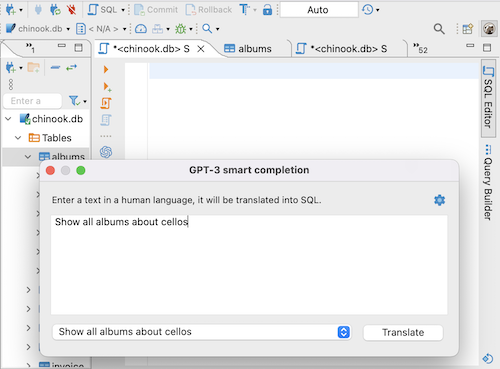
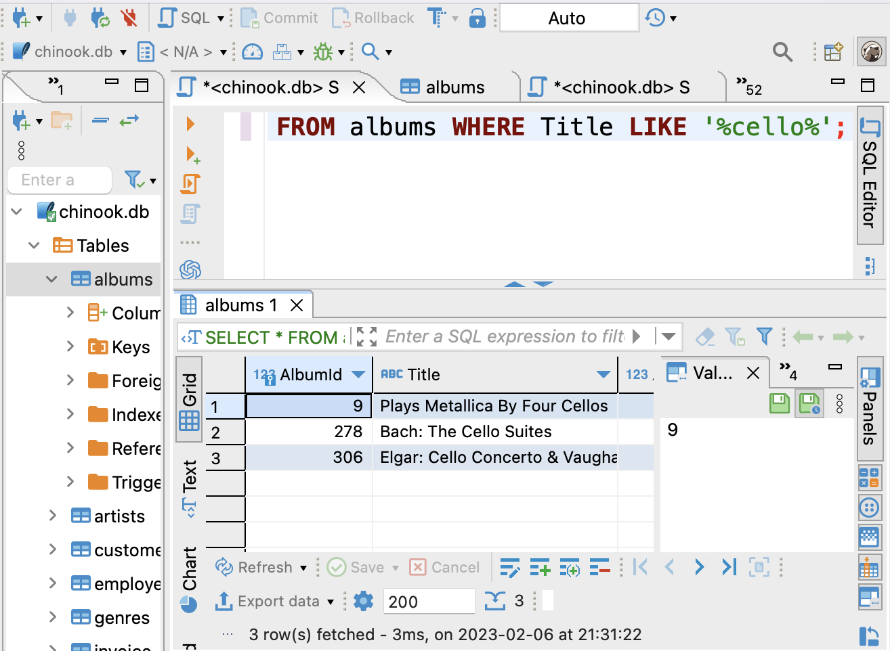
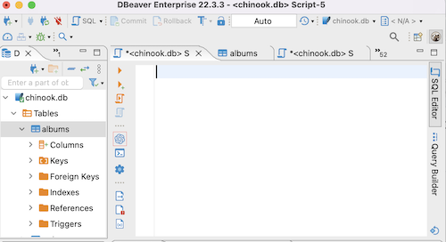
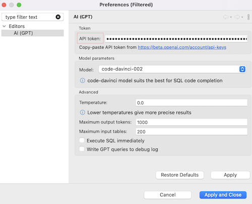
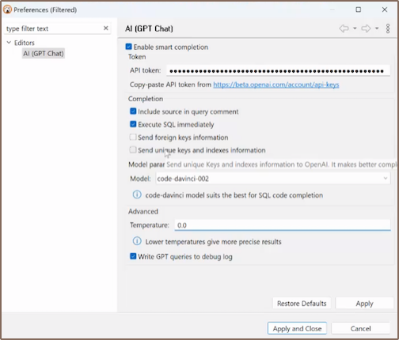
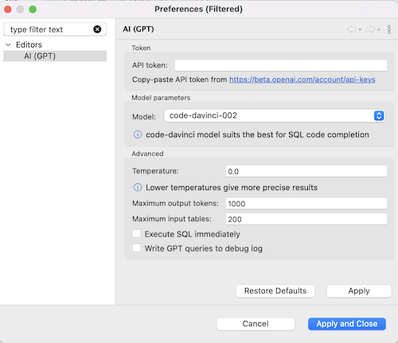
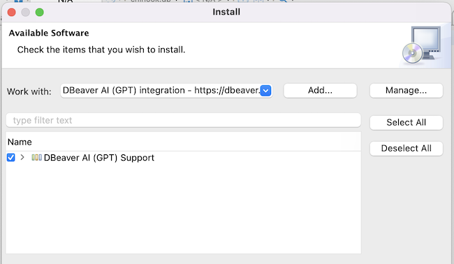

In DBeaver, you can build working SQL queries using human language thanks to integration with OpenAI (ChatGPT, to be more precise - the [GPT-3 language model](https://platform.openai.com/docs/models/gpt-3)). 

**Note:** 
- **DBeaver Corp has nothing to do with OpenAI company. We just use public API to integrate with the GPT completion engine.**
- **To use this feature, you need to register on the OpenAI platform and [receive a secret key](#receive-api-key).** 
- **To use this feature in the DBeaver Community version, you need to [install the GPT-3 extension](#install-gpt-3-extension).**

[How it works](#how-it-works) | 
[Get started](#get-started) |
[Write questions](#how-to-write-questions) |
[Configure](#configure) |
[Receive API key](#receive-api-key) |
[Install GPT-3 extension](#install-gpt-3-extension) 

## How it works

You write what you want to get from the database in the **GPT-3 Smart Completion** window, and DBeaver translates your phrase into the correct SELECT query.

Enter human language request:  



Generated SQL query:  


**Note: To translate a phrase into a query, DBeaver needs to send the database metadata to the OpenAI platform.** OpenAI will know table and column names in your database. DBeaver will ask about this on the first smart completion.  


## Get started

1. Open **SQL Editor** (F3) and click the **GPT icon** in the left toolbar.



2. On the first run, you'll see **Preferences** window. Copy the **Open AI secret key** to the **API token** field and apply changes. [Where to find a secret key](#receive-api-key)



3. Confirm the metadata transfer to Open AI. 

4. Write your question in the **GPT-3 Smart Completion** window and press **Translate**.

## How to write questions

You need to write a phrase in English or any other language describing what you want to get from the database. You should know at least something about your database structure. You can correct the query step by step, add details and make it more accurate. You can add some specific details, such as how to build a query or which tables or columns to use.

For example, using [DBeaver sample SQLite database](Sample-Database), you could write something like this:

_show customers from Italy_

```SQL
Translation: SELECT * FROM customers WHERE country = 'Italy';
```

_montre les clients de France_
```SQL
Translation: SELECT * FROM customer WHERE country = 'France';
```

_show customers who purchased blues tracks, use joins_

```SQL
SELECT c.FirstName, c.LastName, t.Name, g.Name
FROM Customer c
JOIN Invoice i ON c.CustomerId = i.CustomerId
JOIN InvoiceLine il ON i.InvoiceId = il.InvoiceId
JOIN Track t ON il.TrackId = t.TrackId
JOIN Genre g ON t.GenreId = g.GenreId
WHERE g.Name = 'Blues'
ORDER BY c.LastName, c.FirstName;
```

_get names of customers who purchased blues tracks, use joins_

```SQL
SELECT DISTINCT c.FirstName, c.LastName
FROM Customer c
JOIN Invoice i ON c.CustomerId = i.CustomerId
JOIN InvoiceLine il ON i.InvoiceId = il.InvoiceId
JOIN Track t ON il.TrackId = t.TrackId
JOIN Genre g ON t.GenreId = g.GenreId
WHERE g.Name = 'Blues';
```


## Configure 

You don't need to configure GPT-3 Smart Completion to use it. It's enough to [specify the API key](#get-started), and everything will work. However, if you have problems generating SQL queries or want to experiment, you can try changing some settings.

To configure this feature, open **GPT-3 Smart Completion** window and click on a **Gear button**.



You'll see the **Preferences** window.




- **API token** it's a secret key from the OpenAI platform. [Where to find a secret key](#receive-api-key)

- **Model** is a GPT-3 tool for understanding and generating natural language. The best model for generating SQL queries is **code-davinci**.

- **Temperature** sets the level of creativity of the translation results. If you need accurate results, use 0.0. For less standard and more creative results, use 0.9.

- **Maximum output tokens** indicates how many meaningful elements GPT-3 can analyze during translation. If you have trouble generating a query, try to specify a smaller number.

- **Maximum input tables** is the number of tables GPT-3 try to analyze during translation. If you have trouble generating a query, try to specify a smaller number.

- **Execute SQL immediately** — select this option if you want to run SQL query just after translation.

- **Write GPT queries to debug log** — select this option if you want to see requests to GPT-3 in the log files. 


## Receive API key

1. Register on the [OpenAI platform](https://openai.com/api/).
2. Open [API Keys section](https://platform.openai.com/account/api-keys) in your profile, and click Create new secret key button. 
3. You'll see the new secret key, copy it and paste it into **API token** field in Preferences.

## Install GPT-3 Extension

You only need to install this extension in the DBeaver Community version. In other versions, it is already installed.

1. From the main menu, select **Help —> Install New Software**.
2. In the installation window, in the **Work with** field select **DBeaver AI (GPT) integration** .
3. Then select **AI (GPT) Support**, press **Next** and follow the installation process. 



4. Restart DBeaver.

That's all done. Open the SQL editor, and in the left toolbar, you'll see the GPT-3 icon .