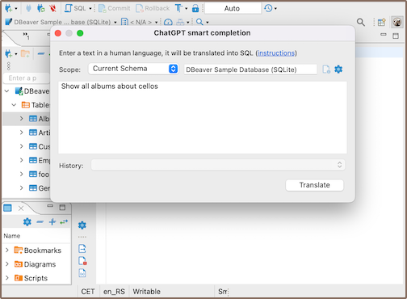
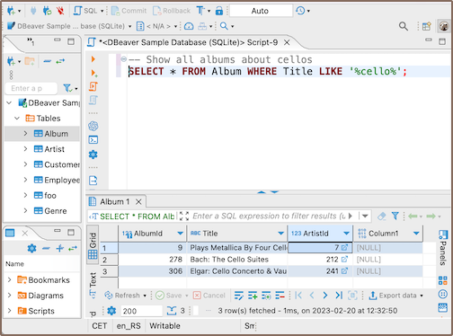
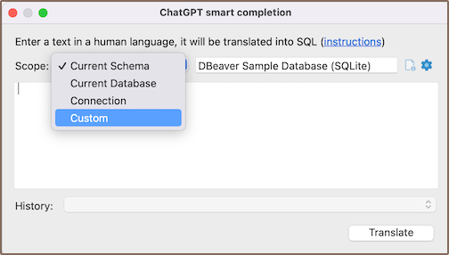
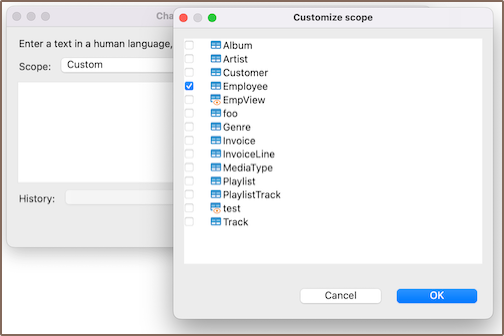
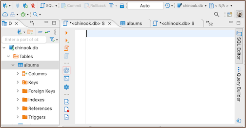
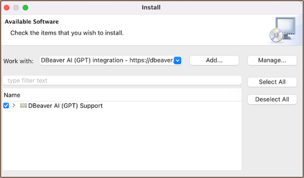
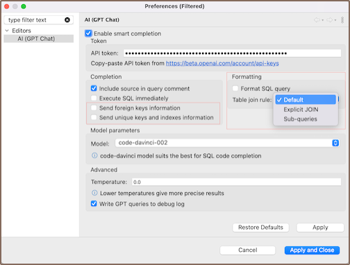
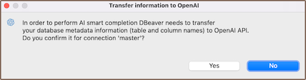

In DBeaver, you can build working SQL queries using human language thanks to integration with OpenAI (ChatGPT, to be more precise - the [GPT-3 language model](https://platform.openai.com/docs/models/gpt-3)).

**Note:**
- **DBeaver Corp has nothing to do with OpenAI company. We just use public API to integrate with the GPT completion engine.**
- **To use this feature, you need to register on the OpenAI platform and [receive a secret key](#receive-api-key).**
- **To use this feature in the DBeaver Community version, you need to [install the GPT extension](#install-gpt-extension).**
- **This feature isn't available in [Lite](Lite-Edition) version.**

[How it works](#how-it-works) |
[Get started](#get-started) |
[Write questions](#how-to-write-questions) |
[Configure](#configure) |
[Disable](#disable) |
[Receive API key](#receive-api-key) |
[Install GPT extension](#install-gpt-extension) |
[Data privacy](#data-privacy)

## How it works

You write what you want to get from the database in the **ChatGPT smart completion** window, and DBeaver translates your phrase into the correct SELECT query.

Enter human language request:  



Generated SQL query:  


**Note: To translate a phrase into a query, DBeaver needs to send the database metadata to the OpenAI platform.** OpenAI will know table and column names in your database. DBeaver will ask about this on the first smart completion for every connection. [Learn more about data privacy](#data-privacy)

### Additional settings

#### Scope

You can specify scope used to generate queries in the **Scope** field. You may need this if your database schema is large enough to eliminate problems when generating queries

If you want to choose a table, select the **Custom** option.


Then select a table.


#### History

You can see request history in the **History** field. If you are using the PRO version, you can see request history for previous sessions.

## Get started

1. Open **SQL Editor** (F3) and click the **GPT icon** in the left toolbar. (Note: toolbar is customizable. See [Toolbar Customization](Toolbar-Customization))



2. On the first run, you'll see **Preferences** window. Copy the **Open AI secret key** to the **API token** field and apply changes. [Where to find a secret key](#receive-api-key)



3. Confirm the metadata transfer to Open AI.

4. Write your question in the **ChatGPT smart completion** window and press **Translate**.

You can also select database objects to work with in the **Scope** field. This is useful if you have a large schema with many objects.

## How to write questions

You need to write a phrase in English or any other language describing what you want to get from the database. You should know at least something about your database structure. You can correct the query step by step, add details and make it more accurate. You can add some specific details, such as how to build a query or which tables or columns to use.

For example, using [DBeaver sample SQLite database](Sample-Database), you could write something like this:

_show customers from Italy_

```SQL
Translation: SELECT * FROM customers WHERE country = 'Italy';
```

_montre les clients de France_
```SQL
Translation: SELECT * FROM customer WHERE country = 'France';
```

_show customers who purchased blues tracks, use joins_

```SQL
SELECT c.FirstName, c.LastName, t.Name, g.Name
FROM Customer c
JOIN Invoice i ON c.CustomerId = i.CustomerId
JOIN InvoiceLine il ON i.InvoiceId = il.InvoiceId
JOIN Track t ON il.TrackId = t.TrackId
JOIN Genre g ON t.GenreId = g.GenreId
WHERE g.Name = 'Blues'
ORDER BY c.LastName, c.FirstName;
```

_get names of customers who purchased blues tracks, use joins_

```SQL
SELECT DISTINCT c.FirstName, c.LastName
FROM Customer c
JOIN Invoice i ON c.CustomerId = i.CustomerId
JOIN InvoiceLine il ON i.InvoiceId = il.InvoiceId
JOIN Track t ON il.TrackId = t.TrackId
JOIN Genre g ON t.GenreId = g.GenreId
WHERE g.Name = 'Blues';
```

## Configure

You don't need to configure ChatGPT smart completion to use it. It's enough to [specify the API key](#get-started), and everything will work. However, if you have problems generating SQL queries or want to experiment, you can try changing some settings.

To configure this feature, open **ChatGPT smart completion** window and click on a **Gear button** or navigate to **Preferences —> Editors —> AI (GPT Chat)**.


You'll see the **Preferences** window.



- **Enable smart completion** shows ChatGPT icon in SQL Editor. If this options is not selected, you can enable ChatGPT in Preferences.

- **API token** it's a secret key from the OpenAI platform. [Where to find a secret key](#receive-api-key)

- **Include source in query comment** — select this option if you want see the request in human language in the SQL Editor before the generated query.

- **Execute SQL immediately** — select this option if you want to run SQL query just after translation.

- **Model** is a GPT-3 tool for understanding and generating natural language. The best model for generating SQL queries is **code-davinci**.

- **Temperature** sets the level of creativity of the translation results. If you need accurate results, use 0.0. For less standard and more creative results, use 0.9.

- **Write GPT queries to debug log** — select this option if you want to see requests to ChatGPT in the log files.

### Settings in PRO versions

There are some additional settings available in [Enterprise](Enterprise-Edition), and [Ultimate](Ultimate-Edition) editions only.




- **Send foreign keys information** and **Send unique keys and indexes information**  allow to understand the relationships between tables, which can help create complex queries to database with a complex structure.

- **Format SQL query** add formatting.

- **Table join rule** allows to use explicit JOIN or join with sub-queries.

## Receive API key

1. Register on the [OpenAI platform](https://openai.com/api/).
2. Open [API Keys section](https://platform.openai.com/account/api-keys) in your profile, and click Create new secret key button.
3. You'll see the new secret key, copy it and paste it into **API token** field in Preferences.

## Install GPT Extension

You only need to install this extension in the DBeaver Community version. In other versions, it is already installed.

1. From the main menu, select **Help —> Install New Software**.
2. In the installation window, in the **Work with** field select **DBeaver AI (GPT) integration** .
3. Then select **AI (GPT) Support**, press **Next** and follow the installation process.



4. Restart DBeaver.

That's all done. Open the SQL editor, and in the left toolbar, you'll see the ChatGPT icon .

## Disable

You can temporarily remove ChatGPT icon from the SQL Editor toolbar. Move on Preferences —> Editors —> AI (GPT chat) and uncheck  **Enable smart completion** option. You can always enable it again.

You can permanently disable ChatGPT smart completion only in PRO versions. In this case, it cannot be enabled in Preferences.

How to do it:
- set system variable `DBEAVER_AI_DISABLED` to `true`
- or add the string `Dai.disabled=true` to the end of `dbeaver.ini`.


## Data privacy

DBeaver needs to send the tables and column names of the current database schema to the OpenAI platform to convert your request into an SQL query. DBeaver don't send anything else besides that (no data from tables). The full text of the request can be seen in the log file, which you can enable in **Preferences** by selecting the **Write GPT queries to debug log** option.

DBeaver will ask for confirmation the first time you use ChatGPT completion for each connection. You must confirm the metadata sending before using this feature.



If you don't want to send information about some tables, you can [choose which tables to use](#scope) in the **Scope** field.

You can completely disable ChatGPT feature in PRO versions. [How to disable it](#disable)

If you don't want to use ChatGPT in CE version, you can choose not to install the plugin and it will not be visible at all.
