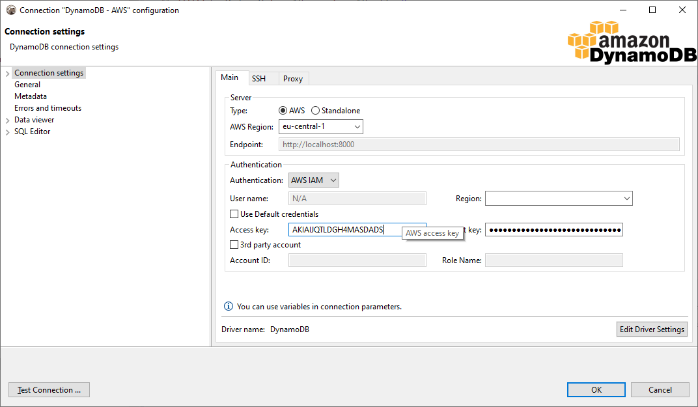
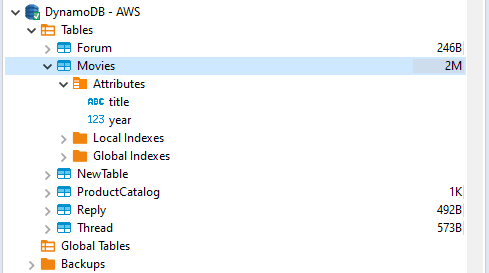

### Supported features:
- Table data view
- Table data edit in document (json) mode
- Data filters
- SQL queries execution
- JSON queries execution
- Data export and import

## DynamoDB connection

DBeaver supports AWS Cloud and Standalone versions of DynamoDB.  
For standalone server you need to enter endpoint (http or https URL).  
For cloud server you must enter AWS region. DynamoDB exists in all available regions in your AWS account but tables are different.

AWS Access Key and Secret Key are used for authentication.  
For 3rd-party account access you must specify 3rd party account ID (12-digits number) and 3rd party role name. This role will be used for permission management. You account must be added to whitelist in the 3rd party account.  

Press "Test Connection" to validate your connection settings.

### Database navigation

DynamoDB has simple metadata structure. Basically you can access only Table and Global tables.  
Table has primary attributes (a kind of primary key) and indexes.  
DynamoDB is document-oriented database. Each table may have its own set of attributes and sub-attributes.  

### Viewing table data

### Executing queries

