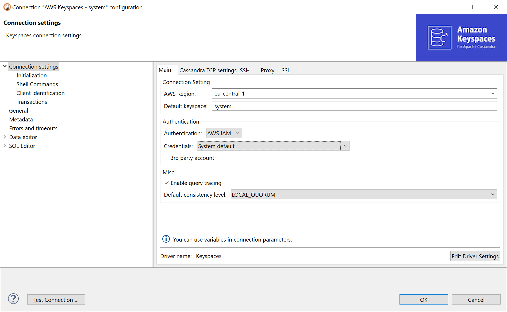
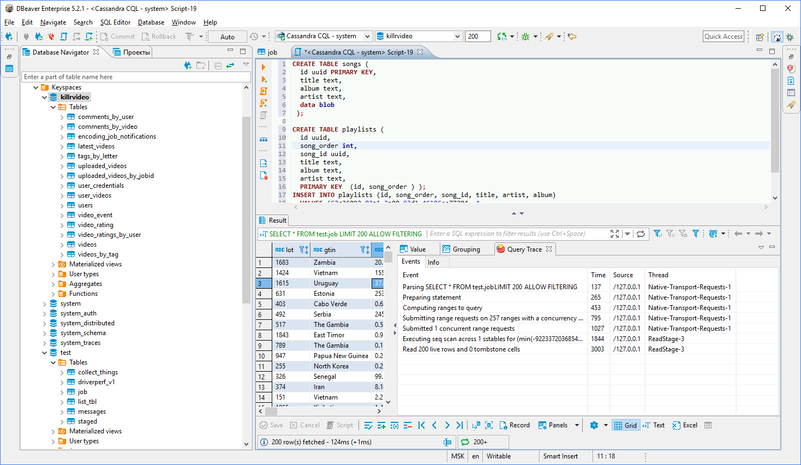
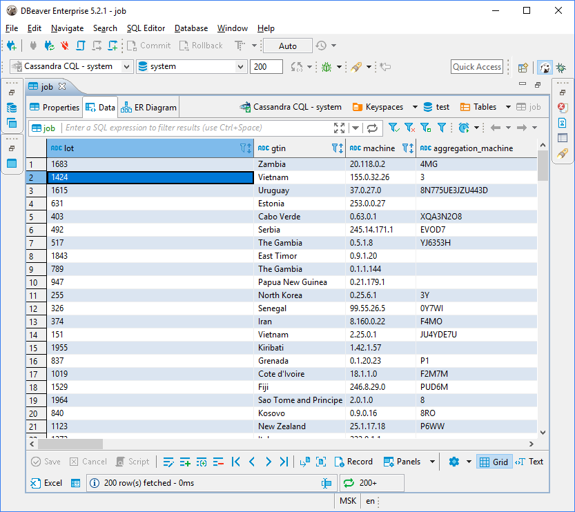

### Overview 

[[AWS Keyspaces|https://docs.aws.amazon.com/keyspaces/latest/devguide/what-is-keyspaces.html]] is a key-value database based on [[Apache Cassandra|Cassandra]].  

DBeaver EE supports the Keyspaces schema browser, data viewer and CQL queries execution.
It also supports various administrative tools.

### Connecting to Keyspaces

AWS Keyspaces uses AWS IAM authentication.  
You need to specify your IAM credentials and AWS region. There is no specific endpoint - there is only one cluster per account per AWS region.  
There is also no need to configure SSH or SSL - DBeaver uses default AWS settings to access the Keyspace cluster.  

### Browsing Keyspaces tables

You can browse, view, edit and filter Cassandra tables the same way as with regular (relational) tables.
However, being a distributed key-value database, Keyspaces does not support any kind of referential integrity. There are no foreign keys, references, etc.  
Note that Cassandra has a very advanced (comparing to relational databases) data type system. Each column may be a collection, map or set of values (with a very big number of values). In some cases this makes browsing data in the "Grid" mode inconvenient.

### Executing CQL

CQL [[Cassandra Query Language|http://cassandra.apache.org/doc/4.0/cql/]] is a very simple kind of SQL language dialect.  
It supports simple SELECT queries, DDL statements (like CREATE TABLE) and some other query types.

You can use the standard DBeaver SQL editor to execute CQL queries.
DBeaver supports Cassandra query execution, results scrolling, data export/import, mock data generation and other features.

### ERD

Physical ERD (Entity Relation Diagram) does not make much sense for Keyspaces as there are not any foreign keys.
However, you can make you own [custom ERD](Custom-Diagrams) and connect Keyspaces tables with each other using logical associations.
