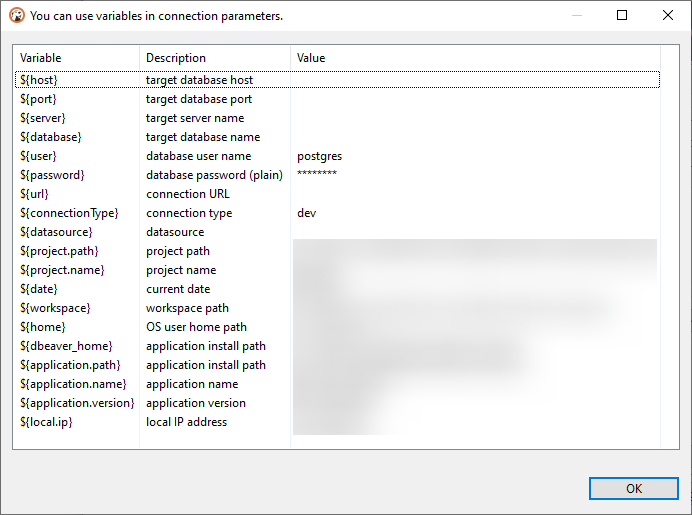

## Variables

#### Disclaimer: this article does **NOT** cover variables used in SQL editor.

### What are variables

A variable is a special template which is replaced with an associated value. Variables help keeping your configuration clean and tidy by avoiding unnecessary repetitions: instead of manually replacing each occurrence of some value, you could have replaced value of a variable just once and its occurrences will be kept intact.

Variables are available in a lot of places, you might have seen them in:
1. Connection settings
2. SSH tunnel settings
3. [Data Transfer](Data-transfer) and in other tasks
4. Command Line Interface

Usually, whenever variables are available in the user interface, a hint is present:


By clicking on it, a separate window will open showing all the available variables with their description and value:



### Using variables

To use variables you need to utilize a special syntax:

```
${variable_name}
```

Where `variable_name` is a variable name which you want to use. The window shown above already contains `${` и `}` anchors, you don't need to specify them multiple times.

Variables may be a part of something bigger: e.g., a part of a path. For example, it some file lies under the user's root folder, you may want to use variable `home`: `${home}`: `${home}/path/to/file.txt`.

### Variable resolution

A value of a particular variable may be resolved from different places depending on the origin you use it.

The resolution is performed in the following order (from the highest to the lowest priority):
1. Dialog, where a specific variable is used
2. Datasource-specific variables (`host`, `port`, `server`, `database`, etc.)
3. Application-specific variables (`application.name`, `application.version`, `home`, etc.)
4. Environment variables. For additional information see [Wikipedia](https://en.wikipedia.org/wiki/Environment_variable).
5. External configuration (see [the below](#declare-external-variables-in-a-file))

That means if you had an environment variable called `home`, it would resolve to the application-specific variable because it has higher priority.

### Declare external variables in a file

You can create a file and fill it with pairs of named values and pass it to DBeaver using the `-vars` [command-line](Command-Line) argument.

Variables from this file can be accessed by other command-line arguments, in the data transfer wizard, and in other places that support variable resolving.

For example, you may want to put your credentials in that file to avoid showing them to everyone else:

```properties
# Lines that start with the `#` symbol are comments and therefore ignored
sampleVar1=abc
someOtherVar=DBeaver is cool
password=P4$$w0r3
```

And use them like so:
```shell
dbeaver.exe -vars C:\secrets.properties -con "driver=<xxx>|url=<xxx>|password=${password}"
```

Here, the `-con` argument has the `${password}` variable that will be replaced with `P4$$w0r3` defined in the example file from above.