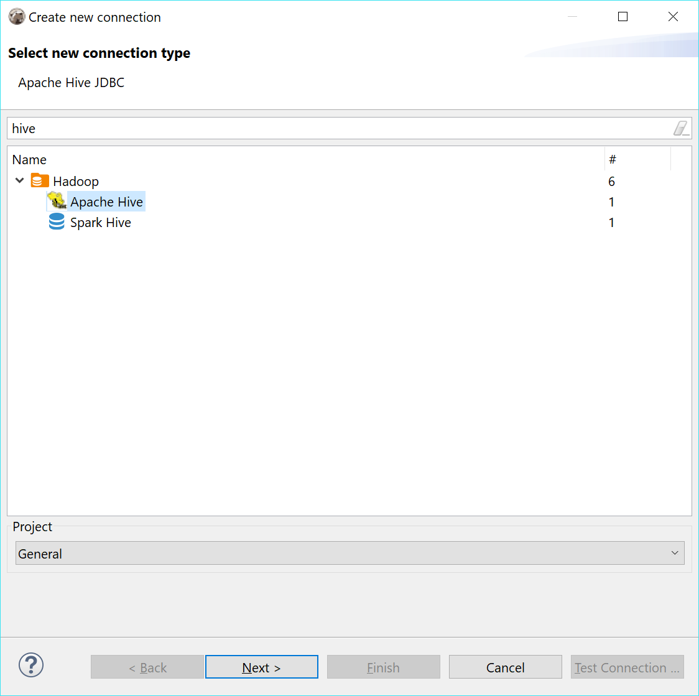
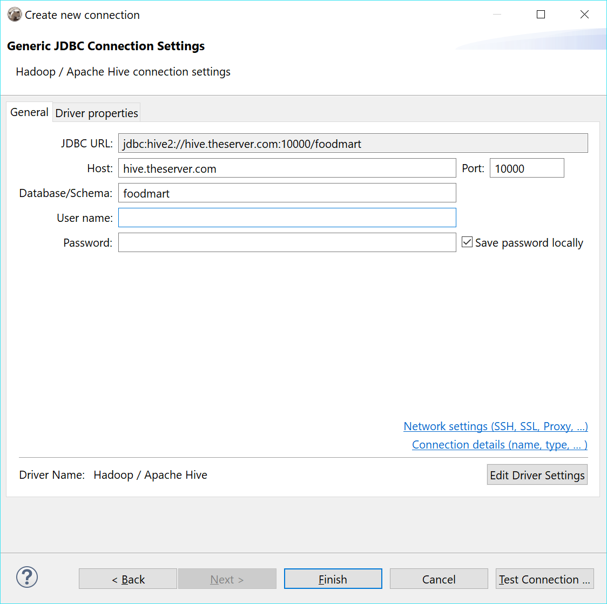
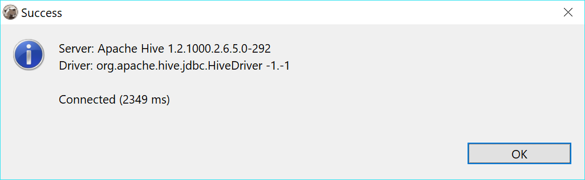
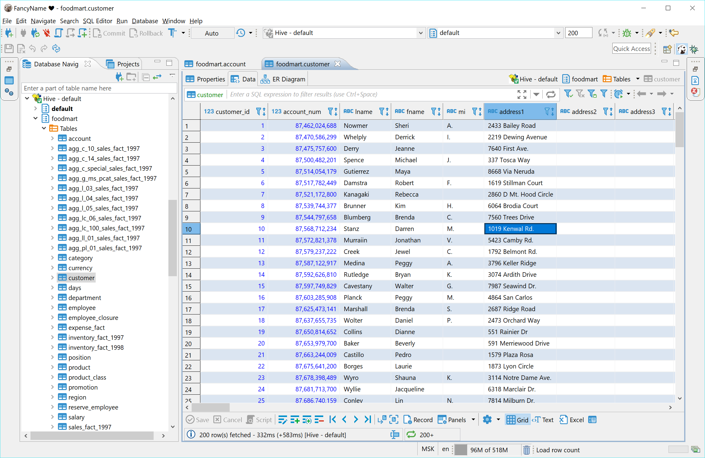
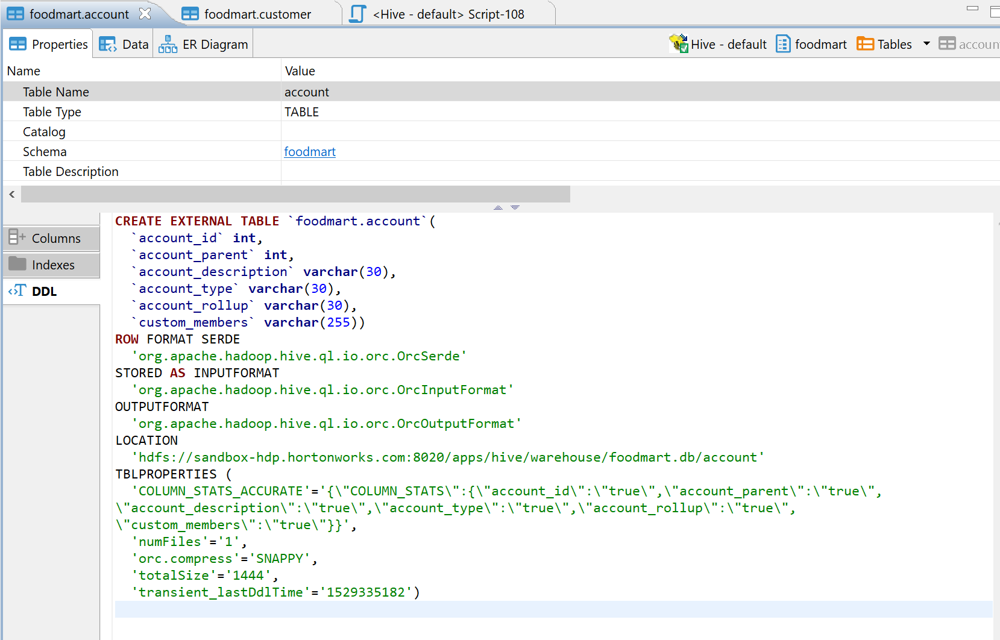

### Apache Hive

Hive is a Hadoop-based storage system.
Hive uses a special SQL dialect (HiveQL) to operate with data and metadata. Generally, it is quite similar to SQL.

There is multiple implementation of storage systems which utilize Hive on the server-side - including Apache Spark, Impala, etc. Most of them support the standard Hive JDBC driver which is used in DBeaver to communicate with the server.

DBeaver uses a so-called Hive JDBC Uber Jar driver (https://github.com/timveil/hive-jdbc-uber-jar) which includes all necessary dependencies. You do not need to download anything - DBeaver will download everything automatically (if you have internet access).

### Connection setup

### Schema/data browser

### Limitations

Hive does not support referential integrity so you will not see primary keys or foreign keys.
ER diagrams also do no make much sense.