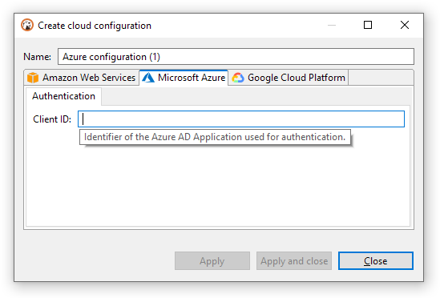
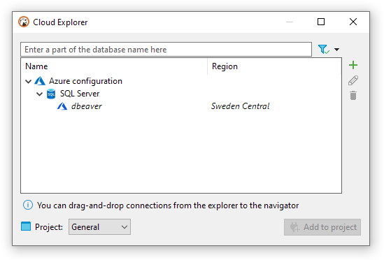

# Azure Cloud Explorer

## Cloud configuration

You have to provide just the ID of the application (client) that is used for
authentication and database access:

## Supported services

__As of DBeaver 22.3, the only supported service is Azure SQL.__

