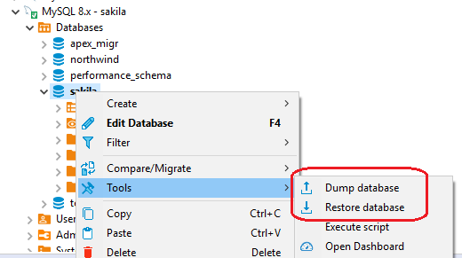
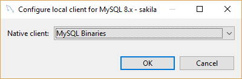
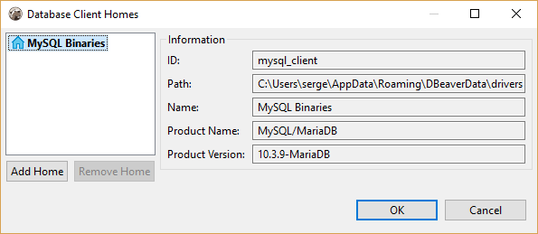
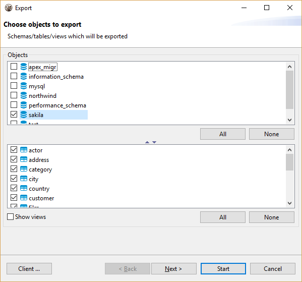
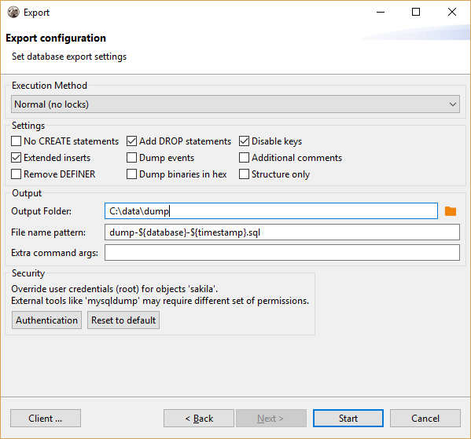

**NB: This feature is not available in the [Lite](Lite-Edition) edition.**

## Database Backup/restore

DBeaver supports native database backup/restore functions for the following databases:
  - PostgreSQL
  - MySQL

The native backup restore differs from the standard DBeaver [data transfer](Data-Transfer) feature. It uses database native dump formats and it may work much faster as it uses special utilities for the direct high-performance database access.

These functions can be accessed from the Context Menu's Tools or the Main Menu's Database->Tools.

### Native client configuration
In order to execute native backup/restore tools you need to configure the database native client. The native client is a set of binaries (different for different OSes) which will be executed by DBeaver to process an actual backup/restore.
The native client configuration can be done in [driver editor dialog](Database-drivers) or directly from the backup/restore wizard. Just click on the `Client ...` button in the button bar:
  

To configure a new client location, choose the `Browse ...` item and add a new client in the following dialog:  

### Database dump object selector
You can choose what schemas/tables you want to backup/dump:

### Database native tool configuration
You can pass a set of additional dump/restore parameters to the native tool. The particular set of configuration options depends on the database type.  
