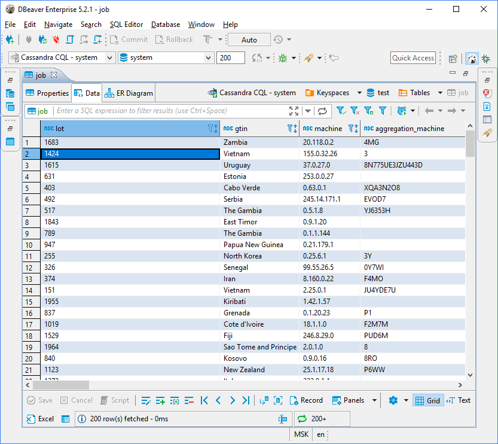

### Overview 

DBeaver EE supports Cassandra schema browser, data viewer and CQL queries execution.
It also supports various administrative tools.

### Connecting to Cassandra cluster

You can connect directly to a server or use SSH tunneling or SOCKS proxy.
DBeaver uses the DataStax Java driver to operate with a server. It supports Cassandra servers 2.x, 3.x or higher.  

### Browsing Cassandra tables

You can browse, view, edit and filter Cassandra tables the same way as with regular (relational) tables.
However, being a distributed key-value database, Cassandra does not support any kind of referential integrity. There are no foreign keys, references, etc.  
You should note that Cassandra has a very advanced (comparing to relational databases) data type system. Each column may be a collection, map, or set of values (with very big number of values). In some cases this makes browsing data in the "Grid" mode inconvenient.

### Executing CQL

CQL [[Cassandra Query Language|http://cassandra.apache.org/doc/4.0/cql/]] is a very simple SQL language dialect.  
It supports simple SELECT queries, DDL statements (like CREATE TABLE) and some other query types.

You can use the standard DBeaver SQL editor to execute CQL queries.
DBeaver supports Cassandra query execution, results scrolling, data export/import, mock data generation and other features.
Data viewer (of individual tables or custom CQL query results) query tracing is supported.  

### ERD

Physical ERD (Entity Relation Diagram) does not make much sense for Cassandra as there are no foreign keys.
However, you can make you own [custom ERD](Custom-Diagrams) and connect an actual Cassandra table with each other using logical associations.
