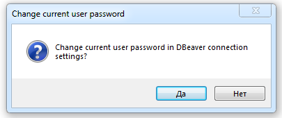

You can change the current user password in Navigator Tree for connected connections.

1. Right-click on connected connection.
2. Mouse over the label "Security" and click on "Change user password".

3. A new password input dialog opens. Enter the new password and confirm it.

4. Confirm the password change in the current connection settings so that it is saved in the settings for future connections. 
(This dialog will not appear if the entered password was incorrect).

Password will be changed.

Databases, which support this setting:
- PostgreSQL
- Greenplum
- Cockroach
- Redshift 
- Netezza 
- SQL Server
- Oracle
- Exasol
- Snowflake
- Vertica

### Changing user password if the current password is expired.

In some databases, the session can be opened for an expired password, in which case the expired password can be changed using this password change tool. Such an opportunity, for example, exists for Oracle, PostgreSQL, and Netezza databases.
Some databases do not support this opportunity.
