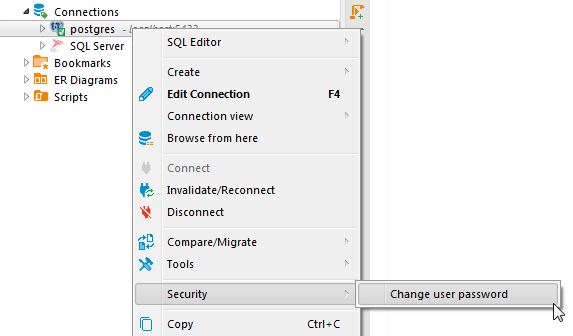
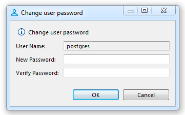
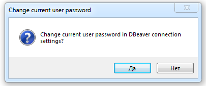

DBeaver has a possibility to change credentials for the current database user. 

Databases, which support this feature:
- PostgreSQL
- Greenplum
- Cockroach
- Redshift 
- Netezza 
- SQL Server
- Oracle
- Exasol
- Snowflake
- Vertica

### Changing expired user password

Different databases perform password management for users in a different ways. For some of them you can change the user password after the expiration date. It works for Oracle, PostgreSQL, and Netezza databases.

For the rest databases user has to change the password before the expiration. Otherwise, it will be impossible to do in DBeaver.

### How to change user password

You can change the current user password in the Navigation Tree according to the instructions below:

1. Connect to the database.
2. Open the context menu by right-clicking on the connection in the Navigation tree.
3. Select a "Security" point and click on a "Change user password" point in a sub-menu.

4. When a new password input dialog opens enter the new password and confirm it.

5. Confirm the password changing to keep the new password for further connections. 
(This dialog will not appear if the entered password was incorrect).

Password will be changed.
