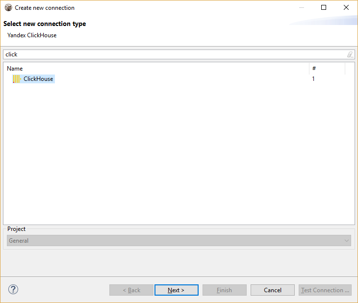
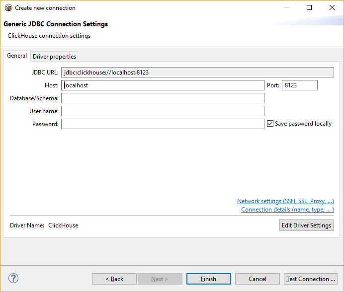
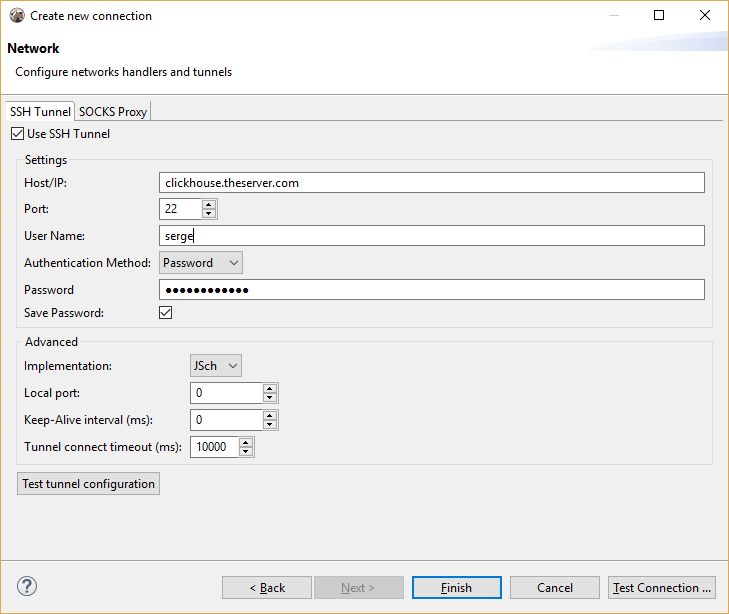
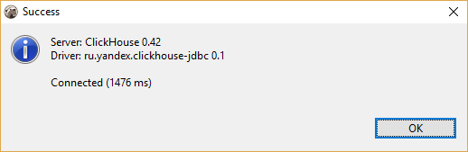
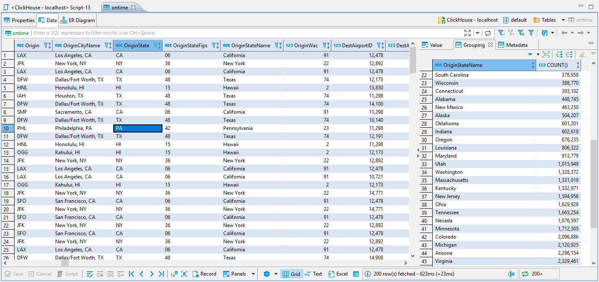
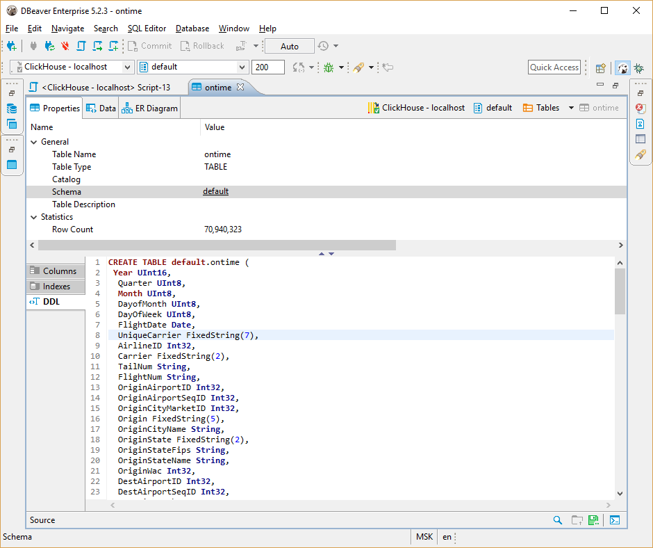

### Yandex Clickhouse

<a href="https://clickhouse.yandex/docs/en/">ClickHouse</a> is an open source column-oriented database management system capable of real time generation of analytical data reports using SQL queries.

DBeaver uses standard Clickhouse JDBC driver to communicate with Clickhouse servers. Driver is downloaded automatically once you establish connection with database server.

### Connection setup

### Schema/data browser

### Limitations

Clickhouse doesn't support referential integrity so you won't see foreign keys. ER diagrams are also doesn't make much sense.
