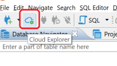
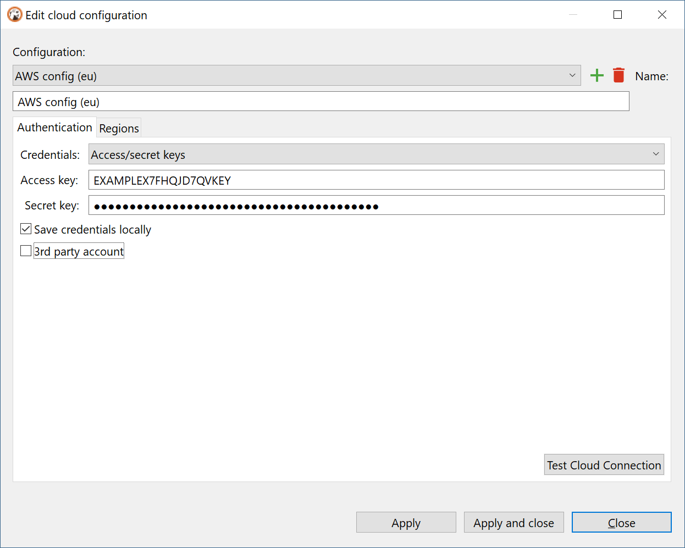

### Overview 

Cloud Explorer provides deep integration with classic cloud service providers such as Amazon, Google and Azure.  

__Note: Cloud Explorer is supported only in DBeaver Ultimate Edition.__  
__Version 21.0 support only AWS (Amazon Cloud Services) cloud.__

It allows users to configure cloud access once and then browse, connect and manager all cloud databases easily with just a few clicks.  
There is no need to configure each database connection manually, all database endpoint information read directly from cloud provider.
Authentication is managed in centralized mode - you use your cloud account to get access to cloud databases.  

### Cloud configuration

Before you begin to work with cloud explorer you need to configure your cloud provider access.
Configuration includes access credentials, availability zones which will be used to search databases and some other cloud-specific settings.
Cloud configuration si different for each cloud service provider.

- [[Configuring AWS cloud|AWS Cloud Explorer]]

### Explorer

### Database cloud information

