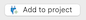

**Note**: This feature is available in [Ultimate](Ultimate-Edition) and <a href="https://dbeaver.com/dbeaver-team-edition">Team</a> editions only.

### Overview 

**Cloud Explorer** offers deep integration with popular cloud service providers. As of the latest version, it supports
Amazon Web Services (AWS), Google Cloud Platform (GCP), and Microsoft Azure.

With **Cloud Explorer**, you can set up your cloud access once and then easily browse, connect, and manage all your cloud
databases. It saves you from manually configuring each database connection, as it reads all database endpoint
information directly from the cloud provider.

Authentication is centralized. You use your cloud account to access your cloud databases. Before you start using **Cloud
Explorer**, you need to set up your cloud provider access. This setup includes access credentials, availability zones for
database search, and other cloud-specific settings.

### Cloud configuration

To begin the configuration process, click the **Cloud Explorer** button 
located in the [Toolbar](Application-Window-Overview#toolbar). From there, you can start setting up your cloud provider 
access according to your needs. This involves configuring your access credentials, specifying the availability zones for 
database search, and adjusting other cloud-specific settings. The setup process varies depending on the cloud service
provider you're using.

If this is your first time setting up, the **Create Cloud Configuration** dialog will open, guiding you through the setup
process. Once you've set up your first cloud configuration, clicking the **Cloud Explorer** button will open
a dialog displaying your cloud databases.

If you need to set up a new cloud configuration, you can do so by clicking the **New** button
 in the **Cloud Explorer** dialog. You can start
setting up your new cloud provider access according to your needs.

Cloud configuration is different for each cloud service provider.

#### **Amazon Cloud Services**

 Name                     | Description                                                                                                                                                                                      | Additional article                                                   
--------------------------|--------------------------------------------------------------------------------------------------------------------------------------------------------------------------------------------------|----------------------------------------------------------------------
 **Default Credentials**  | Allows AWS to determine credentials using the standard credential providers.                                                                                                                     | [AWS Default credentials](AWS-Credentials#default-credentials)       
 **AWS Profile**          | Allows you to choose which credentials profile you want to use.                                                                                                                                  | [AWS Profile](AWS-Credentials#aws-profiles)                          
 **Access/Secret Key**    | Allows you to choose which credentials profile you want to use. If you have an [AWS Secret](AWS-Credentials#aws-secrets-manager) set up, enter it in the [Connection settings](Edit-Connection). | [AWS Access/Secret Key](AWS-Credentials#AWS-Credentials#access-keys) 
 **Single Sign-On (SSO)** | Allows access to AWS resources without explicitly specifying user credentials in DBeaver connections configuration.                                                                       | [AWS SSO guide](AWS-SSO)                                             

About permissions, read [AWS managed policies](AWS-Permissions) article. 

#### **Google Cloud Platform**

 Name                       | Description                                                                                                                 | Additional article                                             
----------------------------|-----------------------------------------------------------------------------------------------------------------------------|----------------------------------------------------------------
 **Default Credentials**    | Allows GCP to determine credentials using the standard credential providers.                                                | [GCP Default credentials](GCP-Credentials#default-credentials) 
 **Web browser** or **SSO** | Allows you to authorize your connection through your Google account without needing a service or user-based key file. | [GCP SSO](GCP-SSO)                                             
 **Access key file**        | Allows you to provide the path to your service or user credentials files.                                        | [GCP Access key](GCP-Credentials#access-key-file)              

#### **Microsoft Azure**

 Name          | Description                                                                                                   | Additional article                           
---------------|---------------------------------------------------------------------------------------------------------------|----------------------------------------------
 **Client ID** | Allows you to provide the ID of the application (client) used for authentication and database access. | [Azure Cloud Explorer](Azure-Cloud-Explorer) 

### Explorer

Once you've configured your cloud provider access, open the **Cloud Explorer** dialog and add database
connections. In the top drop-down of the explorer dialog, you can select the active cloud configuration or click
**Edit** button  to change the cloud configuration.

You can see cloud databases in the center of the dialog in a hierarchical view. All databases are grouped by database/service type.
When you expand one of the top elements, DBeaver will search cloud databases in configured availability zones/regions.

If you have a large number of databases in your cloud, you can search or filter them using filter text above the cloud
navigator.

You can drag-and-drop cloud databases directly to [database navigator view](Database-Navigator)
or [projects view](Projects-View). You can also add any number of databases to your project directly from the **Cloud
Explorer**. To do this, click on the database you want to add. Once selected, click on the **Add to Project** button
 located in the bottom right corner of the
**Cloud Explorer** dialog, or right-click on the database and select **Add to Project** from the context menu.
This will add the selected database to your project, making it easier to manage and navigate your databases within specific projects.

### Database cloud information

You can access your cloud database configuration directly from the **Database Navigator**. To do this, right-click on
the database you are interested in and select **Edit Connection**. This action opens a special tab in the connection
settings dialog. The information displayed in this tab is specific to the cloud and database type of the selected
database. 
