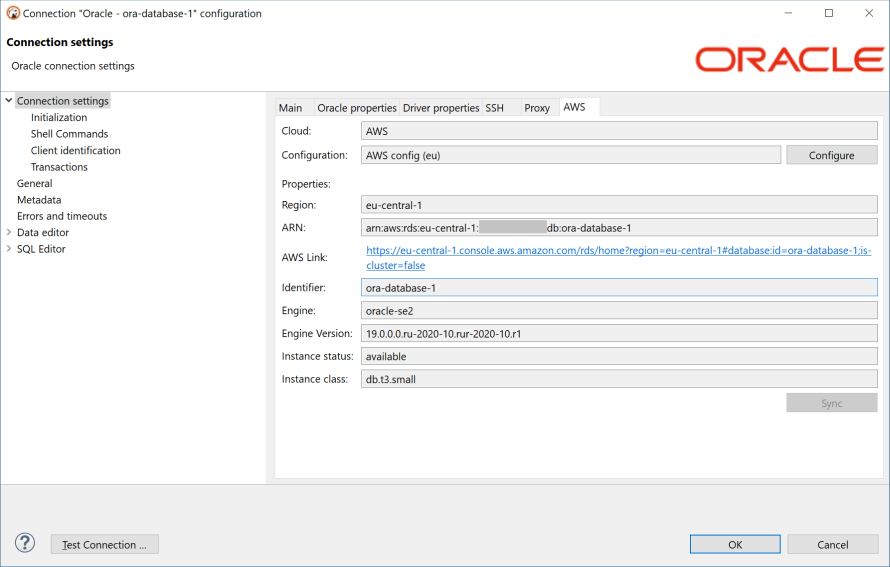

### Overview 

Cloud Explorer provides deep integration with classic cloud service providers such as Amazon, Google and Azure.  

__Note: Cloud Explorer is supported only in DBeaver Ultimate Edition.__  
__Version 21.0 support only AWS (Amazon Cloud Services) cloud.__

It allows users to configure cloud access once and then browse, connect and manager all cloud databases easily with just a few clicks.  
There is no need to configure each database connection manually, all database endpoint information read directly from cloud provider.
Authentication is managed in centralized mode - you use your cloud account to get access to cloud databases.  

### Cloud configuration

Before you begin to work with cloud explorer you need to configure your cloud provider access.
Configuration includes access credentials, availability zones which will be used to search databases and some other cloud-specific settings.
Cloud configuration si different for each cloud service provider.

### [[Configuring AWS cloud|AWS Cloud Explorer]]

### Explorer

One you configure cloud configuration you can open Cloud Explorer dialog and start adding database connections.
In the top drop-down of explorer dialog you can select active cloud configuration or click "Edit" to change cloud configuration.

In the center of dialog you can see cloud databases in hierarchical view. All databases are grouped by database/service type.
When you expand one of top elements DBeaver will start to search cloud databases in configured availability zones/regions.

If you have big number of databases in your cloud then you can search or filter them using filter text above the cloud navigator.

You can drag-and-drop cloud databases directly to [[database navigator view|Database Navigator]] or [[projects view]].
You can also check any number of databases in the Cloud Explorer using checkbox control on the left side of Cloud Explorer tree and then click on "Add to Project" button in the right bottom corner.

### Database cloud information

You can always see you cloud database configuration in a special tab on the connection settings dialog.
This information depends on a cloud and on a database type.
You can also click on the external link to open your database configuration in cloud provider web console.

