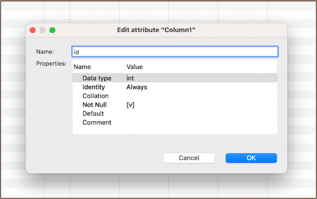
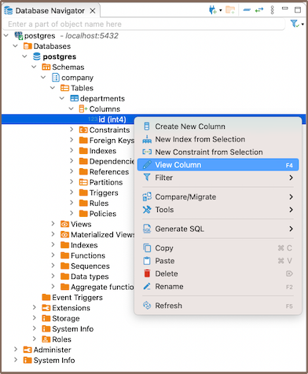

### Create

1) Go to the **Columns** tab in the **[Properties editor](Properties-Editor)**, right-click on the
pane of the object's sub-entities and select **Create New Column** from the context menu.

  

  You can also add a new column by expanding the table view in the **[Database Navigator](Database-Navigator)** and selecting **Create New
Column** from the context menu.

  

2) Customize the settings of a column in the **Edit Attribute** window. Adjust the **Name**, **Data type**, **Identity**,
**Collation**, **Not null**, **Default** value, and add a **Comment** as needed.

  

3) Persist the changes.

### Modify

Go to the **Database Navigator** menu, choose the right database and column to modify its settings. Right-click the
column and select **View Column**.

You can rename the column, change its data type, tweak the **Not Null** option, adjust permissions, and add comments.

**Note**: Make sure the new data type for the column, along with the **Not Null** option, can hold all existing values.

### Delete

To delete a column, right-click on the column's name in the **Database Navigator** and select **Delete**, or you can
select the necessary column and press the <kbd>Delete</kbd> key.

**Tip**: Remember, before deleting a primary key column, first remove its constraint within the table properties.

### Restrictions

* Data Type: Each column in a table has a specific data type. The type of data that can be stored in a column is
  dictated by its data type.
* Nullability: By default, columns can hold **NULL**. However, by specifying **NOT NULL** during column creation, you can
  enforce that every row must contain a value for that column.
* Unique [Constraint](Constraints.md#Restrictions): A unique constraint ensures that all values in a column are
  distinct. Duplicate entries are not permitted.
* Check Constraint: A check constraint enables you to specify a condition on a column.
  Every value added to the column must satisfy this condition.
* Default Value: A column can be given a default value. If no value is specified during data insertion, the column uses
  the default.

Remember, these restrictions are essential to ensure data integrity, accuracy, and reliability in your database.