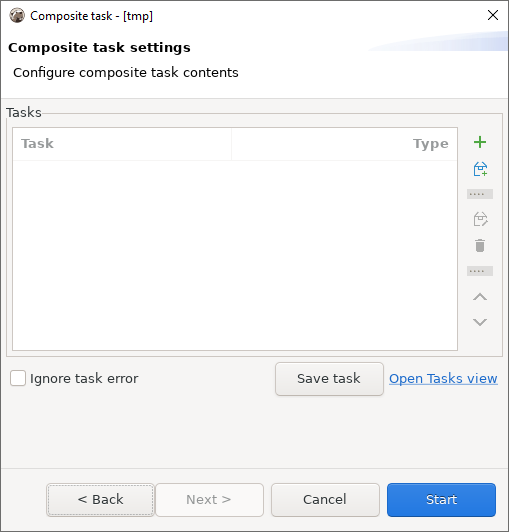

**Note: This functionality is available only in the [[Enterprise Edition]].**

As the name suggests, the _composite task_ is a type of task that consists of other tasks. 
Just like the other type of tasks, the composite tasks can be scheduled via [[Task Scheduler]].
Let's take a look at what they can offer.

### Creating a _composite task_

The first thing we need to open is the _Create a task_ dialog. You can do it in multiple ways:

- From the context menu in the database navigator -> Tools -> Create new task... -> Composite task

- By clicking Database -> Tasks -> Create new task... -> Composite task

- From the context menu in the Database Tasks view.

Choose _Composite task_, enter the task name, description (optional), and hit _Next_.

You will be presented with the following dialog:

### Setting up a _composite task_

When creating a composite task, you need to specify which tasks the composite task consists of.

This can be done:

1. By adding an existing task. To do that, click the button with the plus sign

2. By creating a new task and adding it simultaneously. To do that, click the button 
   below the aforementioned button with the plus sign

3. By drag-and-dropping a task from the _Database tasks panel.

As a side note, you can add a composite task to your new composite task.

You can edit tasks in the same dialog, 
delete a task from a composite task, and change the execution order.

There is also a very important checkbox, _Ignore task error_. 
The tasks from the _composite task_ are executed in the order they appear in the settings dialog. 
Executing a task from a _composite task_ might produce an error that will block the next tasks from proceeding. 
The _Ignore task error_ checkbox can be used to bypass this behavior.