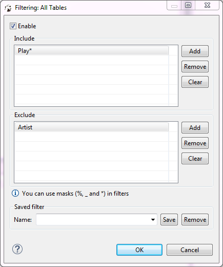

You can configure custom filters to filter database objects in the [Database Navigator](Database-Navigator) and [Database Object Editor](Database-Object-Editor).

To configure a custom filter:
1. In the Database Navigator, right-click the object and on the context menu click **Filter -> Configure [objects] filter**. In the Database Object editor, in the toolbar of the **Properties** tab, click the Filter settings button ().
The Filtering window opens.

     

2. Select the **Enable** checkbox to activate the fields of the window.
3. If you want the filter to apply to all objects of a certain type, for example to all schemes, click **Show global filter**. Otherwise, the filter will apply only to the current object.
NOTE: Once you apply the global filter, you cannot revert back to the local filer in the same window. To create a local filter, reopen the Filtering window, see Step 1.
4. For objects that you want to show, click **Add** next to the **Include** field and then, in the field itself, enter the name or combination of symbols to search. 
For objects that you want to hide, click **Add** next to the **Exclude** field and then, in the field itself, enter the name or combination of symbols to search. 
NOTE: You can use masks with `%` and `*` to replace one or more symbols and `_` to replace one symbol in the search combination.
5. To remove one filtering combination, click the combination in the field and then click **Remove**. To remove all combinations from either of the fields, click **Clear** next to the field.
6. Once you set all filtering criteria, you can save a filter to use for other objects. To save the filter, in the Saved filter area, in the **Name** field, enter the filter`s name and click **Save**.
7. You can also remove any of the saves filters. To remove a filter, in the **Name** drop-down list, click the filter name and then click **Remove**.
8. Click **OK** to apply the filtering criteria. Otherwise, click **Cancel**.
