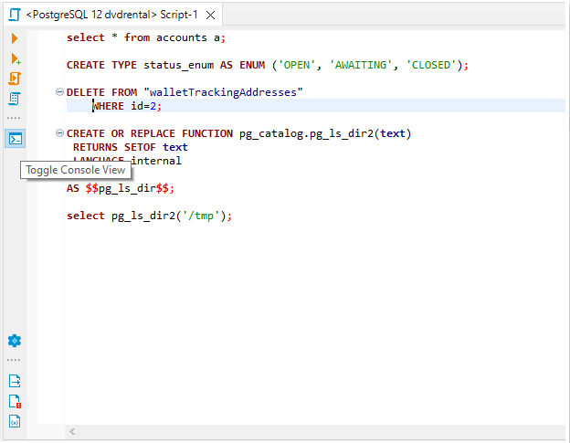
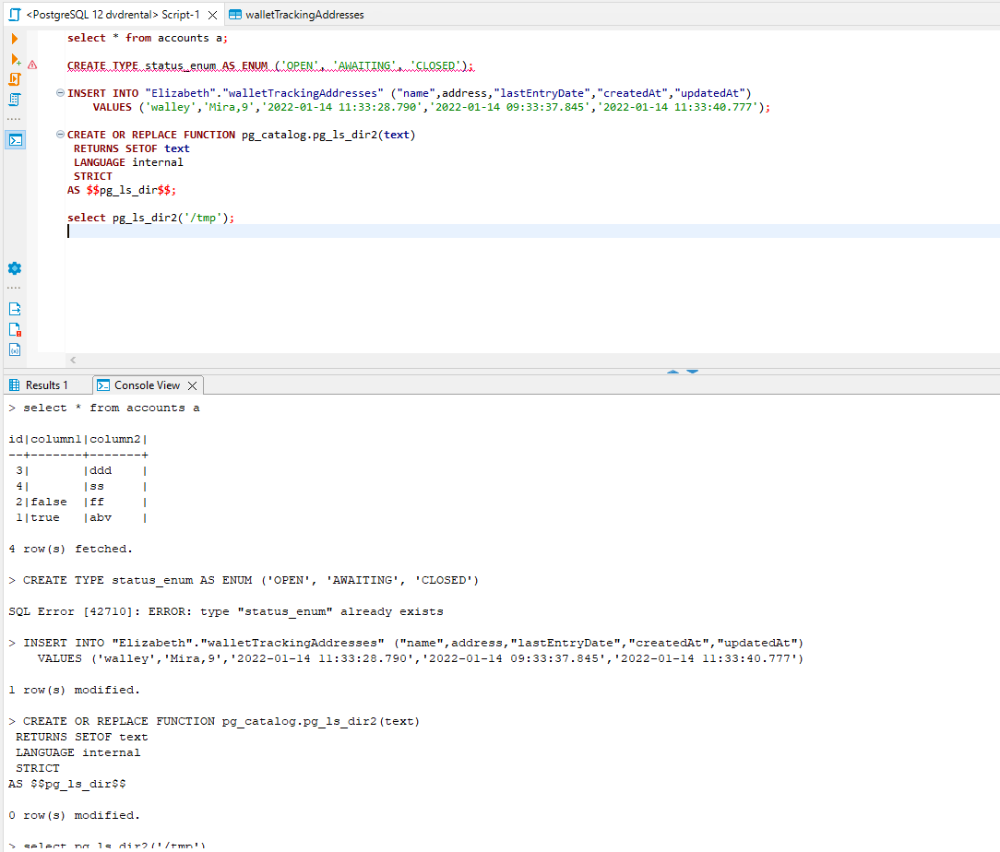
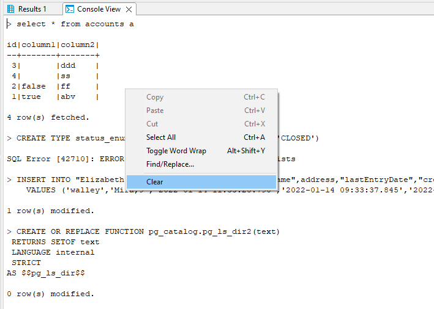
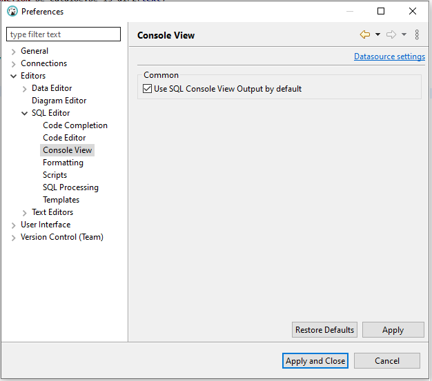

Console View is an SQL Editor result tab where you can find the results for all executed queries in a text format.

To enable Console View you should press the corresponding button on the left SQL Editor toolbar.

You can execute a single query or a script and see the result set with data, errors, and statistical information along with the corresponding query text.

Don't worry if you close the Console View tab. It will be restored on the new query execution.

The context menu is available by right-clicking.

The toggle state of the Console View will be saved per script and restored when the script is opened.

You can set up whether to enable or disable the Console View for new scripts by default in `Preferences->Editors->SQL Editor->Console View`.

