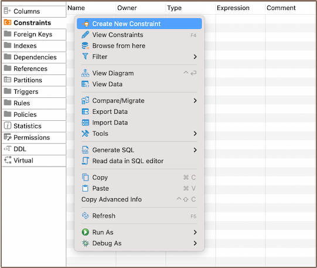
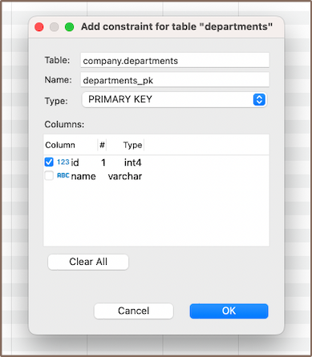
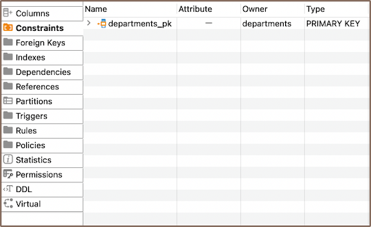
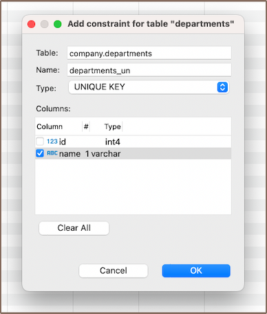

## Primary key
### Create

1) In the **[Properties editor](Properties-Editor)**, move to the **Constraints** tab of the corresponding table, right-click on the pane or window, and
**Create New Key** from the context menu.

   

2) Select the column and save.  
   

   **Note**: Уou can create a composite primary key by selecting multiple columns for it.

3) After you hit **OK**, a window will appear displaying the newly created primary Key.

   
4) Persist the changes.

### Modify

To modify an existing primary key, you need to first delete it and then add a new primary key with the updated
parameters.

### Delete

To delete a primary key, right-click on the key's name in the **Properties editor** and select
**Delete**, or you can select the necessary column and press the <kbd>Delete</kbd> key.

### Restrictions

You can't delete a primary key in a table with records unless you first remove all dependent foreign keys. Or, you can
adjust the **On Delete** and **On Update** actions of the foreign key.

**Tip**: If you see an error, try using **Cascade** option to delete dependent objects.

## Unique key

When you're adding constraints, you can pick not just a primary key, but also a unique key.

A Unique key is a database constraint ensuring distinct values in a column or a group of columns. While it identifies
unique records in a table, it's not necessarily the primary key. It can be created on a single column or a group of
columns, with each value being unique. A Unique key maintains data integrity in the table. If you try to insert a
duplicate value, you'll get an error.

## Check expression

A check expression in a database is also a constraint, it defines acceptable values for a column.

When creating or altering a table, you can set a check expression to enforce specific conditions, such as values being
greater than or equal to a certain number or within a certain range. For instance, you could set a constraint for
salary_amount column to always be non-negative. Inserting a negative value, like `-100000` for salary, would trigger an
SQL Error.

