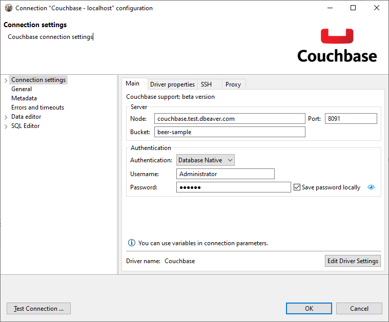
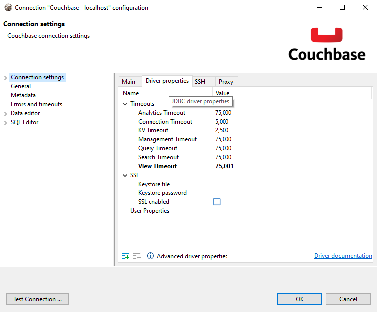
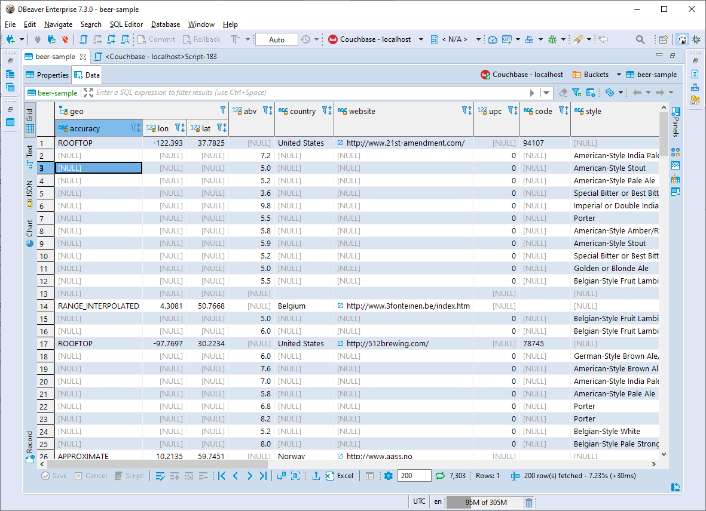
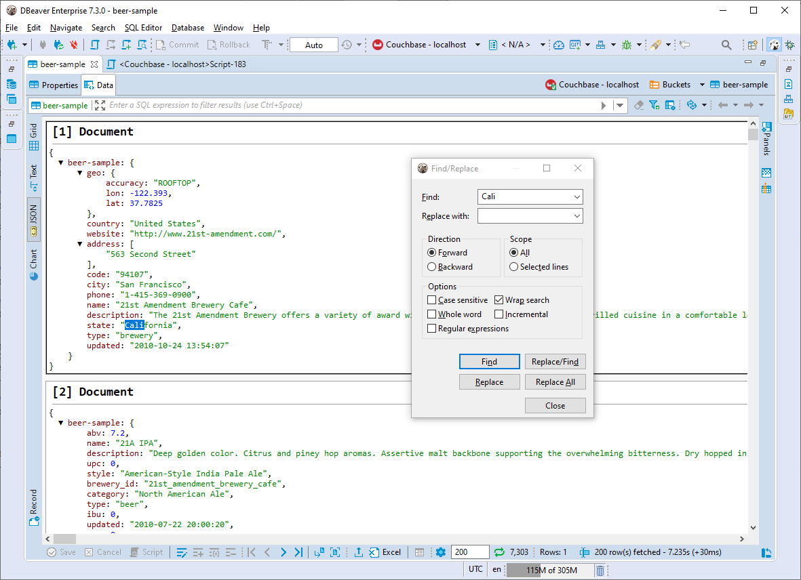
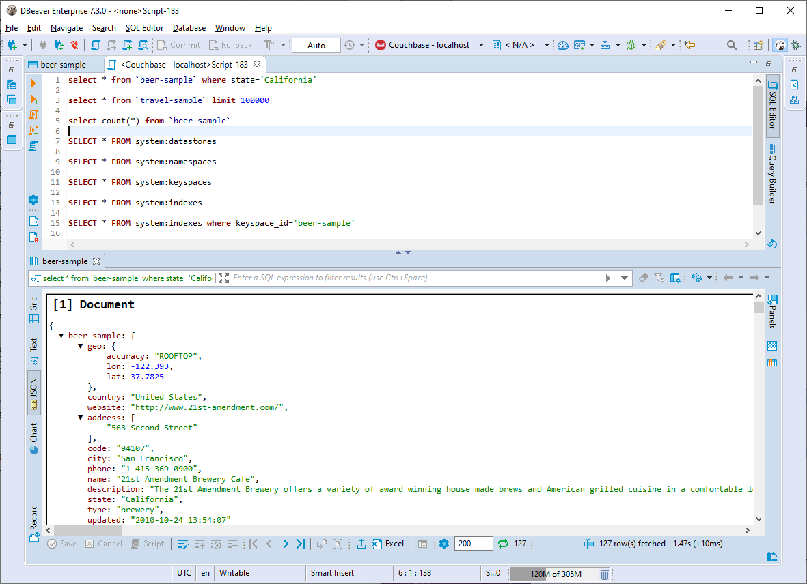

### Connecting to Couchbase server

Couchbase client uses <a href="https://docs.couchbase.com/server/current/install/install-ports.html">multiple ports</a> to connect to a cluster (8091-8096, 9140, etc). Some of these ports are dynamic (i.e. depend on server settings) and cannot be overwritten.  It makes SSH tunnelling impossible.
Thus, if you work with a remote Couchbase deployed behind a firewall, you will need to setup a VPN connection or SOCKS proxy.  




### Viewing and editing Couchbase tables

Couchbase is a document-oriented database. It means that all documents may have different structures.  
You can view/edit buckets content, such as standard relational tables (grid/plain text presentations) or JSON documents.  




### Executing Couchbase queries

Couchbase uses <a href="https://docs.couchbase.com/server/current/getting-started/try-a-query.html">N1QL language</a> for queries. It is very similar to the standard SQL language.

```sql
SELECT country FROM `travel-sample` WHERE name = "Excel Airways";
```

