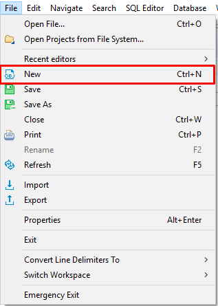
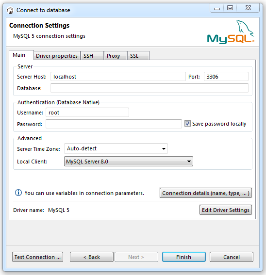
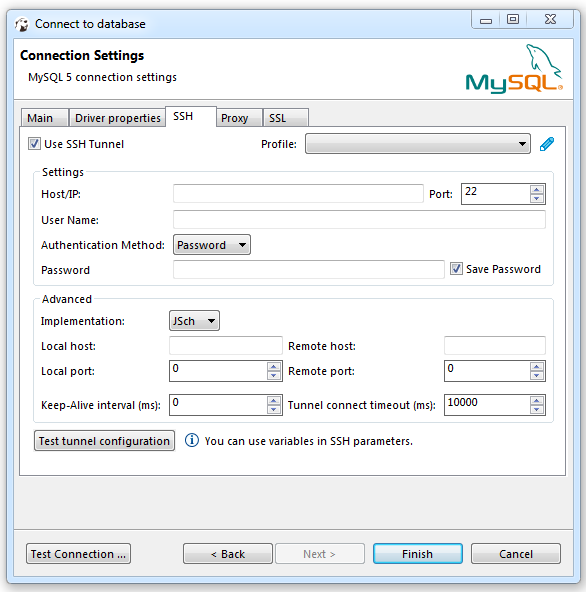
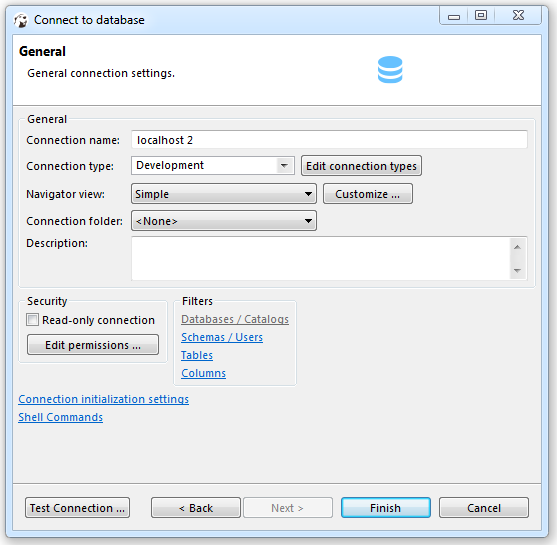

DBeaver provides a wizard that guides you through the steps to create a connection.
If you run DBeaver for the first time (standalone version), the new connection wizard appears automatically.
In other cases, to create a connection, do one of the following:
* Click the **New Connection Wizard** button in the application toolbar or in the Database Navigator view toolbar:

  

* Click **Database -> New Connection** in the menu bar:

  

* Press <kbd>Ctrl+N</kbd> or click **File -> New** in the menu bar:

    
  Then, in the wizard, click **Database connection** and then click **Next**:

  

Then, in the **Create new connection** wizard:
1. Choose a driver for the new connection: click the name of the suitable database type in the gallery. Then click **Next**.
   
     

   To quickly find the needed driver, you can type a hint in the text field above the list of drivers.  
   If you cannot find a driver for your database then probably there is no suitable driver and you need to create one. Please see [Database Drivers](../Database-drivers) article.  

   NOTE: The list of database drivers diaplays the number of exising connections next to each driver. No number is displayed if there are no connections.

If you prefer the classic list view of the available drivers, use the **Classic** button.

 

2. In the Connection Settings screen, on the General tab, set all primary connection settings:

     

   For most drivers required settings include:   
   - Host  
   - Port  
   - Database name  
   - User name and password  

   However, the number and type of connection properties are very dependent on the driver.  
   For example, embedded drivers (such as SQLite, Derby Embedded, HSQLDB, H2 Embedded), unlike remote ones, require only the path to the database. 

3. If necessary, specify advanced settings, see **Advanced Settings** section below, and click **Next**.
4. To test if the connection works, click **Test Connection**.
5. Click **Finish**. The connection appears in the tree of connections in the Database Navigator and DBeaver actually connects to the database.

# Advanced Settings
## Network Settings (SSH, SOCKS, SSL)
If your database cannot be accessed directly, you can use SSH tunnel:

  

If a connection has network settings specified, such a connection appears in the application with a special 'arrow' icon such as this: 

## Connection Details (name, type, etc.)
You can also set the connection name, type and initial settings (such as bootstrap queries, transaction state, global filters, etc.).

 

## Driver Properties
Each driver has its own set of additional properties. Refer to the driver documentation to get information about available properties and their values. 
 
  

# Variables in parameters

You can use variables in all connection parameters and in the driver properties.
Variables are system environment variables or one of the following list:

Name|Value
----|-----
${host}|Host name
${port}|Port number
${database}|Database name
${server}|Server name
${url}|Connection URL
${user}|User name
${password}|User password

Note: option `Use environment variables in connection parameters` must be turned on (see preferences).
