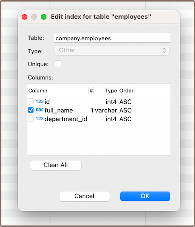
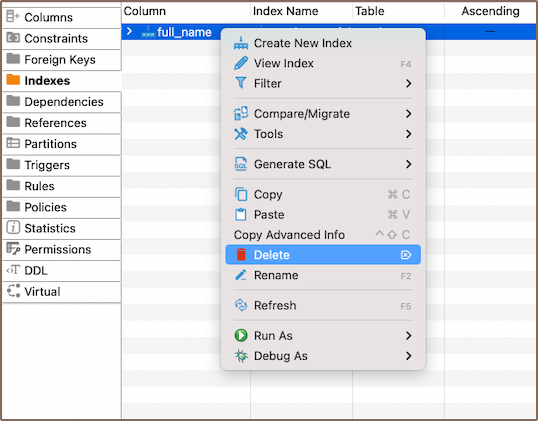

In the process of creating [tables](New-Table-Creation) in a database, an integral part is the creation of indexes. Indexes are tools that can
significantly enhance the performance of your database. They are designed to speed up the retrieval of data from the
tables, making them particularly useful in large databases where without them, searches could be time-consuming.

Indexes work by providing a more direct path to the data, reducing the need for the database to scan the entire table.
They can be created on one or more [columns](Creating-columns) of a table, and when a query is made, the database can use the indexes to
find the data more quickly.

However, while indexes can improve the speed of data retrieval, they can also slow down data modification operations
such as `INSERT`, `UPDATE`, and `DELETE`, as the index must also be updated. Therefore, it's crucial to strike a balance
between the number of indexes and the frequency of data modification in your database.

This article will guide you through the process of creating, modifying, and deleting indexes using the DBeaver. It will
also discuss the restrictions you need to be aware of when working with indexes, such as the impact on performance,
storage considerations, and restrictions related to null values and certain data types.

### Create

1) You can start the process of creating a new index in three ways:
- Using the **[Properties editor](Properties-Editor)**: Open the Properties Editor and navigate to the **Indexes**
   tab of the corresponding table.

   

- Using the **[Database Navigator](Database-Navigator)**: Navigate to the database where the table you want to add a
  index to is located. Find and select the table for which you want to create a new index. Within the
  selected table, you'll find a folder named **Indexes**. 
- Additionally, to create a new index, you can utilize the **Create New Index**
  button  located at the bottom of the **Properties editor**.

2) Depending on the method you chose in step 1, either right-click on the window (in the **Properties Editor**) or within
   the **Foreign Keys** folder (in the **Database Navigator**), and select **Create New Index**. If you're using 
   the third method, simply click the **Create New Index** button. This will open a new window where you'll be able
   to customize the index's settings to suit your needs.  

   

 Field       | Description                                                                                                                                     
-------------|-------------------------------------------------------------------------------------------------------------------------------------------------
 **Unique**  | If set to unique, the index ensures that all entries in the indexed column(s) are distinct. This can limit data entry if values must be unique. 
 **Columns** | This setting allows you to select one or more columns for the index.                                                                            

**Note**: In addition to creating a simple index on a single column, DBeaver also provides the option to create a composite index.
A composite index is an index that is built on several table columns. This type of index can significantly boost query
execution speed when dealing with multiple-column conditions. It's recommended to put unique fields at the end of the
composite index to maximize its efficiency.

3) After you've chosen the column(s) for your index and configured any additional settings, you can finalize the creation
of the index by clicking **OK**. 

#### Saving changes

Once you have configured the index properties, it is essential to save these changes to the database. Until you
commit your modifications, the new index will only exist within DBeaver and will not be added to the actual database
table.
Here are three options for committing the changes:

* Click on **File** -> **Save** -> **Persist**.
* Select the desired table in the **Database Navigator** and press <kbd>Ctrl+S</kbd> (or <kbd>CMD+S</kbd> for Mac OS),
  choose **Persist** to save the changes.
* Utilize the **Save** button  located at the bottom of the
  **Properties editor** and press **Persist** to save the changes.

### Modify

As your database evolves, there might be a need to modify the properties of your indexes. This could involve changing
the indexed columns, adjusting the uniqueness constraint, or renaming the index. DBeaver provides the flexibility to
make these modifications as required. Here's the process:

- **Properties Editor**: Open the Properties Editor by double-clicking on the table name. Within the selected table, you'll find a
  folder named **Indexes**. Right-click on the index you want to modify and select **View Index**.
- **Database Navigator**: In the Database Navigator, select the appropriate database and table. Within the selected table, you'll find a
  folder named **Indexes**. Right-click the index and select **View Index**.
- **Bottom Menu**: In the **Properties Editor** interface, use the **View Indexes**
  button  to open the properties of the selected index in the
  **Editor panel**.

   

### Delete

1) You can delete an index either through the **Properties Editor** or the **Database Navigator**:

- Using the **Properties Editor**: Open the Properties Editor, navigate to the **Indexes** tab of the corresponding table,
  and find the index you want to delete.

   

- Using the **Database Navigator**: Navigate to the database where the table with the index is located. Open the 
  **Indexes** folder, and find the index you want to delete.

2) To delete an index, right-click on the index's name and select **Delete**, or you can select the necessary index and
   press the <kbd>Delete</kbd> key, or **Delete button**  (in the
   **Bottom Menu** of the **Properties Editor**).
3) A confirmation dialog will appear, asking you to confirm the deletion. Before proceeding, ensure that you've selected
   the correct index for deletion.
4) After confirming the deletion, you'll need to persist the changes to apply them to the database.

### Restrictions

* Unique indexes created due to a primary key or unique constraint can't be deleted. Instead, remove the constraint.
  This action removes the uniqueness requirement for column values involved in the constraint expression and deletes the
  corresponding unique index.
* **Unique Indexes**: These enforce uniqueness on the indexed column(s), which can limit data entry if values must be
  distinct.
* **Performance Impact**: Indexes can improve query speed, but they slow down data modification operations (INSERT, UPDATE,
  DELETE) as the index must also be updated.
* **Storage**: Indexes consume disk space. This might become significant if there are many indexes or the table is large.
* **Null Values**: Depending on the database system, there may be restrictions related to indexing null values.
* **Data Types**: Certain data types might not be indexable or may require specific index types.

    
**Further Reading:** 
[New Table Creation](New-Table-Creation) | [Creating columns](Creating-columns) | [Implementing Constraints](Implementing-Constraints) | [Utilizing foreign keys](Utilizing-Foreign-Keys) | Creating indexes | [Incorporating triggers](Incorporating-Triggers)