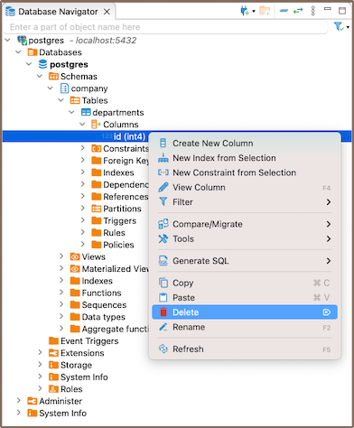

As you delve deeper into the intricacies of table structures, understanding columns and their functionalities becomes
crucial. In DBeaver, columns are fundamental components of tables, which in turn are housed within databases. Before you
can create columns, you must first establish a [database](Connect-to-Database) and a [table](New-Table-Creation).

Columns in DBeaver are versatile and customizable. You can create new columns, modify their settings, and even delete
them when necessary. Each column in a table has a specific data type, dictating the kind of data it can store. You can also enforce rules on columns such as nullability, unique constraints, check constraints, and default values. These rules are essential to maintain data integrity, accuracy, and reliability in your database.

Beyond these basic operations, you can perform more advanced tasks with columns. You can rename columns, change
their data types, adjust permissions, and add comments. All databases may not support some of these operations,
so it's essential to be aware of the specific capabilities of your database system.

This guide will walk you through the process of creating, modifying, and deleting columns, as well as customizing their settings to suit your needs. 

### Create

Creating a new column in DBeaver involves a series of steps that guide you through the process. Here's how you can do it:

1) Go to the **Columns** tab in the **[Properties editor](Properties-Editor)**, right-click on the pane of the object's
   sub-entities, and select **Create New Column** from the context menu.

     

- Also you can also add a new column by expanding the table view in the **[Database Navigator](Database-Navigator)** and
  selecting **Create New Column**.

     

- Another method to create a new column is by utilizing the **Create New Column**
  button  located at the bottom of the **[Editor panel](Data-Editor)**.  

2) When creating a new column, you'll be presented with the **Edit Attribute** window. Here, you can customize the
   column's settings to suit your needs. You can adjust the **Name**, **Data type**, **Identity**, **Collation**,
   **Not null**, **Default**, and add a **Comment** as needed.

     

 Field         | Description                                                                                                             
---------------|-------------------------------------------------------------------------------------------------------------------------
 Name          | Specify the name of the column.                                                                                         
 Data type     | Select the type of data the column will store.                                                                          
 Identity      | Set the column as an identity column, which will auto-increment its value with each   new row.                       
 Collation     | Set the collation for the column, which determines how data in the column is sorted   and compared.                  
 Not null      | Enforce that the column must always contain a value.                                                                    
 Default value | Set a default value for the column, which will be used when no value is specified for   the column during insertion. 
 Comment       | Add a comment for the column, which can be helpful for documentation purposes.                                           

#### Saving changes

Saving a column in DBeaver is an essential and simple operation. After you've configured the column properties, it's
vital to persist these changes to the database. Until you save your modifications, your new column only exists within DBeaver and hasn't been added to the actual database table. Here are the three options for committing the changes:

* Click on **File** -> **Save** -> **Persist**.
* Select the desired table in the **Database Navigator** and press <kbd>Ctrl+S</kbd> (or <kbd>CMD+S</kbd> for Mac OS),
  choose **Persist** to save the changes.
* Utilize the **Save** button  located at the bottom of the
  **[Editor panel](Data-Editor)** and press **Persist** to save the changes.

### Modify

As your database evolves and your needs change, you may find it necessary to modify the properties of your columns.
Whether it's renaming a column, changing its data type, adjusting its nullability, or updating its permissions, DBeaver
provides you with the flexibility to adapt your columns to your changing requirements.

Modifying columns is a crucial aspect of database management, allowing you to ensure that your columns continue to serve their intended purpose effectively.

Here's how you can modify a column in DBeaver:

* Via the **Properties Editor**: You can double-click on the table name to open the **Properties Editor**. In this window,
you can see all the columns of the table. Right-click on the column you want to modify and select **View Column**.

* Via the **Database Navigator**: Go to the **Database Navigator** menu, and choose the proper database and column to modify its
settings. Right-click the column and select **View Column**.

* Via the **Bottom Menu**: In the bottom menu of the **Properties Editor** interface, there is a **View Column** button .
  Clicking this button will open the properties of the currently selected column in the **Editor panel**, allowing you to modify its settings.

**Note:** Not all databases support all types of column modifications, so always check the specific capabilities of
your database system.

### Delete

1) You can delete a column either through the **Properties Editor** or the **Database Navigator**:

- Using the **Properties Editor**: Open the Properties Editor, navigate to the **Constraints** tab of the corresponding table,
  and find the column you want to delete.

- Using the **Database Navigator**: Navigate to the database where the table with the column is located. Find and select
  the table, open the **Columns** folder, and find the column you want to delete.

2) To delete a column, right-click on the column's name and select **Delete**, or you can select the necessary column
   and press the <kbd>Delete</kbd> key, or **Delete button**  (in the **Bottom Menu** of the **Properties Editor**).

3) A confirmation dialog will appear, asking you to confirm the deletion. Before proceeding, ensure that you've selected
   the correct column for deletion. 

4) After confirming the deletion, you'll need to persist the changes to apply them to the database.

Once a column is deleted, all the data stored in that column will be lost. Furthermore, there are several restrictions
and considerations to keep in mind when deleting columns:

 Limitations               | Description                                                                                                                                                                                                                                                                          
---------------------------|--------------------------------------------------------------------------------------------------------------------------------------------------------------------------------------------------------------------------------------------------------------------------------------
 **Data Loss**             | As mentioned, deleting a column will permanently remove all data stored in that column. Make sure to back up any important data before proceeding with the deletion.                                                                                                                 
 **Primary Key Columns**   | If the column you want to delete is a primary key column, you must first remove its primary key constraint within the table properties. Primary key columns are used to identify each row in the table uniquely, and deleting them without removing the constraint can cause issues. 
 **Referential Integrity** | If the column you want to delete is referenced by other tables in the database (i.e., it's a foreign key), you may not be able to delete the column without first deleting or modifying the referencing tables. This is to maintain referential integrity in the database.           
 **Database Support**      | Not all databases support the ability to delete columns. Always check the specific capabilities of your database system.                                                                                                                                                             

### Restrictions

When working with columns in DBeaver, it's important to understand the various restrictions that can be applied to them.
These restrictions are not limitations but rather rules that help ensure the integrity, accuracy, and reliability of
the data stored in your database. They dictate what data can be stored in a column, how it's treated, and how it
interacts with other data in the database. Let's take a closer look at these restrictions:

* **Data Type**: Each column in a table has a specific data type. The type of data that can be stored in a column is
  dictated by its data type.
* **Nullability**: By default, columns can hold **NULL**. However, by specifying **NOT NULL** during column creation, you can
  enforce that every row must contain a value for that column.
* **Unique Constraint**: A unique constraint ensures that all values in a column are distinct. Duplicate entries are not permitted.
* **Check Constraint**: A check constraint enables you to specify a condition on a column.  Every value added to the
  the column must satisfy this condition.
* **Default Value**: A column can be given a default value. If no value is specified during data insertion, the column uses
  the default.

    
**Further Reading:** 
[New Table Creation](New-Table-Creation) | Creating columns | [Implementing constraints](Implementing-Constraints) | [Utilizing foreign keys](Utilizing-Foreign-Keys) | [Creating indexes](Creating-Indexes) | [Incorporating triggers](Incorporating-Triggers)
