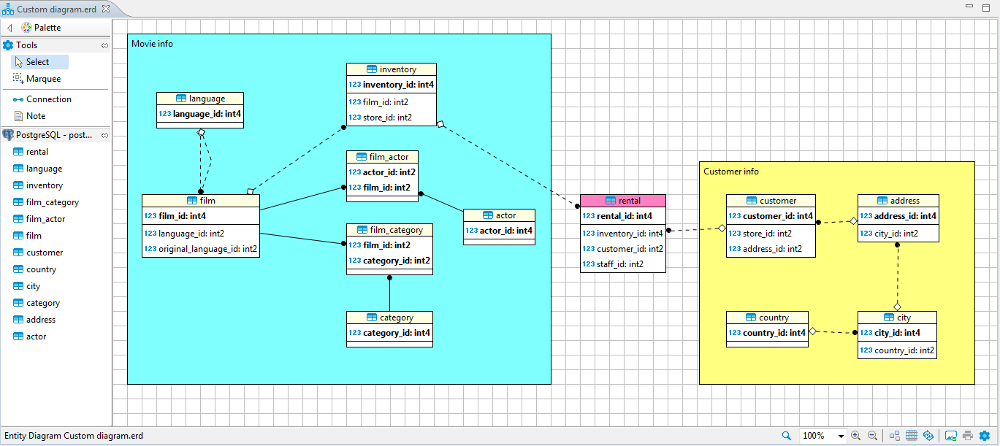
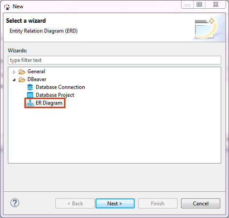
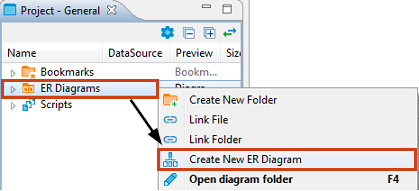
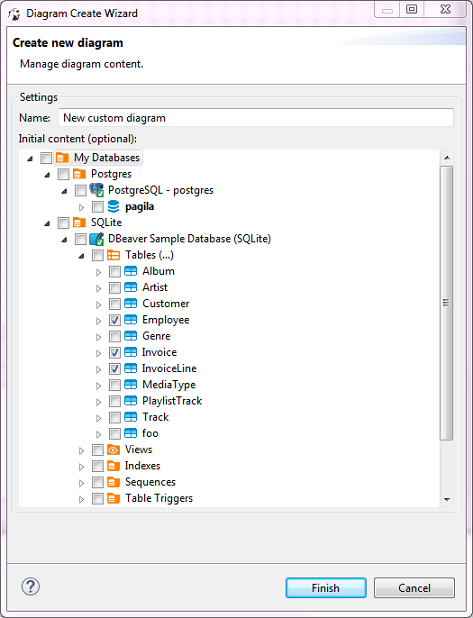

You can create custom ER diagrams that can contain any tables, relations and notes.  
However, even custom diagrams may contain only real existing database entities (tables). 

You can create a custom diagram in one of the ways:
1. On the DBeaver main menu, click **File -> New**. Then in the new diagram wizard, click **DBeaver -> ER Diagram**, and then **Next**:  

     
   
2. In the [Project Explorer](Project-Explorer) view, right-click the **ER Diagrams** node and then click **Create New ER Diagram** on the context menu.

   

In both cases, in the Diagram Create Wizard, specify the diagram name and (optional) choose the initial diagram contents (set of tables):  

The new diagram appears in a separate editor. Now you can drag-n-drop any number of tables into it. You can add tables from different connections as well as from different database types (for example, combine Oracle and MySQL tables in one and the same diagram).

You can also add notes and custom relations (associations) using the ERD palette on the left side of diagram tab - see details in the [ER Diagrams](ER-Diagrams) article. For example, to create a diagram similar to the one shown at the beginning of this article, you need to:

1. Add required tables and relationships between them and move them around to create a well-shaped structure (see _Structure Adjustment_ section of the [ER Diagrams](ER-Diagrams) article).
2. Add notes (see the _Notes_ section of the [ER Diagrams](ER-Diagrams) article).
3. Stretch the notes to cover the intended tables, then send the notes to the back, and then set a color to the tables and notes (see the _View Adjustment_ section of the [ER Diagrams](ER-Diagrams) article).

Undo/redo functions are fully supported in diagram editing.
