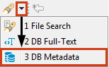
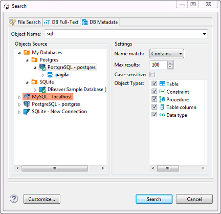
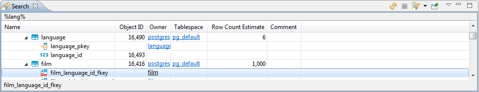

To search for database metadata, click the arrow next to the **Search** button in the main toolbar and then click **DB Metadata Search** on the dropdown menu:

 
Alternatively, you can click the **Search** button on the main menu and then click the **DB Metadata** tab in the Search window:

 
Now you need to choose the database connection against which to run the search. You only need to select the database connection(s) in the **Objects Source** field.  
In the **Object Types** field, you can select the database objects among which DBeaver will run the metadata search – select or clear the checkboxes.  
You can specify if the metadata should start with, contain or be similar to the search combination (**Name match** field). You can also set the maximum number of results to display (**Max results** field) and apply **Case-sensitive** search.

After you click **Search**, the results will open in a [Search](Search) view:

Double-clicking a row in the Search view opens the respective object in a dedicated [Database Object editor](Database-Object-Editor).
