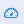
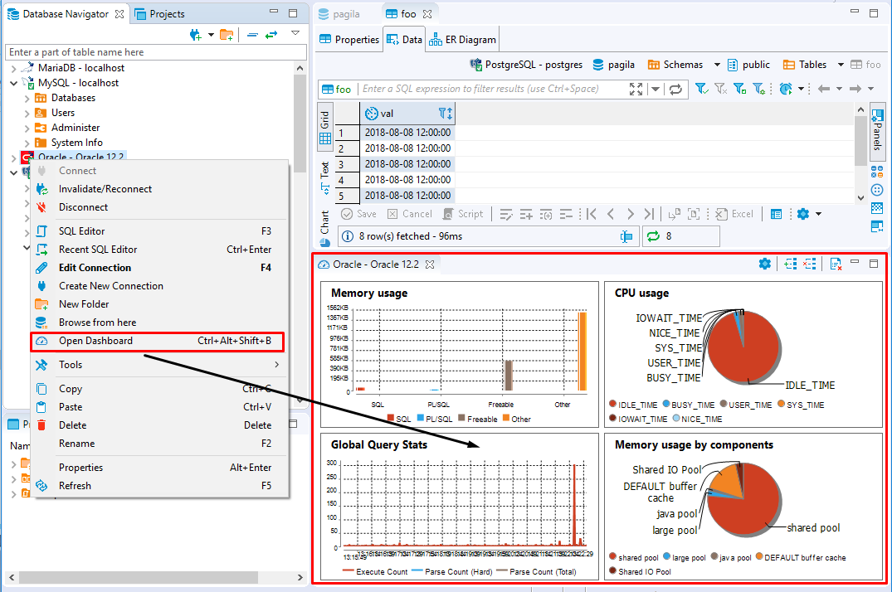
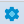
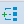
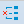
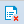

**Dashboards** tool allows DBAs and programmers to quickly identify performance, disk space issues, number of connections and other important KPIs associated with a single database connection. To learn more about database connections, see Database Connections. 

By default, DBeaver is delivered with a number of predefined sets of dashboards for such data bases as PostgreSQL, MySQL, Oracle and Exasol. Custom dashboards are also supported. To learn more about custom dashboards, see Creating a New Dashboard section below.

# Managing Dashboards Panel

Dashboard panel is a collection of real-time dashboards, that is dashboards that are continuously updated. 
Dashboards displayed on the dashboard panel are actually a combination of continiously run SQL SELECT queries and charts continiously built on the data fetched.

## Opening Dashboard Panel

To open Dashboard panel click the **Open Dashboard** button  in the main toolbar. The default configuration of the dashboard panel for the current database connection will appear. To learn more about database connections, see [Database Connections](https://github.com/dbeaver/dbeaver/wiki/Database-Connections).

You can also right-click a connection name in the **Database Navigator** editor and select **Open Dashboard** menu option or use keyboard shortcut <kbd>Ctrl</kbd>+<kbd>Alt</kbd>+<kbd>Shift</kbd>+<kbd>B</kbd> and the dashboards panel will be opened. 

The following controls are available in the dashboard panel toolbar:

Icon|Name|Description
----|-----|-----
|Settings|Allows managing dashboards' configuration.
|Add dashboard| Allows to add dashboards to the dashboard panel.
|Remove dashboard| Allows to remove dashboards from the dashboard panel.
|Reset dashboards| Allows to restart dashboard calculation.

## Adding Dashboards 

To add a dashboard to the Dashboard panel press button **Add dashboard**  in the dashboard panel's toolbar and choose one of the dashboards from the list of available dashboards. 

**Note** Different databases have different sets of predefined dashboards. DBeaver is delivered with sets of predefined dashboards for such databases as Postgress SQL, MySQL, Oracle, and Exasol. It is also possible to create new custom dashboards, for more details see Creating New Dashboards.

You can also add a dashboard by right-click in any place of the dashboard panel and then select the **Add dashboard** menu option.

## Removing Dashboards

To remove a dashboard from the Dashboard panel, click on the dashboard you want to remove and press the button **Remove dashboard**  in the dashboard panel toolbar  or select **Remove dashboard** option in the dashboard's context menu.

## Resetting Dashboards

If you want to restart dashboard calculation you can reset it.

You can reset all dashboards displayed in the dashboard panel by a single click on the **Reset dashboards**   button in the dashboard panel toolbar.

To reset a particular dashboard right-click on it and select **Reset dashboards** menu option or left click a dashboard and press the **Reset dashboards** button in the dashboard panel toolbar.

## Changing Dashboard Representation

To adjust dashboard representation settings right click on a dashboard and select the **Settings** menu option, and in the opened dialog change the required parameters. 

The following dashboard representation parameters can be adjusted:

Parameter|Description
----|-----
Name|Defines a name of a dashboard.
Description| Defines dashboard description.
Update periods(ms)| Defines how often data should be fetched from the database. The default value is 1000 ms. 
Maximum items|Defines maximum number of fetched items. The default value is 300.
View| Defines vsual representation of the dashboard. The following options are available: Bar, Pie, Time series.
Show legend| If this check-box is selected, the legend is displayed on the dashboard.
Show grid| If this check-box is selected, the grid is displayed on the dashboard.
Show domain axis| If this check-box is selected, the domain axis is displayed. 
Show range axis|If this check-box is selected, the range axis is displayed. 

## Adjusting Dashboard Configuration

To adjust dashboard configuration right-click on a dashboard and select the **Settings** menu option, in the opened dialog box press the **Configuration** button. 

The following dashboard parameters can be configured:

Parameter|Description
----|-----
ID| Defines dashboard's ID. Make sure that ID has numeric values in it.
Name|Defines dasboard's name.
Database|Defines the database driver. To learn moe about database drivers, see Database Drivers.
Data type|Defines the data type. The following options are availabe: timerseries (the default option) and statistics. Select timeseries type if you want to track the current state of the server. Select statistics type if your dashboard will show historical data.
Calc type|Defines how the data should be calculated. The following options are available: value (the default option) and delta. Select value if you're interested in the current value. Select delta if you want to track the difference between the current value and the previous one. This may be very useful when you work with statistics data, for example.
Value type|Defines the value to be shown on the range domain. The following options are available: decimal (the default option), integer, percent, bytes. Choose the value type in accordance with your data, for example, memory usage is convinient to be tracked in KBytes.
Interval|Defines time interval to be shown on the domain axis. The following time intervals are available: millicecond(the default option), second, minute, hour, day, week, month, year.
Fetch type|Defines whether the query should fetch data from rows or columns.
Description| Defines the description of a dashboard. Use this field to make it easy to understand what kind of information the dashboard represents.
Queries|Defines an SQL query whose fetched data will be used to build the chart displayed on the dashboard.
Default view|Defines the default visual representation of a dashboard on the dashboard panel. The following options are available: Bar, Pie, Time series(the default option).
Update period(ms)|Defines how often the dashboard's rendering should be updated.
Maximum items| Defines maximum number of items to be fetched for the dashboard.

**Note** Predefined dashboards are read-only and cannot be re-configured, but you can copy them and use as templates to create new dashboards with any query you want. To learn about creating new dashboards, see Creating New Dashboards section. 

## Detaching Dashboards 

If you have several monitors and would like to place a dashboard into a separate screen, you can either detach the whole dashboard panel or a single dashboard and drag-and-drop it to any place you want.

To detach the whole dashboard panel right click on the dashboard's tab name and select the **Detach**menu option.

To detach a single dashboard make a double left click over it. You can also right click the dashboard and choose the View Dashboard option in the context menu opened.

## Changing Dashboard View

You can change representation of a dashboard and view it as a Pie, Bar or Time series. To change the view of a dashboard, right click on it and select option **View as** menu option and select the view you prefer.

## Copying Dashboards to Clipboard 

To copy a dashboard into the clipboard, right click on the dashboard and use *Copy to Clipboard* menu option.

## Saving Dashboards

If you want to save a screenshot of a dashboard locally in PNG format, right click on it and select the **Save as ...** option in the context menu displayed. 

## Printing Dashboards

If you want to print out a screenshot of a dashboard, right-click the dashboard to be printed and select the **Print…** option.

                                                                                                                                                                                                                          
## Zooming 

For Time series and Bar dashboard representation the following zooming options are available in the dashboard's context menu:

* Zoom In
* Zoom Out
* Zoom Reset

# Managing Dashboards 

## Creating Dashboards

To create a dashboard from scratch

To create a dashboard from template

## Deleting Dashboards

