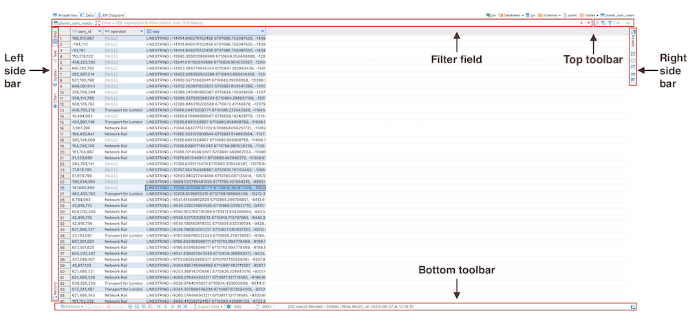
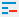

The Data editor appears:
* as the **Data** tab of the [Database Object Editor](Database-Object-Editor), which is only available for tables and views;
* as the **Results** tab when you run a custom SQL query in [SQL Editor](SQL-Editor).

The Data editor allows to view and edit data of a database table or view.
The central part of the Data editor is the data grid. The editor also provides [top toolbar](#top-toolbar), [bottom toolbar](#bottom-toolbar), [left side bar](#left-side-bar), [right side bar](#right-side-bar) and a filter field:

To learn how many rows the table data contains, click the **Calculate total row count** button in the bottom toolbar.
The number of rows appears in a status field next to the button: 

To learn about ways to navigate data in the data table, see [Navigation](Navigation) article.

### Top toolbar
The top toolbar contains the following buttons:

 Button                                                     | Name                                               | Description                                                                                                                                                                                                                                                               
------------------------------------------------------------|----------------------------------------------------|---------------------------------------------------------------------------------------------------------------------------------------------------------------------------------------------------------------------------------------------------------------------------
             | **Remove all filters/orderings**                   | Removes all filters and orderings applied to the data in the filter field.                                                                                                                                                                                                                    
  | **Save filter settings for current object**        | Saves the current filter settings for the database object to apply next time when you reopen it in the editor, see details in the [Data Filters](Data-Filters) article.                                                                                                   
                            | **Custom Filters**                                 | Opens the Result Set Order/Filter Settings window, see [Data Filters](Data-Filters) article for more information.                                                                                                                                                         
                       | Forward and backward -  history navigation buttons | Navigate forward and backward in the Data Editor history, see the [history section](Navigation#history) of our article for more information. 

### Left side bar
The left side bar contains the following tabs:

 Button                            | Name        | Description                                                                                                                                                                                                                                               
-----------------------------------|-------------|--------------------------------------------------------------------------------------------------------------------------------------------------------------------------------------------------------------------------------------------------------------------------
     | **Grid**    | Switches to grid view of data.                                                                                                                                                                                                                                           
     | **Text**    | Switches to plain text view of data.                                                                                                                                                                                                                                     
  | **Spatial** | Switches to spatial view. For more details, see the [GIS data](Working-with-Spatial-GIS-data) article.                                                                                                                                                                   
    | **Chart**   | Switches to chart view. For more details on charts, see the [Managing Charts](Managing-Charts) article.                                                                                                                                                                  
   | **Record**  | - Same as pressing <kbd>Tab</kbd> - Switches the positions of rows and columns so that the columns appear as rows, and the rows hide in one **Value** column, see details in the [Table vs. Record Views section](Data-View-and-Format#table-vs-record-views) of our article. 

### Right side bar
The right side bar contains the following tabs (see the [Panels](Panels) for more information):

 Button                               | Name           | Description                                                     
--------------------------------------|----------------|-----------------------------------------------------------------
      | **Panels**     | Opens panels on the right side of the Data Editor.              
        | **Calc**       | Opens the result cells calculation panel (SUM, MAX, AVG, etc.). 
    | **Grouping**   | Opens grouping panel window tools.                              
    | **Metadata**   | Opens Metadata panel.                                           
  | **References** | Opens References panel.                                         
       | **Value**      | Opens Value Viewer.                                             

### Bottom toolbar
The bottom toolbar provides the following buttons:

 Button                                               | Name                                          | Description                                                                                                                                                                                              
------------------------------------------------------|-----------------------------------------------|----------------------------------------------------------------------------------------------------------------------------------------------------------------------------------------------------------
                     | **Refresh**                                   | Refreshes the whole results set including all items that are not visible on the screen, while its dropdown option allows for customizing the refresh frequency over a specific period.                   
            | **Save**                                      | Saves all unsaved changes to the data such as adding, duplicating, deleting rows, inline editing of values, see [the Data Viewing and Editing](Data-Viewing-and-Editing) article for information.        
          | **Cancel**                                    | Discards all unsaved changes to the data.                                                                                                                                                                
             | **Edit cell value in separate dialog/editor** | Opens the cell in focus for editing in a separate editor or dialog box, see details in the [Cell Editor section](Data-Viewing-and-Editing#cell-editor) of our article.                                   
                 | **Add new row**                               | Adds a new empty row below the current row, see details in the _Adding, Copying and Deleting Rows_ section of the [Data Viewing and Editing](Data-Viewing-and-Editing) article.                          
       | **Duplicate current row**                     | Copies the current rows and pastes the copy below the current row, see details in [Adding, Copying and Deleting Rows section](Data-Viewing-and-Editing#adding-copying-and-deleting-rows) of our article. 
          | **Delete current row**                        | Colors the rows in focus in red to mark them for deletion, see details in the [Adding, Copying and Deleting Rows section](Data-Viewing-and-Editing#adding-copying-and-deleting-rows) of our article.     
           | **Move to first row**                         | Moves the focus (highlighting) from the current to the first row of the table.                                                                                                                           
        | **Move to previous row**                      | Moves the focus (highlighting) from the current to the previous row of the table.                                                                                                                        
            | **Move to next row**                          | Moves the focus (highlighting) from the current to the next row of the table.                                                                                                                            
            | **Move to last row**                          | Moves the focus (highlighting) from the current to the last row of the table.                                                                                                                            
              | **Fetch all data**                            | Fetches the whole result set making it ready for display, see the _Scrolling Results Page_ section of the [Navigation](Navigation) article for more information.                                         
  | **Configure**                                 | Opens a dropdown menu with settings.                                                                                                                                                                     
                  | **Result-set fetch size**                     | Displays the selected number of rows in the result-set, which can be updated by clicking the <kbd>Refresh</kbd> button.                                                                                  
        | **Calculate total row count**                 | Calculates the total number of rows in the table.                                                                                                                                                        

**Note**: Some of these buttons may be disabled and may not work if you are using a read-only connection, connecting to
a read-only database or if you see the result of a complex query, such as joining two or more tables.

### Column context menu
Each column has a context menu, accessed by clicking the downward arrow button , providing different filter options.

### Cell context menu
Every cell in the data table also has a context menu – right-click the cell to open the menu. The context menu provides the
following items:

 Menu Item                | Description                                                                                                                                                                                                                                                                                                                                                                                                                                        
--------------------------|----------------------------------------------------------------------------------------------------------------------------------------------------------------------------------------------------------------------------------------------------------------------------------------------------------------------------------------------------------------------------------------------------------------------------------------------------
 **Copy**                 | Copies the content of the current cell or column to the clipboard.                                                                                                                                                                                                                                                                                                                                                                                 
 **Advanced Copy**        | Opens advanced copy submenu that allows copying data with preset formatting parameters.                                                                                                                                                                                                                                                                                                                                                            
 **Paste**                | Pastes the copied content to the cells in focus.                                                                                                                                                                                                                                                                                                                                                                                                   
 **Advanced Paste**       | Pastes several values delimited with a tabulation or line break.                                                                                                                                                                                                                                                                                                                                                                                   
 **Delete**               | Deletes the row that has the cell in focus  NOTE: In fact, when users click **Delete**, the system only highlights the red row while the actual deletion happens when users click **Save**.                                                                                                                                                                                                                                                    
 **Edit**                 | Opens a submenu enabling inline editing, see the [Data Viewing and Editing](Data-Viewing-and-Editing) article.                                                                                                                                                                                                                                                                                                                                     
 **Order**                | Displays a submenu that allows selecting ordering criteria for the data. The submenu contains the most common ordering options that can be applied to the column in focus – see details in [Data Filters](Data-Filters) article. By default, DBeaver orders data by sending a request to the server (the Server-side results ordering checkbox selected). To order data on the client side using DBeaver's internal algorithm, clear the checkbox. 
 **Filter**               | Displays a submenu that allows selecting filter criteria for the data. The submenu contains the most common filters that can be applied to the cell in focus – see details in [Data Filters](Data-Filters) article. By default, DBeaver filters data by sending a request to the server (the Server-side results ordering checkbox selected). To filter data on the client side using DBeaver's internal algorithm, clear the checkbox.            
 **View/Format**          | Opens a submenu that provides tools for formatting and modifying the view of data, see the [Data View and Format](Data-Filters) article.                                                                                                                                                                                                                                                                                                           
 **Navigate**             | Opens a submenu that helps users navigate throughout the data table, see the [Navigation](Navigation) article.                                                                                                                                                                                                                                                                                                                                     
 **Layout**               | Changes the layout of data, see the [Data View and Format](Data-View-and-Format#table-vs-record-views) article.                                                                                                                                                                                                                                                                                                                                    
 **Export data**          | Opens the Data Transfer wizard that guides you through the steps to select a format and export data, see the [Data Tansfer](Data-Transfer) article. **Note**: The system exports the whole result set including records that are not visible on the screen and preserves all applied data filters and ordering.                                                                                                                                
 **Generate SQL**         | Opens a submenu on which you can select the type of SQL query to generate, see the [SQL Generation](SQL-Generation) article.                                                                                                                                                                                                                                                                                                                       
 **Generate Mock Data**   | Opens Mock Data Generator, see the [Mock Data Generation in DBeaver](Mock-Data-Generation-in-DBeaver) article.                                                                                                                                                                                                                                                                                                                                     
 **Logical structure**    | Opens a submenu allowing you to write virtual column expressions, see our [article](Virtual-column-expressions).                                                                                                                                                                                                                                                                                                                                   
 **Open with**            | Opens the data in external applications like Excel or a web browser.                                                                                                                                                                                                                                                                                                                                                                               
 **Toggle result pannel** | Opens Value Viewer panel on the right side of the Data Editor.                                                                                                                                                                                                                                                                                                                                                                                     
 **Refresh**              | Refreshes the whole results set including all items that are not visible on the screen.                                                                                                                                                                                                                                                                                                                                                            

For more information about using the Data Editor, please see the subsections of this article - open them via the contents tree on the right.
