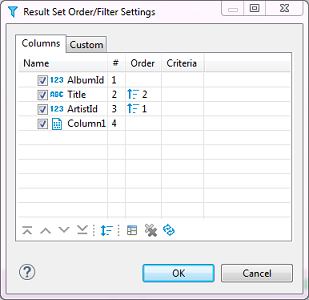

The main tool for managing the appearance of the data table is the Result Set Order/Filter Settings window.

To open this window, click the Custom Filters button () in the top toolbar of the editor or click the Configure button () and then click **Order/Filter** on the dropdown menu.

The Result Set Order/Filter Settings window provides tools to:
* Order data inside columns
* Manage the display of columns in the table
* Manage the order of columns in the table
* Filter data in the table using an SQL expression

Another tool for managing the data appearance is the column headers. In the data table, every column header contains three elements which each has its own function: Data (column) type icon, column name, filter icon, and ordering icon.

* By simply clicking the column name or column type, the icon highlights the whole column.
* You can click the column type icon and then drag and drop the column to a different position in the table.
* You can click the column name and then drag the cursor to the right or left to highlight multiple columns. 
* Clicking the ordering icon allows you to order the data in the column in ascending or descending order - see the 'Ordering Data in Columns' section, further in this article
* Clicking the filter icon allows you to filter filter the data by a cell value, see [TBA]

## Ordering Data in Columns
You can order data in columns in one of the following ways:
1. Click the ordering icon  () in the header of the column.

     

   The icon has three states:  
   * Clicking once establishes ascending order () 
   * Clicking a second time changes the order to descending ()  
   * Clicking a third time removes the ordering from the column ()  

To order data by several columns, go column by column, setting the order with the Ordering icon, starting from the column by which you want to order data first.
  
2. Click the Custom Filters button () in the top toolbar of the editor to open the Result Set Order/Filter Settings window (see above):

   a) Next to the column by which you want to order data in the first turn, set the ascending or descending order using the same three-state principle as described above.  
   b) Set the ordering in other columns by which you want to sort the data in the second, third, etc. turn. The **Order** column indicates the order in which the sorting will happen.  
   NOTE: The number (**#**) column indicates the initial order of columns.  
     
   c) To easily move the ordering setting from column to column, you can use the Move up/down/to top/to bottom/ buttons:    

To reset the data ordering to its initial state, click the Reset button () in the same window.

Also, to remove all ordering settings, click the Remove All Filters/Orderings button () in the top toolbar of the Data Editor.

## Managing Display of Columns in Data Table

To hide a single column, right-click the column or any cell in it and click **View/Format -> Hide column** on the context menu. To unhide a hidden column, open the Result Set Order/Filter Settings window (see the image at the beginning of this article) and select the checkbox next to the column name or click the Reset button ().

To display or hide columns in the data table, in the Result Set Order/Filter Settings window:
1. Select the checkboxes next to the columns that you want to see in the table and clear the checkboxes next to those that you want to hide.

     

2. Use the Show All ()  and Show None () buttons at the bottom of the window.

## Sorting Columns in Data Table

You can modify the order of columns in the data table in two ways:
1.	Click the icon in the column header and drag-and-drop the column to a new position.
2.	To sort the column alphabetically, in the Result Set Order/Filter Settings window (open by clicking the Custom Filters button () in the top toolbar of the editor), click the Sort button ()
3.	In the Result Set Order/Filter Settings window, click the column to set the focus to it and then move it using the navigation buttons: ()

## Inline filters

You can apply custom filters to any table contents or query results. There are several ways in which you can filter data in the table.

One of the ways is to use the filter field above the table next to the top toolbar. To filter data, enter an SQL expression into the field and click the Apply filter criteria button () next to the field or press <kbd>Enter</kbd>.

 
You can apply ready-to-use SQL expressions or SQL expression templates via the context menu. To select a ready SQL expression or a template, press <kbd>F11</kbd> or right-click the cell, then click **Order/Filter** on the context menu and then click one of the expressions.

 
The third way is to filter data by a cell value using the filter icon in the column header. To filter data this way, click the filter icon in the column header and then double-click the cell value in the Filter by column value dialog box:

The data updates dynamically. To remove a filter, click the Remove All Filters/Orderings button () in the top toolbar of the editor.

You can save the current filter settings for the database object to apply next time when you reopen it in the editor. To save the current filter settings, click the Save filter settings for current object button () in the top toolbar.
