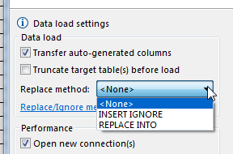
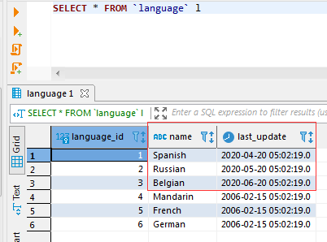

## Data Import and Replace.
Sometimes there are situations when you want to ignore the current primary key value when importing into a table.
Some databases have syntax constructs in addition to the INSERT INTO that may help.

The choice of the replacement method is in the import settings - in "Data load settings". 
 


By default, the selection is `<None`>, you can select other options from the drop-down list. 
The options available depend on the target database you are importing to.
  


The database can only support the replace method or only the ignore method. In this case, the list of methods will consist of only one item except `<None`>. If the base does not support replacement methods or we have not added an implementation yet, then the combo with the list will be disabled.

Further you will find a list of databases supporting these methods and examples of syntax.

Let's take a look at an example of how this works. We use a simple small slightly modified Sakila (MySQL) table - sakila.language  

```sql 
CREATE TABLE language_insert (
language_id tinyint unsigned NOT NULL,
name char(20) NOT NULL,
last_update timestamp NOT NULL,
PRIMARY KEY (language_id)
); 
```

```sql 
INSERT INTO sakila.language_insert (language_id,name,last_update) VALUES
(1,'English','2006-02-15 05:02:19.0'),
(2,'Italian','2006-02-15 05:02:19.0'),
(3,'Japanese','2006-02-15 05:02:19.0'); 
```

If we try to execute this request twice, then the second time we get the following error: SQL Error [1062] [23000]: Duplicate entry '1' for key 'language_insert.PRIMARY' (This message may look different in other databases).

Let's take a new .csv file with the following content and try to use replace methods

```sql
"language_id","name","last_update"
1,Spanish,"2020-04-20 05:02:19.0"
2,Russian,"2020-05-20 05:02:19.0"
3,Belgian,"2020-06-20 05:02:19.0"
4,Mandarin,"2006-02-15 05:02:19.0"
5,French,"2006-02-15 05:02:19.0"
6,German,"2006-02-15 05:02:19.0"
```

If we set the "INSERT IGNORE" method in the settings, the result of the insert will look like this: 
 


There will be no insertion errors, the first three lines will not change, and the fourth to sixth lines will be added to the table.

If we set the "REPLACE INTO" method in the settings, the result of the insert will look like this: 
 


There will be no insertion errors, the first three lines will be replaced and the fourth to sixth lines will be added to the table.

## Which databases support replace/insert methods?

### MySQL
<a href="https://dev.mysql.com/doc/refman/8.0/en/insert.html">INSERT IGNORE</a> and <a href="https://dev.mysql.com/doc/refman/8.0/en/replace.html">REPLACE INTO</a>

Insert examples:

"INSERT IGNORE"
```sql
INSERT IGNORE INTO language_insert(language_id, name, last_update) 
VALUES(1, 'English', '2006-02-15 05:02:19.0');
```

"REPLACE INTO"
```sql
REPLACE INTO language_insert(language_id, name, last_update) 
VALUES(1, 'English', '2006-02-15 05:02:19.0');
```

### SQLite
<a href="https://sqlite.org/lang_insert.html">Documentation</a>
<br> "INSERT OR IGNORE" and "INSERT OR REPLACE"

Insert examples:

"INSERT OR IGNORE"
```sql
INSERT OR IGNORE INTO language_insert(language_id, name, last_update) 
VALUES(1, 'English', '2006-02-15 05:02:19.0');
```

"INSERT OR REPLACE"
```sql
INSERT OR REPLACE INTO language_insert(language_id, name, last_update) 
VALUES(1, 'English', '2006-02-15 05:02:19.0');
```


### PostgreSQL
Available for <a href="https://www.postgresql.org/docs/9.5/sql-insert.html">PostgreSQL version 9.5</a>.
<br/> "ON CONFLICT DO NOTHING" and "ON CONFLICT DO UPDATE SET"

Insert examples:

"ON CONFLICT DO NOTHING"
```sql
INSERT INTO language_insert(language_id, name, last_update) 
VALUES(1, 'English', '2006-02-15 05:02:19.0') ON CONFLICT DO NOTHING;
```

"ON CONFLICT DO UPDATE SET"
```sql
INSERT INTO language_insert(language_id, name, last_update) 
VALUES(1, 'English', '2006-02-15 05:02:19.0') 
ON CONFLICT (language_id) 
DO UPDATE SET (language_id, name, last_update) = (EXCLUDED.language_id, EXCLUDED.name, EXCLUDED.last_update);
```

### FireBird
Available for <a href="https://firebirdsql.org/refdocs/langrefupd21-update-or-insert.html">FireBird version 2.1</a>. 
<br/> "UPDATE OR INSERT INTO"

Insert examples:

"UPDATE OR INSERT INTO"
```sql
UPDATE OR INSERT INTO language_insert(language_id, name, last_update) 
VALUES(1, 'English', '2006-02-15 05:02:19.0');
```

### Oracle
Available for <a href="https://docs.oracle.com/cd/E11882_01/server.112/e41084/sql_elements006.htm#CHDEGDDG">Oracle version 11.2</a>.
<br/> "INSERT IGNORE ROW INDEX"

Insert examples:

"INSERT IGNORE ROW INDEX"
```sql
INSERT /*+ IGNORE_ROW_ON_DUPKEY_INDEX(LANGUAGE_INSERT, LANGUAGE_INSERT_PK) */ 
INTO LANGUAGE_INSERT(LANGUAGE_ID, NAME, LAST_UPDATE) VALUES(1, 'English', TIMESTAMP '2006-02-15 05:02:19.0');
```