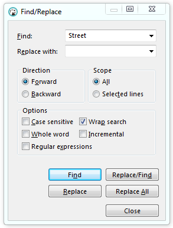

To search for data in the result set, press <kbd>CTRL+F</kbd>. The standard Find/Replace search dialog box opens:

 
You can also use the Find and Replace feature.

NOTE: The system searches only in already fetched rows.

Setting|Description
----|-----
Case sensitive|By default, search is case insensitive. Enable this setting so that the search passed only in the register you need.
Whole word|By default, the word specified in the search field can be found in the case when the word is part of another word. Enabling this setting will lead to a particular word search.
Regular expressions|Enable to use regular expressions in the search. In the search field, you can use <kbd>Ctrl+Space</kbd> for autocomplete regular expressions templates.
Wrap search|Enable this setting to find matches throughout the object from the beginning, and not only from the focus point to the end of the object.
Incremental|Matches are found incrementally as you type, if this setting enabled.
