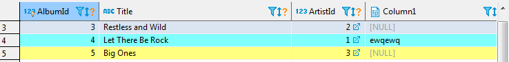
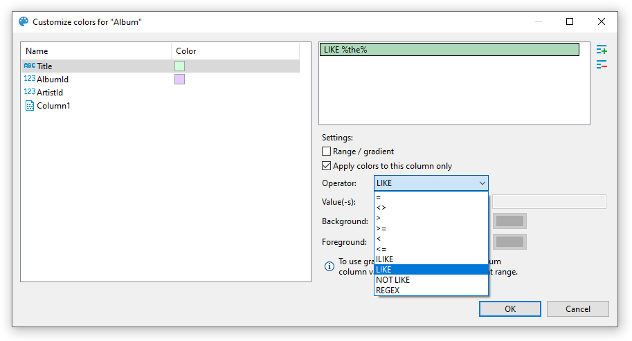

## Grid vs. Plain Text Views

You can switch between two data presentations in SE version and four presentations in EE version. Pressing <kbd>CTRL+~</kbd> switches available presentations in turn.
* To see the data in a grid view, similar to an Excel spreadsheet, click the **Grid** button () on the bottom toolbar of the editor.
* To switch to the plain text view, click **Text** () on the bottom toolbar.
* To switch to JSON view (available in EE version only for MongoDB documents and JSON tables), click **JSON** on the toolbar.
* To switch to XML view (available in EE version only for XML tables), click **XML** on the toolbar.

## Table vs. Record Views

The table view is a standard table (Excel-like) in which columns are vertical and rows are horizontal. This view is the default one. If you click the **Record** button in the bottom toolbar of the editor (), or press <kbd>Tab</kbd>, or right-click a cell and then click **Layout -> Record** on the context menu, the rows and columns switch positions. The columns will appear as rows, and the rows will be hidden in one **Value** column which will show only one row of data. The column headers will shift from the top of the table to its left side:    
  
The Record view is useful if the table contains a big number of columns. To navigate from row to row of data, use the navigation buttons on the bottom toolbar of the editor: 

To return back to the standard table view, click the **Record** button again.

## Rows Coloring
In the data editor, you can colour all rows that have the same value as a particular cell of a certain column. To do so, right-click the cell and click <kbd>View/Format</kbd> &rArr; <kbd>Set the row colour for {column name = value}</kbd> on the context menu:

Then choose the colour in the palette window that appears and click **OK**. The current row and all other rows that contain the same value change their colour to the one you have selected:

To remove the coloring by a particular column, right-click the cell again and click <kbd>View/Format</kbd> &rArr; <kbd>Clear colour for {column name = value}</kbd> on the context menu.

By choosing <kbd>View/Format</kbd> &rArr; <kbd>Row colors ...</kbd> from the context menu, you can gain more precise control of coloring conditions:

Here, you can define multiple conditions for single column using rich set of predefined operators, change background color and define a range between two values.

Operators work as you may expect. Note that they're executed on the client-side, that means no extra queries are made in order to apply colors.

### Value range / Gradient

Value range allows you to paint your rows with gradient that fades from first value to second value:

In this example we defined a range for column `AlbumId` that fades from `#80c6ff` to `#8000ff` between values `1` and `10`.

### Using regex

You can use regular expressions for matching complex values. Otherwise, you can be artistic and, for example, paint rows with odd values in your favorite color:

_Snippet for coloring odd rows: `^\d*[13579]$`; even rows: `^\d*[02468]$`_

## Coloring by Data Types
Besides colouring rows by a value, you can colour the values in the columns by data types. To do so, right-click any cell in the table and, on the context menu, click **View/Format -> Colourize Data Types**. The values in the cells will be coloured in different colours according to the current colour preferences:

You can change the colour preferences in the Preferences window by: clicking **Window -> Preferences** on the main menu. In the window of the navigation pane on the left, expand **User Interface** and then **Appearance**, and then click **Colours and Fonts**:

To remove the colouring by data types, on the context menu, click **View/Format -> Colourize Data Types** again.

## Transforming Data Presentation
For string and numeric data types, DBeaver provides tools to transform the data presentation into a number of formats, such as URL and Binary for strings and Epoch Time, Number Radix, etc. for numbers. To change the data presentation in a certain column, right-click a cell in the column. Then, on the context menu, click **View/Format -> Set {column name} format** and click the presentation type name:

The Transformer settings window opens showing the value in the chosen format. Click **OK** to apply the change:

The values in the column appear in the new format.  
NOTE: For URL format, the resulting cell provides a link to the URL in a browser window. 

To roll back the changes to the default format, right-click any cell in the column, and on the context menu, click **View/Format -> View as -> Default**.

## Structurizing Complex Data Types
For complex data types (that themselves represent a structure), such as objects, structures and arrays, DBeaver provides a tool for breaking them into columns:

To do so, right-click a cell in the column and, on the context menu, click **View/Format -> Visualize complex columns**.

## Configuring Numeric and Time Data Formats
You can specify the exact format of Time, Timestamp, Date, and Number data used in the currently open database or globally. To specify a format, right-click any cell in the table and, on the context menu, click **View/Format -> Data formats**. The Properties window opens displaying the **Data Formats** page:

To configure only the format for the current database, select the **Datasource "[Connection name]" settings** checkbox. To configure the settings globally, to all databases that you have in DBeaver, click **Global settings**.  
You can specify the locale for the data format in the **Locale** area. In the **Type** dropdown list, click the name of the data type and in the **Settings** table, click the required format.  
To apply the changes and make them visible in the table, click **Apply and Close** and then refresh the window (<kbd>F5</kbd>).

## Configuring Boolean presentation

You can choose between two presentation modes1:
 - Text-based
 - Icon-based

### Text-based presentation
This is the most customizable mode. You can:
1. Change **labels** under <kbd>Label</kbd> column. 
Otherwise, you can use presets available in <kbd>Drop-down Menu</kbd>2
2. Change **alignment** of value inside grid cell.3 
Following variants are available: **left**, **center**, and **right**
3. Change **color** of value using color picker under <kbd>Color</kbd> column4. 
You can reset color to match current theme's contrast color in <kbd>Drop-down Menu</kbd>2 &rArr; <kbd>Colors</kbd> &rArr; <kbd>Use theme default color</kbd> 
4. Change font **style** in <kbd>Drop-down Menu</kbd>2 &rArr; <kbd>Styles</kbd>.  
Following variants are available: normal, **bold**, and _italic_

### Icon-based presentation
This presentation only supports alignment changing.