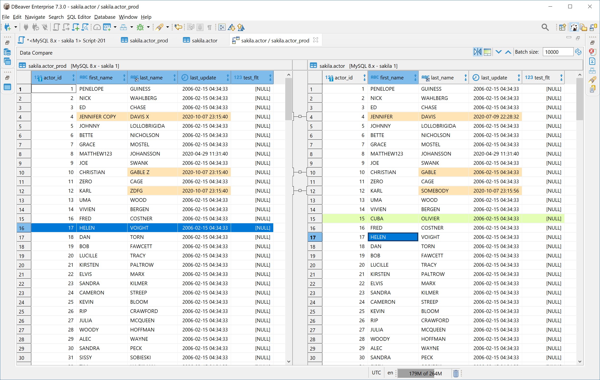

You can compare data of two tables using Data Compare tool.  
It is very useful when you need to compare two tables which have almost identical data with just a few differences.  
DBeaver visualizes these differences using table diff view.

### Running data compare tool

- Select two tables in the [[Database Navigator]] from the same database or from different databases or even from different RDBMS (e.g. PostgreSQL and MySQL);
- In the context menu choose Compare/Migrate->Compare Data.

DBeaver uses the best unique key or index (usually it is a Primary Key) to identify rows.  
Tables without unique key cannot be compared properly because there is no way to compare individual rows.  
Unique keys must have the same number of columns.  

DBeaver fetches portions of data from each table and then finds the differences.  

### Result diff

