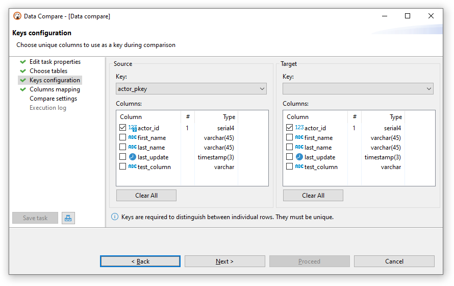

Sometimes you need to compare data from two sources (tables) which have almost identical data with just a few differences.
There may be plenty reasons to do so: quickly visualize and navigate through all the differences; copy different rows or individual values; export them using [Data Transfer](Data-transfer). 

### Preparing the tool
1. You will need to choose one or two desired tables in the [Database Navigator](Database-Navigator) - it may be the
  tables from the same databases or from different databases or even from different RDBMS (e.g. PostgreSQL and MySQL).
1. Then choose <kbd>Database</kbd> &rArr; <kbd>Compare/Migrate</kbd> &rArr; <kbd>Data Compare</kbd> from the menu and the
  Data Compare Wizard will appear. Here you can preview selected tables or choose other ones. Then you can navigate
  to the second page.
1. On the second page you should choose the columns that will be used as a **unique key** during the comparison (the amount of columns must be equal).
  If the _keys_ chosen are wrong, it may lead to invalid results. By default, if the table has a unique key in it, it will
  be chosen automatically during the initial setup:
  
  Without unique keys the rows cannot be compared properly, since there's no way to distinguish between individual rows.
1. After reaching the last page, you can tweak limits (e.g. you only care about the `N` first rows) and exclude categories
  of the resulting rows (e.g. you are not interested in modified rows). Also, you can press the <kbd>Save task</kbd> button
  to save the configuration in [Task](Task-Management) to use it later, or [Schedule](Task-Scheduler) it.

### Viewing the results
After finishing the wizard, you can press the <kbd>Start</kbd> button to begin the actual comparison process - it may take
some time depending on the databases you're comparing, the amount of data in them, and your network speed (*).

When the results are ready, DBeaver will play a _beep_ sound, and the editor will open:

Here you can examine the differences, swap the panels using the <kbd>Swap Containers</kbd> button in the toolbar,
or preview the summary including the statistics by using the <kbd>Show Summary</kbd> button in the toolbar too. Everything you can
do in the regular data editor is possible to perform here - you can copy data or transfer it to another database, except modify the values.

_* - Please note that the actual preview is only available when Data Compare is launched through the wizard - otherwise only
the statistics will be written into the [Task Log](Task-Management#Execution-log)._

### Under the hood
This section is under construction. It will include information about the engine's implementation details and more.