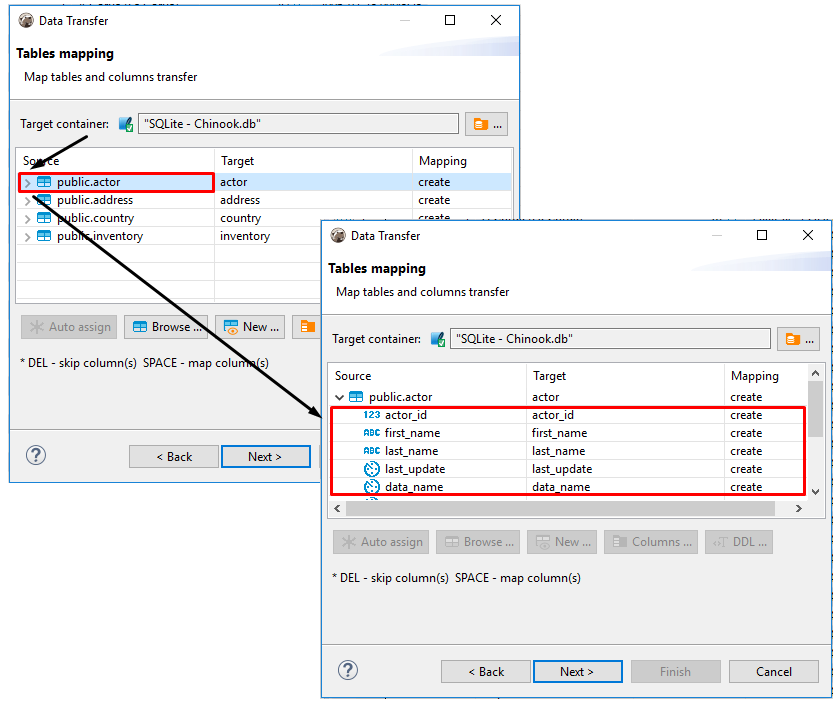

DBeaver supports data migration from tables of one database to tables of another one. 

To perform data transfer, please, follow the steps below.
 
## Step 1: Define the data source

In the **Database Navigator** select one or more tables you want to export. In the context menu choose "Export Data".
(Note: you also can export data from the custom SQL queries results. For that in the results context menu choose "Export results").

## Step 2: Define data transfer target type 

In the opened dialog box choose **Database** type as the data target transfer and press **Next**. 

## Step 3: Define extraction settings  

The following data extraction options are available:

Option|Description
----|-----
**Maximum threads**|Defines a number of threads to be used for data transfer. 
**Extract type**|Select **Single query** option if your data load is not too big. Select **By segments** option if you need to migrate a solid amount of data. When this options is selected you can set the *Segment size* value, that is to define a number of rows to be transferred in each segment.
**Open new connections**|Select this checkbox and a new connection will be opened and data transfer will not interfere with other calls to the database whose data is being transferred.
**Select row count**|Select this check box if you want to see a progress bar displaying data migration process.

Set data extraction options and press **Next**.

## Step 4: Define data mapping

Define the target container by pressing the Browse button  and selecting a target database or schema.

 

For proper table mapping the following options are available:

* **Target container** defines a target, that is a database where the data will be transferred to. Press  button to browse for a one.
* **Source** - contains names of all the tables selected at step 1. You can also see the list of columns existing in the source table by pressing .

* **Target** - contains names of the tables where the data will be transferred to.  

* **Mapping** - contains the list of actions to be applied to the source data on data transfer. The following options are available: 

   **_Create_**- the source data will be populated into a newly created table or column of the target container.  
   **_Skip_** - the source data will not be transferred to the target container.  
   **_Existing_** - the source data will be transferred to the table that already exists in the target container.  
   **_Unassigned_** - this value is set by default when there is no target defined.  

If cells are marked as  it means that in the target table there are no source tables with matching names, otherwise the names will be filled in automatically. 

You can define a target table by clicking on a cell in the **Target** column and entering its name, or press the **New** button  and enter a new name in the opened dialog box. 

You can also choose a name for a target table from the drop-down list.

You can also select a target table from the list of tables already existing in the target container by pressing the **Browse** button .

 

You can also define mapping settings for each column of the target table. To define mapping setting for a column in a target table, release the list of source table columns by pressing  next to the table's name in the **Source** column, then click the name of the target column and enter a new one or select one from the dropdown list.  To collaps the list, press .

If you want tables of the target container to have the same names as source tables, press the **Auto assign** button  and **Target** column will be automatically populated.

You can also define the names of target columns, as well as their data types, by clicking a row with a table name and pressing the **Columns** button . A new dialog box will appear.

The following elements are available here:

* **Source column** -this column contains names of  columns existing in the selected source table;
* **Source type** - this column contains the list of data types assigned to the columns in the selected source table;
* **Target column** - this column contains names of target table columns where the data from source column will be transferred to. To change the name, click the cell and enter a new name.
* **Target type** - this column contains the list of data types that will be assigned to the columns in the target table.   

   **IMPORTANT**: Sometimes data types that are supported on the source database are not supported on the target or vice versa.   
   To set a data type for a column in a target table, click the cell in the **Target Type** column and select one from the dropdown list of data types supported on the target database. 

* **Mapping** - this column contains the list of actions to be applied to the data on data transfer. 

To change mapping type click a cell in **Mapping** column of **Table mapping dialog box** and select the required mapping type. 

You can also view the SQL script that will be run on data transfer by pressing the DDL button  .

You can also use the following keyboard shortcuts for easy navigation within the mapping table area of **Table mapping** screen when a name of any source table is highlighted:

Shortcut|Action
----|-----
<b>Up</b>|Moves one row up.
<b>Down</b>|Moves one row down.
<b>Right</b>|Releases the list of source table columns. 
<b>Left</b>|Swaps the list of source table columns.
<b>Space</b>|Auto-assigns the target.  
<b>Del</b>|Sets mapping type to skip.

Configure data mapping and press **Next**.

## Step 5: Define data loading preferences

The following data loading settings are available:

Option|Description
----|-----
**Truncate data load table before load**|Select this check-box only if you want all the data be cleared from the target table.
**Open new connections**|Use this option to speed up data transfer. Select this checkbox and a new connection will be opened and data transfer will not interfere with other calls to the database where data is being transferred to.
**Use transactions**|This option allows to speed up data transfer and define the number of rows for each transaction by setting **Commit after insert of** parameter. 
**Open table editor on finish**|Select this check-box if you want the table editor to be opened when data tanfer is over.
**Show finish message**|Select this check-box if you want to be notified with a dialog box when data transfer is over.

## Step 6: Confirm

 
Check out data transfer settings and press **Finish**.