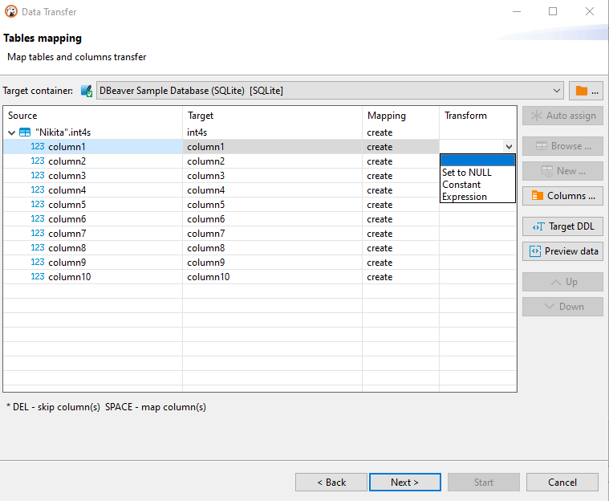

DBeaver supports data migration of tables from one database to tables of another one. 

To perform a data transfer, please, follow the steps below.
 
## Step 1: Define the data source

In the **Database Navigator** select one or more tables you want to export. In the context menu choose "Export Data".
(Note: you also can export data from the custom SQL queries results. For that, choose "Export results" in the results context menu).

## Step 2: Define data transfer target type 

In the opened dialog box choose **Database** type as the data transfer target and press **Next**. 

## Step 3: Define data mapping

For proper table mapping, the following options are available:

* **Target container** - defines a database or a scheme where the data will be transferred to. Press  button and choose the container.

* **Source** - contains names of all the tables selected at step 1. You can also see the list of columns existing in the source table by pressing 

* **Target** - contains names of the tables where the data will be transferred to.  

* **Mapping** - contains the list of actions to be applied to the source data on data transfer. The following options are available: 

   **_Create_**- the source data will be populated into a newly created table or column of the target container.  
   **_Skip_** - the source data will not be transferred to the target container.  
   **_Existing_** - the source data will be transferred to the table that already exists in the target container.  
   **_Unassigned_** - this value is set by default when there is no target defined.  

If the cells are marked with , it means that in the target table there are no columns with matching names, otherwise the names will be filled in automatically. 

You may also want to transform the values of some columns during the transfer. To do that, define column transformers by clicking on corresponding cells in the _Transform_ column. You can choose one of three options:

* _Set to NULL_. All values in the corresponding column will be set to null.
* _Constant._ All values in the corresponding column will be set to the specified constant.
* _Expression_. This transformer uses expressions (namely, JEXL expressions) to calculate the cell's value. You can use basic arithmetic operations and column names to construct an expression. 

You can define a target table by clicking on a cell in the **Target** column and entering its name, or press the **New** button  and enter a new name in the opened dialog box. 

You can also choose a name for a target table from the drop-down list.

Or select a table from the existing tables in the target container by pressing the **Browse** button 

To define the mapping setting for a column in a target table, release the list of source table columns by pressing  next to the table's name in the **Source** column, then click the name of the target column and enter a new one or select one from the dropdown list. To collapse the list, press 

If you want tables of the target container to be named like those of source, press the **Auto assign** button  and the **Target** column will be automatically populated.

You can also define the names of target columns, as well as their data types, by clicking a row with a table name and pressing the **Columns** button  

The following elements are available here:

* **Source column** -this column contains names of  columns existing in the selected source table;
* **Source type** - this column contains the list of data types assigned to the columns in the selected source table;
* **Target column** - this column contains names of target table columns where the data from the source column will be transferred to. To change the name, click the cell and enter a new name.
* **Target type** - this column contains the list of data types that will be assigned to the columns in the target table.   

   **IMPORTANT**: Sometimes data types that are supported on the source database are not supported on the target or vice versa.   
   To set a data type for a column in a target table, click the cell in the **Target Type** column and select one from the dropdown list of data types supported on the target. 

* **Mapping** - this column contains the list of actions to be applied to the data on data transfer. 

To change the mapping type, click a cell in the **Mapping** column of **Table mapping dialog box** and select the required mapping type. 

You can also view the SQL script that will be run on data transfer by pressing the **Target DDL** button  .

If you want to see a preview of the imported data, you can select the **Preview data** button

The following keyboard shortcuts for easy navigation within the mapping table area of **Table mapping** screen are supported:

Shortcut|Action
----|-----
<b>Up</b>|Moves one row up.
<b>Down</b>|Moves one row down.
<b>Right</b>|Releases the list of source table columns. 
<b>Left</b>|Swaps the list of source table columns.
<b>Space</b>|Auto-assigns the target.  
<b>Del</b>|Sets mapping type to skip.

Configure data mapping and press **Next**.

## Step 4: Define export settings

Data export settings are grouped into **Extraction settings** and **Data load settings**.
 

### Extraction Settings

Extraction settings define how the data will be pulled from the source. The following options are available:

Option|Description
----|-----
**Maximum threads**|Defines a number of threads to be used for data transfer. 
**Extract type**|Select **Single query** option if your data load is not too big. Select **By segments** option if you need to migrate a solid amount of data. When this option is selected you can set the **Segment size** value, that is to define the number of rows to be transferred in each segment.
**Open new connections**|If selected, a new connection will be opened and the data transfer will not interfere with other calls to the database whose data is being transferred.
**Select row count**|If selected, a progress bar displaying data migration process will be shown.

### Data load settings

Data load settings define how the extracted data will be pushed to the target. The following options are available.

Option|Description
----|-----
**Truncate data load table before load**|Select this check-box only if you want all the data be cleared from the target table. Be very careful with this option!
**Replace method**|Select this drop-down list if you want to change the import behavior in case of a duplicate primary key value. [Data Import and Replace page](Data-Import-and-Replace)
**Open new connections**|Use this option to speed up data transfer. If selected, a new connection will be opened and the data transfer will not interfere with other calls to the database where data is being transferred to.
**Use transactions**|This option allows you to speed up the data transfer and to define the number of rows for each transaction by setting the **Commit after insert of** parameter.
**Use multi-row insert**|Use multi-row insert with extended values number for higher performance. Database-specific setting.
**Skip bind values during insert**|This option can drastically increase performance for some drivers like Redshift by skipping a process of binding values and setting them directly, but it opens up a vulnerability to SQL injections. Not recommended if you are not sure of imported file contents.
**Disable batches**|Select this check-box if you want to disable the use of batch imports. The import will be made row by row. Enabling this function will show all import errors, but make the import process slower.
**Open table editor on finish**|If selected, the table editor is to be opened when data transfer is finished.
**Show finish message**|If selected, a notification message will be shown when the transfer is finished.

## Step 5: Confirm

 
Check out the data transfer settings and press **Start** or save as [task](Task-Management).
