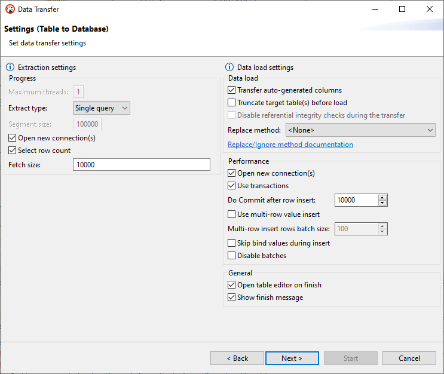

DBeaver supports data migration from tables of one database to tables of another one. 

To perform data transfer, please, follow the steps below.
 
## Step 1: Define the data source

In the **Database Navigator** select one or more tables you want to export. In the context menu choose "Export Data".
(Note: you also can export data from the custom SQL queries results. For that in the results context menu choose "Export results").

## Step 2: Define data transfer target type 

In the opened dialog box choose **Database** type as the data transfer target and press **Next**. 

## Step 3: Define data mapping

For proper table mapping the following options are available:

* **Target container** - defines a database or a scheme where the data will be transferred to. Press  button and choose the container.

* **Source** - contains names of all the tables selected at step 1. You can also see the list of columns existing in the source table by pressing 

* **Target** - contains names of the tables where the data will be transferred to.  

* **Mapping** - contains the list of actions to be applied to the source data on data transfer. The following options are available: 

   **_Create_**- the source data will be populated into a newly created table or column of the target container.  
   **_Skip_** - the source data will not be transferred to the target container.  
   **_Existing_** - the source data will be transferred to the table that already exists in the target container.  
   **_Unassigned_** - this value is set by default when there is no target defined.  

If cells are marked as  it means that in the target table there are no source tables with matching names, otherwise the names will be filled in automatically. 

You can define a target table by clicking on a cell in the **Target** column and entering its name, or press the **New** button  and enter a new name in the opened dialog box. 

You can also choose a name for a target table from the drop-down list.

Or select from the list of tables already existing in the target container by pressing the **Browse** button 

To define mapping setting for a column in a target table, release the list of source table columns by pressing  next to the table's name in the **Source** column, then click the name of the target column and enter a new one or select one from the dropdown list. To collaps the list, press 

If you want tables of the target container to be named like those of source, press the **Auto assign** button  and the **Target** column will be automatically populated.

You can also define the names of target columns, as well as their data types, by clicking a row with a table name and pressing the **Columns** button  

The following elements are available here:

* **Source column** -this column contains names of  columns existing in the selected source table;
* **Source type** - this column contains the list of data types assigned to the columns in the selected source table;
* **Target column** - this column contains names of target table columns where the data from source column will be transferred to. To change the name, click the cell and enter a new name.
* **Target type** - this column contains the list of data types that will be assigned to the columns in the target table.   

   **IMPORTANT**: Sometimes data types that are supported on the source database are not supported on the target or vice versa.   
   To set a data type for a column in a target table, click the cell in the **Target Type** column and select one from the dropdown list of data types supported on the target. 

* **Mapping** - this column contains the list of actions to be applied to the data on data transfer. 

To change mapping type click a cell in **Mapping** column of **Table mapping dialog box** and select the required mapping type. 

You can also view the SQL script that will be run on data transfer by pressing the DDL button  .

The following keyboard shortcuts for easy navigation within the mapping table area of **Table mapping** screen are supported:

Shortcut|Action
----|-----
<b>Up</b>|Moves one row up.
<b>Down</b>|Moves one row down.
<b>Right</b>|Releases the list of source table columns. 
<b>Left</b>|Swaps the list of source table columns.
<b>Space</b>|Auto-assigns the target.  
<b>Del</b>|Sets mapping type to skip.

Configure data mapping and press **Next**.

## Step 4: Define export settings

Data export settings are grouped into **Extraction settings** and **Data load settings**.
 

### Extraction Settings

Extraction settings define how the data will be pulled from the source. The following options are available:

Option|Description
----|-----
**Maximum threads**|Defines a number of threads to be used for data transfer. 
**Extract type**|Select **Single query** option if your data load is not too big. Select **By segments** option if you need to migrate a solid amount of data. When this options is selected you can set the **Segment size** value, that is to define a number of rows to be transferred in each segment.
**Open new connections**|If selected, a new connection will be opened and data transfer will not interfere with other calls to the database whose data is being transferred.
**Select row count**|If selected, a progress bar displaying data migration process will be shown.

### Data load settings

Data load settings define how the extracted data will be pushed to the target. The following options are available.

Option|Description
----|-----
**Truncate data load table before load**|Select this check-box only if you want all the data be cleared from the target table. Be very careful with this option!
**Open new connections**|Use this option to speed up data transfer. If selected, a new connection will be opened and data transfer will not interfere with other calls to the database where data is being transferred to.
**Use transactions**|This option allows to speed up data transfer and to define the number of rows for each transaction by setting **Commit after insert of** parameter. 
**Open table editor on finish**|If selected, the table editor to be opened when data tanfer is over.
**Show finish message**|If selected, a notification message will be shown when transfer is over.

## Step 5: Confirm

 
Check out data transfer settings and press **Finish**.
