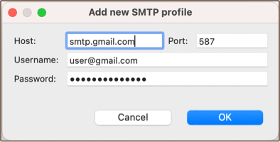
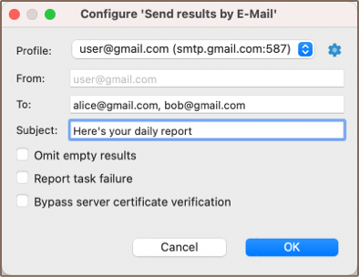

**Note: Following feature is available in [Enterprise](Enterprise-Edition) and [Ultimate](Ultimate-Edition) editions only.**

DBeaver offers a way to send exported data via [Data Transfer](Data-transfer) to E-Mail.

### SMTP profile configuration

First, you will need to add an SMTP profile to send email from. Go to <kbd>Window</kbd> &rArr; <kbd>Preferences</kbd> &rArr; <kbd>General</kbd> &rArr; <kbd>Mail</kbd> and create a new profile.

Parameters <kbd>Host</kbd> and <kbd>Port</kbd> may depend on the mail service you're using. If service offers both SSL and TLS ports, use the latter one. Gmail, for example, uses host `smtp.gmail.com` and port `587`. An example of configured profile:

Then you can use <kbd>Test connection</kbd> button to verify that host and credentials are valid.

See [troubleshooting](#Authorization-troubleshooting) section for more information about resolving common authorization problems.

### Setting up data transfer
When at least one [profile](#SMTP-profile-configuration) is present, you can actually set up e-mail sending. Create a regular export task, go to <kbd>Output</kbd> page and make sure the <kbd>Send results by E-Mail</kbd> option is enabled. By pressing <kbd>Configure</kbd> label near it, you can specify several recipients and subject for your mail:

That's it. After task is completed, specified recipients will receive an e-mail containing exported file in specified during data transfer format.

### Authorization troubleshooting

You may face various problem while setting up a new SMTP profile.

There are described several common errors when using Gmail and solutions for them:
- `535-5.7.8 Username and Password not accepted`. If you are certain that you have entered valid credentials, then give a try allowing less secure apps. Otherwise, check username and password for correctness. Read more at https://support.google.com/accounts/answer/6010255
- `534-5.7.9 Application-specific password required`. You have two-factor authorization enabled. You will need to generate a special password for DBeaver to use. Read more at https://support.google.com/accounts/answer/185833