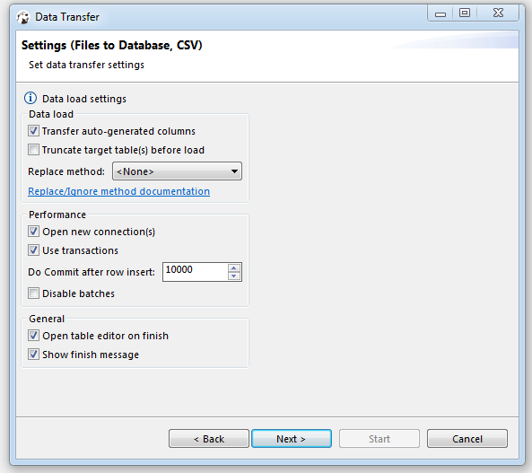

You can perform data export/import or migration for database table(s).
We will describe most typically used cases.

## CSV format

### Exporting table data to CSV format

1. Select a table or tables you want to export. In the context menu choose **Export Data**.  
   (Note: you can also export data from custom SQL queries results. To do that, choose **Export data** in the results
   context menu).

2. Choose export format. DBeaver supports many different output formats including CSV, HTML, XLSX, etc:

3. Set data extraction options (how the data will be read from the tables). This may affect the extraction's
   performance.
   And set export format option. They are specific to the data format you chose on step 2:

6. Set options for output files or clipboard.
   Note: Timestamp pattern is used here to target the file name pattern:

7. Review what you want to format and into which format you will export it. You can also save all your settings as a
   task in this step or change the task variables:

8. Press finish. See extraction progress. You can keep working with your database during the export process as the
   extraction will be performed in the background.
   Note: avoid changing data in tables you have selected to be exported while the exporting is in progress.
   In the end you will see status message:

### Importing data from CSV format

You can import data from CSV file(s) directly into your database table(s).

1. Select a table(s) to which you want to import data. In the context menu choose  **Import Data**:

2. Choose import format (CSV):

3. Select input CSV file for each table you want to import and you can change the Importer settings (format specific) at
   this step:

4. Set CSV-to-table mappings.
   You need to set a column in the CSV file for each database table column.
   You can skip columns (the value will be set to NULL in the target table column).
   You can set constant values for the table column if there is no source column for it in the CSV.

5. Set options for loading data in the database. These options may affect the loading's performance:

Read our guide on [Data Import and Replace](Data-Import-and-Replace) to learn more about the replacing method option.

6. Review which file(s) and to which table(s) you will import. You can also save all your settings as a task in this
   step:

7. Press finish. See extraction progress. You can keep working with your database during the export process as the data
   loading will be performed in the background.
   Note: avoid changing data in tables you have selected to be imported while the import is in progress.
   In the end you will see the status message:

## XLSX format

### Importing data from XLSX format

You can import data from XLSX file(s) directly into your database table(s).

1) Choose the database table (or tables) you want to import data into. Do this by right-clicking on the table name in
   the **Database Navigator** section and then clicking on **Import Data**.

   

2) In the window that appears, choose `XLSX` and then click **Next**.

   

3) In the following window, choose the file that contains the data you wish to import into the table. Select the appropriate settings as described below, and then click **Next**.

   

 Setting name              | Description                                                                                                                                                                                                                                                                                                                                                                                                                                                          
---------------------------|----------------------------------------------------------------------------------------------------------------------------------------------------------------------------------------------------------------------------------------------------------------------------------------------------------------------------------------------------------------------------------------------------------------------------------------------------------------------
 **Header position**       | Determines the location of the column names in the Excel table, either at the top or none. This setting specifies whether the column names are located in the first row of the Excel table or if there are no column names present.                                                                                                                                                                                                                                  
 **Skip empty roes**       | If this setting is enabled, any empty string values encountered during the data processing will be ignored and not inserted into the corresponding cells in the row. If the setting is disabled, all cells in the row will be filled with a `NULL` value if an empty string is encountered.                                                                                                                                                                          
 **Import all sheets**     | Specifies that all sheets present in the file should be imported during the data import process.                                                                                                                                                                                                                                                                                                                                                                     
 **Specific sheet name**   | Enables you to choose a particular sheet from the Excel file for importing during the data transfer process.                                                                                                                                                                                                                                                                                                                                                         
 **Date/time format**      | Use this setting to specify the date format used in the `XLSX` file. This is used to clarify the date format during the import process and does not affect the output data. For details on the format pattern syntax, you can refer to the **java DateTimeFormatter** documentation.                                                                                                                                                                                 
 **Timezone ID**           | By default, the local machine timezone is used. There are three ways to specify the timezone:   1) Local zone offset: Specify the offset from UTC in the format of either a positive or negative number (e.g., +3, -04:30).   2) Specific zone offset: Specify the offset from GMT or UTC in the format of GMT+/-X or UTC+/-X (e.g., GMT+2, UTC+01:00).   3) Region-based: Specify the timezone using a region-based identifier such as UTC, ECT, PST, etc. 
 **Sample rows count**     | Determines the number of rows that will be used as a sample to estimate the length and data types of the imported data.                                                                                                                                                                                                                                                                                                                                              
 **Minimum column lenght** | This value is used when creating a new column and specifying its type, if necessary. It indicates the minimum number of characters or digits expected in the column. This information helps determine the appropriate data type and size for the column during the creation process.                                                                                                                                                                                 
 **Save task**             | Opens the [**Save Task window**](Task-Management) to assist in creating a task during the data transfer process. This window provides options and settings for creating and configuring a task related to the data transfer operation.                                                                                                                                                                                                                               

5) In the next window set XLSX-to-table mappings. Please refer to our guide for detailed information on the [mapping process](Data-migration#step-3-define-data-mapping).

   

6) In the following window, choose your **Data load settings** and then hit **Next**. For more information on data load settings, please refer to the section [**Data load settings**](Data-migration#data-load-settings) in our article.

   

7) In the final window, you can review all the settings you selected earlier. If you missed something, you can go **Back**
   and fix it. When you're ready, finish the import by clicking **Proceed**.

   

8) If the `XLSX` file is valid and there are no errors, you will see a notification window with information about the
   completion of the task. You can keep working with your database during the export process as the data
   loading will be performed in the background.

   

    **Note**: avoid changing data in tables you have selected to be imported while the import is in progress.
## Table format

You can find more information about migrating data from one database table to another in our [Data Migration](Data-migration) guide.
## XML format

### Importing data from XML

1) Select the database table (or tables) where you want to import data. Do this by right-clicking on the table name in
   the **Database Navigator** section, then clicking on **Import Data**.

   

2) In the window that appears, select `XML` and then click **Next**.

    

3) In the following window, select the `XML` file that contains the data you want to import, then click **Next**.

    

4) In the next window set XLSX-to-table mappings. Please refer to our guide for detailed information on the [mapping process](Data-migration#step-3-define-data-mapping).

    

5) In the subsequent window, select your data load settings, and then click **Next**. For more information, please refer to the section [**Data load settings**](Data-migration#data-load-settings) in our article.

    

6) In the final window, you can review all the settings you selected earlier. If you missed something, you can go back
   and adjust it. Once everything looks good, finish the import by clicking **Proceed**.

    

7) If the file is valid and there are no errors, you'll see a notification window with information about the completion
   of the task.You can keep working with your database during the export process as the data
   loading will be performed in the background.

    

    **Note**: avoid changing data in tables you have selected to be imported while the import is in progress.