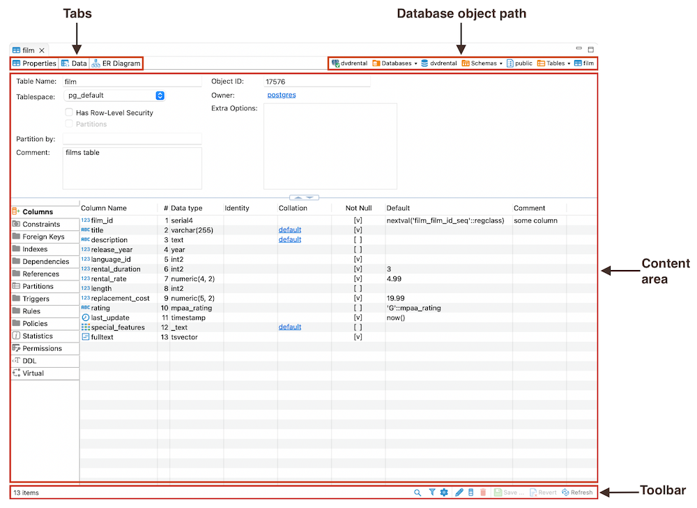

The Database object, or metadata editor is available for multiple database objects such as tables, views and schemas. To
open the metadata editor for an object, in the [Database Navigator](Database-Navigator) or in the [Projects](Projects)
view:

* Double-click the database object
* Click the database object and press <kbd>Enter</kbd> or <kbd>F4</kbd>

Upon performing these steps, you will see a window where the tabs contain the following common parts:

### Tabs

* The **Properties** tab, available for all objects, encompasses the properties of the database object as well as its
  sub-entities. For more information, please refer to the [Properties Editor](Properties-Editor) article.
* The **Data** tab appears for tables and views and represents the [Data Editor](Data-Editor).
* The **ER Diagram** tab appears for tables and schemas and displays [ERD (Entity Relation Diagrams)](ER-Diagrams).

### Database object path

The object's path shows the chain of all its parent entities. The entities are clickable: clicking an entity in the
path, depending on its nature, either shows its children or opens an editor or a settings window.

### Content area and Toolbar

The Content Area and Toolbar are key parts of the Properties tab. The Content Area shows information about a database
object and things like its sub-parts or DDL. The Toolbar has different tools on each tab to help with different tasks.

