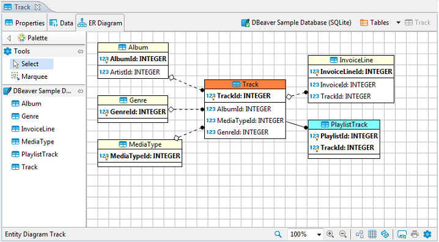
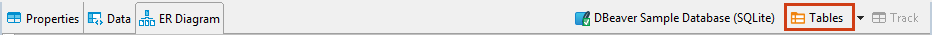
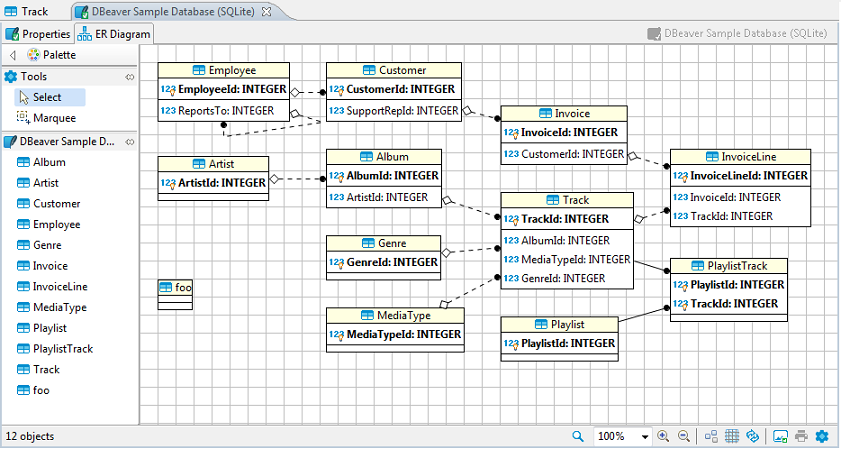

You can view a database structure in the standard ERD (Entity Relation Diagram) form. ER diagrams are available for all tables and schemas (databases).  

The ER diagram for a table shows the table itself and its relations with other tables inside the schema. To view the ER diagram for a table or view, double-click the table or view in the [Database Navigator](Database-Navigator) and then, in the [Database Object Editor](Database-Object-Editor), switch to the **ER Diagram** tab:

To view the ER diagram for a full database schema, double-click the schema name in the Database Navigator or the previous node in the path (usually - **Tables**):

NOTE: Table and schema diagrams are read-only. You can rearrange the layout, drag-n-drop elements inside a diagram but you cannot save the changes state or delete/add anything. This is because the diagrams represent the actual state of databases.

## Relationship Notation

Lines representing the relationship between tables can look different depending on the nature of the relationship. Please note that any line can have only one beginning and one end. We may have links between two tables not only for one pair of attributes, which means that several associations will be displayed:

Notation|Description
---------------|-----------
|A solid line means that the foreign key column in one table is a primary key in another table 
|A dashed line means that the foreign key column is not a primary key but a regular column in another table 
|A black dot is used as the start of the line 
|A diamond is used at the end of the link when the column in the source table is optional (there is no NOT NULL)

A one-to-one relationship is always a solid line due to the unique primary key - foreign key relationship:

A dashed line is for the one-to-many relationship:

