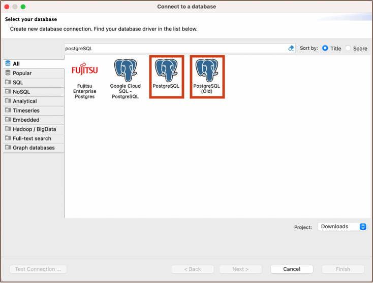
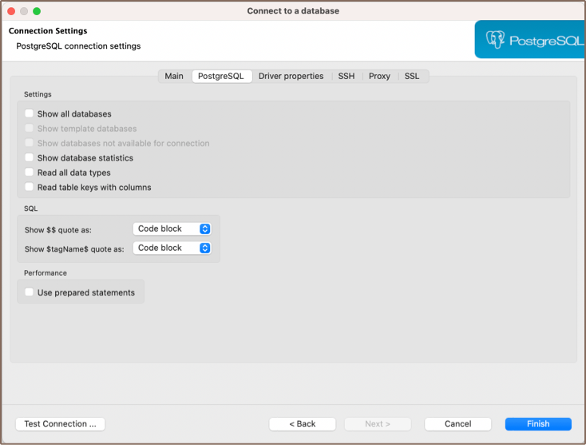

## Overview

This guide provides instructions for setting up and using PostgreSQL with DBeaver.

DBeaver offers extensive support for PostgreSQL, but it might not cover all possible functionalities. If DBeaver is
missing a feature you need, please submit a request through our [GitHub page](https://github.com/dbeaver/dbeaver/issues/new/choose).
If you're a developer, you have the option to  enhance DBeaver's capabilities by contributing your own code. For 
guidelines on how to do this, check out our [Contribution Guide](https://github.com/dbeaver/dbeaver/wiki/Contribute-your-code).

Before you start, you must create a connection in DBeaver and select PostgreSQL. If you haven't done this, please refer to
our [Database Connection](Connect-to-Database) article.

DBeaver interacts with the PostgreSQL server using a specific driver, it supports all versions of PostgreSQL, but the
correct driver must be selected: use **PostgreSQL (old)** for versions below 8.x and **PostgreSQL** for newer versions.
DBeaver also supports PostgreSQL extensions such as **EDB**, **Google Cloud SQL for PostgreSQL** and 
**Fujitsu Enterprise Postgres**. You must select the appropriate driver in the **Select Database** window for these extensions. 

DBeaver communicates with the PostgreSQL server using a specific driver. While it supports all versions of PostgreSQL,
the appropriate driver must be chosen. For PostgreSQL versions below 8.x, use the deprecated **PostgreSQL (old)** driver.
For newer versions, simply use the **PostgreSQL** driver. DBeaver also accommodates PostgreSQL extensions such as **EDB**,
**Google Cloud SQL for PostgreSQL** and **Fujitsu Enterprise Postgres**. To use these extensions, select the corresponding
driver in the Select Database window.

### Table of contents:

- [Setting Up](#setting-up) 
  - [PostgreSQL connection settings](#postgresql-connection-settings)
    - [Connection details](#connection-details)
  - [PostgreSQL driver properties](#postgresql-driver-properties)
  - [ODBC and JDBC Driver Configuration](#odbc-and-jdbc-driver-configuration)
  - [Secure Connection Configurations](#secure-connection-configurations)
- [Powering PostgreSQL with DBeaver](#powering-postgresql-with-dbeaver).
  - [PostgreSQL database objects](#postgresql-database-objects)
  - [PostgreSQL Features in DBeaver](#postgresql-features-in-dbeaver)

## Setting Up

This section provides an overview of DBeaver's settings for establishing a direct connection and the
configuration of secure connections using SSH, proxies, SSL, and the setup of ODBC/JDBC drivers for PostgreSQL.

### PostgreSQL connection settings

In this subsection, we'll outline the settings for establishing a direct connection to a PostgreSQL database using DBeaver.
Correctly configuring your connection ensures seamless interaction between DBeaver and your PostgreSQL database.

1) The first page of the connection settings requires you to fill in specific fields to establish the initial connection.

 Field                     | Description                                                                                                                                                                                                                                                                                                                                                                                                                                                                                                                                                                                                       
---------------------------|-------------------------------------------------------------------------------------------------------------------------------------------------------------------------------------------------------------------------------------------------------------------------------------------------------------------------------------------------------------------------------------------------------------------------------------------------------------------------------------------------------------------------------------------------------------------------------------------------------------------
 **Connect by (Host/URL)** | Choose whether you want to connect using a host or a URL.                                                                                                                                                                                                                                                                                                                                                                                                                                                                                                                                                         
 **Driver Type**           | [Select the appropriate driver](#odbc-and-jdbc-driver-configuration) for your PostgreSQL database.                                                                                                                                                                                                                                                                                                                                                                                                                                                                                                                
 **URL**                   | If you're connecting via URL, enter the URL of your PostgreSQL database here. This field is hidden if you're connecting via the host.                                                                                                                                                                                                                                                                                                                                                                                                                                                                             
 **Host**                  | If you're connecting via host, enter the host address of your PostgreSQL database here.                                                                                                                                                                                                                                                                                                                                                                                                                                                                                                                           
 **Database**              | Enter the name of the PostgreSQL database you want to connect to.                                                                                                                                                                                                                                                                                                                                                                                                                                                                                                                                                 
 **Port**                  | Enter the port number for your PostgreSQL database. The default PostgreSQL port is `5432`.                                                                                                                                                                                                                                                                                                                                                                                                                                                                                                                        
 **Authentication**        | Choose the type of authentication you want to use for the connection. For detailed guides on authentication types, please refer to the following articles:        - Native Database Authentication     - AWS RDS IAM Authentication  - Azure AD Authentication for PostgreSQL   - DBeaver Profile Authentication   - PostgreSQL Kerberos Authentication - PostgreSQL pgpass Authentication  - PostgreSQL SSPI Authentication   You can also read about [security in DBeaver PRO](Security-in-DBeaver-PRO). 
 **Local Client**          | Specify the local client, see our article about Local client.                                                                                                                                                                                                                                                                                                                                                                                                                                                                                                                                     
 **Connection Details**    | Provide [additional connection details](#postgresql-driver-properties) if necessary.                                                                                                                                                                                                                                                                                                                                                                                                                                                                                                                              
 **Driver Name**           | This field will be auto-filled based on your selected driver type.                                                                                                                                                                                                                                                                                                                                                                                                                                                                                                                                                
 **Driver Settings**       | If there are any [specific driver settings](#postgresql-driver-properties), configure them here.                                                                                                                                                                                                                                                                                                                                                                                                                                                                                                                  

2) The second page of the connection settings offers additional options that allow you to customize your further
   connection to the PostgreSQL database.

   

 Field                                         | Description                                                                                      
-----------------------------------------------|--------------------------------------------------------------------------------------------------
 **Show all databases**                        | Displays all databases in the [database navigator](Database-Navigator).                          
 **Show template databases**                   | Displays template databases. This option is available when **Show all databases** is checked.    
 **Show databases unavailable for connection** | Displays databases unavailable. This option is available when **Show all databases** is checked. 
 **Show databases statistics**                 | Displays statistics for databases.                                                               
 **Read all data types**                       | Reads all data types from the server.                                                            
 **Read table keys with columns**              | Reads table keys with columns.                                                                   
 **Show `$$` quote as**                        | Displays `$$` quotes as code blocks or strings.                                                  
 **Show `$tagName$` quote as**                 | Displays `$tagName$` quotes as code blocks or strings.                                           
 **Use prepared statements**                   | Uses prepared statements for SQL execution.                                                      

#### Connection details

The **Connection Details** section in DBeaver allows for further customization of your PostgreSQL connection. This includes
options for adjusting the **Navigator View**, setting up **Security measures**, applying **Filters**, configuring **Connection
Initialization** settings, and setting up **Shell Commands**. Each of these settings can significantly impact your database
operations and workflow. For detailed guides on these settings, please refer to the following articles:

- [Connection Details Configuration](Create-Connection#connection-details-name-type-etc)
- [Database Navigator](Database-Navigator)
- Security Settings Guide
- [Filters Settings Guide](Configure-Filters)
- Connection Initialization Settings Guide
- Shell Commands Guide

### PostgreSQL driver properties

The settings for PostgreSQL **Driver properties** enable you to adjust the performance of the PostgreSQL JDBC and ODBC driver.
These adjustments can influence the efficiency, compatibility, and features of your PostgreSQL database.

For a complete walkthrough on setting up PostgreSQL JDBC and ODBC drivers properties, you can refer to the official
[PostgreSQL JDBC documentation](https://jdbc.postgresql.org/documentation/use/) and [PostgreSQL ODBC documentation](https://odbc.postgresql.org/).
These guides detail each driver's properties and how they can be used to optimize PostgreSQL database connections. 

You can customize the PostgreSQL driver in DBeaver via the **Edit Driver** page, accessible by clicking on the <kbd>Driver
Settings</kbd> button on the first page of the driver settings. This page offers a range of settings that can influence your
PostgreSQL database connections. For a comprehensive guide on these settings, please refer to our [Database drivers](Database-drivers) article.

### ODBC and JDBC Driver Configuration

DBeaver provides extensive capabilities for managing PostgreSQL database connections via ODBC/JDBC drivers. This
functionality enables you to connect to your PostgreSQL database using native ODBC drivers, offering an alternative when
specific DBeaver drivers aren't available.

You can find a comprehensive, step-by-step guide on how to install the driver manager, set up drivers,
configure data sources, and establish connections in DBeaver in our [ODBC Driver Configuration](ODBC-JDBC-Driver) article.

### Secure Connection Configurations

DBeaver supports secure connections to your PostgreSQL database. Guidance on configuring such connections, specifically
**SSH**, **Proxy**, and **SSL** connections, can be found in various referenced articles. For a comprehensive understanding, please
refer to these articles:

- [**SSH Configuration**](SSH-Configuration).

- [**Proxy Configuration**](Proxy-configuration).

- [**SSL Configuration**](SSL-Configuration).

## Powering PostgreSQL with DBeaver

DBeaver provides a host of features designed for PostgreSQL databases. This includes the ability to view schemas,
along with numerous unique capabilities aimed at optimizing database operations.

### PostgreSQL database objects

DBeaver lets you view and manipulate a wide range of PostgreSQL database objects. DBeaver has extensive support for
various PostgreSQL metadata types, allowing you to interact with a wide variety of database objects, such as:
- Databases
    - Schemas
        - Data types
        - Tables
            - Columns
            - Constraints
            - Indexes
            - Foreign Keys
            - Dependencies
            - References
            - Partitions
            - Triggers
            - Rules
            - Policies
        - Procedures and functions
        - Views
        - Materialized Views
        - Sequences
        - Aggregate functions
        - Data types
    - Roles
    - Storage
      - Tablespaces
    - Event Triggers
    - Extensions

For a practical guide on creating new tables and working with various database objects in PostgreSQL, check out our
[tutorial](New-Table-Creation).

### PostgreSQL Features in DBeaver

DBeaver isn't limited to typical SQL tasks. It also includes numerous unique features specifically for PostgreSQL.
Beyond regular SQL operations, DBeaver provides a range of PostgreSQL-specific capabilities, such as:

 Category            | Feature                                           
---------------------|---------------------------------------------------
| Data Types          | [PostgreSQL Arrays](PostgreSQL-Arrays.md)         |
|                     | PostgreSQL Structures                             |
| Extensions          | [PostgreSQL Extensions](PostgreSQL-Extensions.md) |
| Security            | PostgreSQL Permissions                            |
|                     | PostgreSQL Policies                               |
|                     | PostgreSQL Roles                                  |
| Data Organization   | PostgreSQL Partitions                             |
| Database Management | PostgreSQL Dependencies                           |
|                     | PostgreSQL Tools                                  |

Additional features compatible with PostgreSQL, but not exclusive to it:

 Category           | Feature                                    
--------------------|--------------------------------------------
| Data Transfer      | [Data Import](Data-transfer#import-data)   |
|                    | [Data Export](Data-transfer#export-data)   |
| Session Management | Session Manager                            |
| Lock Management    | Lock Manager                               |
| Backup and Restore | How to Backup data                         |
|                    | How to Restore data                        |
| Schema Management  | [Schema Compare](Schema-compare)           |
| Data Visualization | [GIS Guide](Working-with-Spatial-GIS-data) |
|                    | [ERD Guide](ER-Diagrams)                   |

