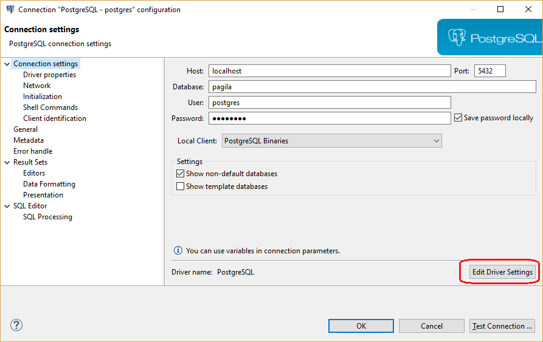

You can use a pre-configured database driver or create a new driver.

DBeaver has a lot of pre-configured drivers including SQL, NoSQL, key-value databases, graph databases, search engines, etc.
But sometimes you need to connect to a database which was not configured in DBeaver yet.

All you need is a JDBC driver of your database. The rest is easy.

### Obtaining JDBC driver

JDBC driver is a program (in Java) which can connect and operate with some local or remote database server. It usually provides all needed functionality to cover 100% of database functionality. The JDBC driver is usually provided by database vendors to allow customers to work with their databases.

The JDBC driver consists of one or multiple `jar` files. The Jar file is a library which contains program code and some other files.
You need to download the driver's jar files before adding them to DBeaver. Sometimes the jar files are included in the database server distribution - in that case you need to refer to your database documentation or ask your DBA.

### Adding driver configuration in DBeaver

##### Open driver manager dialog

You can open the driver manager from the main menu:  
  
or from Database Navigator drop-down menu.  

##### Add a new driver

Just click the button New and create a new driver.
On the driver edit dialog you need to enter all required information:

### Main parameters

Parameter|Description
----|-----
Driver Name|Name of your driver. It can be any name you like
Driver Type|Driver provider. In 99% cases you will need a generic driver (JDBC provider)
Class Name|JDBC driver class name. You can get it from the documentation or find it in the jar files (see "Find Class" button description)
URL Template|Template of driver URL. You can leave it empty. But in this case you will be ready to set JDBC URL for each your connection. It is better to define a valid template, which will greatly simplify the connections creation. See "URL Templates" for a detailed description
Default Port|Default database port. You can get it from the documentation or leave it empty
Embedded|Enable it for server-less databases. This flag affects a few config options related to the network/connections management
No Authentication|This means that driver does not require authentication (no user/password fields will be shown)
Category|Driver category, deprecated
ID|Driver unique ID, ignore it
Description|Driver description, it is shown in some dialogs/wizards as a hint

##### Libraries

This is the list of jar files, binary libraries (dll or so) and any other files required by the driver. In most cases you only need the jar files.  
Click "Add File" to add a single jar file, "Add Folder" to add to the folder with Java classes/resources and "Add Artifact" to add the Maven artifact (see below).  

After you add the jar files you will be able to find all JDBC driver classes which are found in these jars. Just click on the "Find Class" button and DBeaver will show all of them. In most cases there is just one driver class in the driver. If there are many of them, you need to refer to the driver's documentation.

##### Maven artifacts

DBeaver can download driver jars directly from the Maven repository (it is a global public repository of Java libraries, usually an open-source). If your database driver is published on some public repository you can use this feature. Maven artifacts are better than plain jar files because you can see all existing driver versions and can change the driver version in runtime without any driver properties reconfiguration.

_for additional information look_
[[How to add additional artifacts to the driver]]
### Saving driver, adding connection

After you have finished configuring your driver, just press the Ok button.  
Now you can [[create connection]].

If you need to change some driver properties later you can access them directly from connection properties dialog:

### URL Templates

JDBC drivers use URLs to identify remote servers - strings similar to classic web URLs.
Usually, URL has form `jdbc:vendor:host:port/database`, for example `jdbc:postgresql:localhost:5432/postgres'.
It is not very convenient to edit such a long and an unobvious string.
DBeaver can construct this URL from connection parameters (like host, port, etc).

For example above the URL template is: jdbc:postgresql://{host}:{port}/{database}  
Host, port and database are parameters which you will need to enter on the connection configuration page.

Supported URL variables:

Parameter|Description
----|-----
{host}|Database server host name
{port}|Database server port number
{database}|Target database name
{server}|Target server name (rarely used)
{folder}|Folder path (on the local file system). Used for embedded drivers
{file}|File path (on the local file system). Used for embedded drivers

### Advanced settings

For most drivers you do not need to change any advanced properties.
But in some cases you can use this as driver tuning, e.g. for better performance or for structure fixing.

###### Main parameters

Parameter|Description
----|-----
Driver supports indexes|Driver supports table indexes
Driver supports stored code | Whether this driver supports stored code (procedures, functions, packages, etc)
Driver supports references | Driver supports table references (foreign keys)
Driver supports SELECT count(*) clause | Driver supports SELECT count(*) clause
Driver supports views | Driver supports table views
Split procedures and functions | Show procedures and functions in different folders
Script delimiter | Literal for SQL queries separation in scripts
Script delimiter redefiner | SQL clause which redefines script delimiter value
Use script delimiter after query | Keep SQL script delimiter after each SQL query
Use script delimiter after SQL block | Keep SQL script delimiter after SQL script blocks (BEGIN/END)
String escape character | Character used to escape special symbols in strings
Meta model type | Type of metadata reading model - standard or indexed
All Objects Pattern | SQL pattern for all metadata objects
Omit catalog(s) | Do not read and use catalog (aka database) information
Omit single catalog | Hide catalog (database) if there is only one catalog on server
Omit schema(s) | Do not read and use schemas information
Omit single schema | Hide schema if there is only one schema on the server
Use schema filters | Use JDBC schema filters when the database does not support catalogs. Otherwise just read all database schemas and filter on client-side
Omit type cache | Do not use data types provided by driver
Shutdown parameter | Database shutdown URL parameter
Create database parameter | Database create URL parameter
Driver supports multiple results | Driver supports multiple results for a single query
Driver supports result set limit | Driver supports multiple result set limit (max rows)
Driver supports structure cache | Driver supports structure cache reading. Enables schema columns, keys, etc
Driver supports TRUNCATE operation | Driver supports TRUNCATE command. It is much faster than DELETE without criteria

###### Queries (Custom driver queries)

Parameter|Description
----|-----
Get active database | Query to obtain active database name
Set active database | Query to change active database
Shutdown database | Query to shutdown active database connection. Used for some embedded databases
PING query | Query to check connection state
Dual table name | Name of dummy 'DUAL' table which is used for expressions evaluation
Active object type | Type of selectable object (schema, catalog)
Driver supports results scrolling | Driver supports resultset scrolling
Quote reserved words | Quote columns/table names if they conflicts with reserved SQL keywords
Escape LIKE masks in search queries | Use to access JDBC metadata API. Enabled by default but should be disabled for some (broken) drivers

###### DDL (DDL generation options)

Parameter|Description
----|-----
Drop column short syntax | Use 'ALTER TABLE DROP column-name' instead of standard syntax
Drop column - use brackets | Use 'ALTER TABLE DROP (column-name)' instead of standard syntax
Use legacy SQL dialect for DDL | Use legacy SQL dialect for DDL
Add COLUMN keyword in alter table query | Add COLUMN keyword after keyword ADD and before column name in alter table query

###### Formatting (SQL values formats)

Parameter|Description
----|-----
Timestamp format | Format pattern for timestamp columns
Date format | Format pattern for date columns
Time format | Format pattern for time columns

### Summary

If you have configured some driver, it works well and you think that it makes sense to have this driver configuration in standard DBeaver, please send your configuration to us. Just create a feature request issue on GitHub and copy/paste driver description to the ticket (in any suitable form).

Thank you.