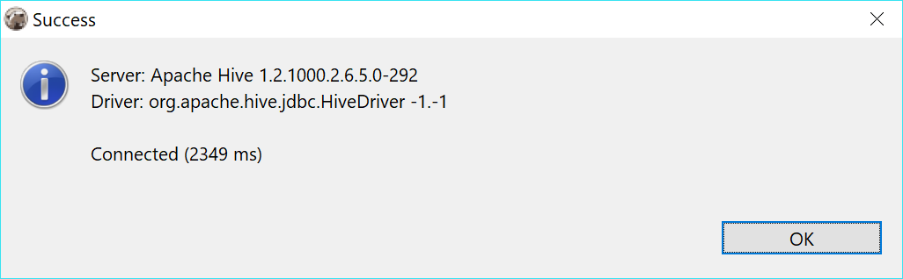

### Apache Hive

Hive is Hadoop-based storage system.
Hive uses special SQL dialect (HiveQL) to operate with data and metadata. Generally it is quite similar to SQL.

There are multiple implementation of storage systems which utilize Hive on server-side - including Apache Spark, Impala, etc. Most of them support standard Hive JDBC driver which is used in DBeaver to communicate with the server.

DBeaver uses so-called Hive JDBC Uber Jar driver (https://github.com/timveil/hive-jdbc-uber-jar) which includes all necessary dependencies. You don't need to download anything - DBeaver will download everything automatically (if you have internet access).

### Connection setup

### Schema/data browser

### Limitations

Hie doesn't support referential integrity so you won't see primary keys or foreign keys.
ER diagrams also don't make much sense.