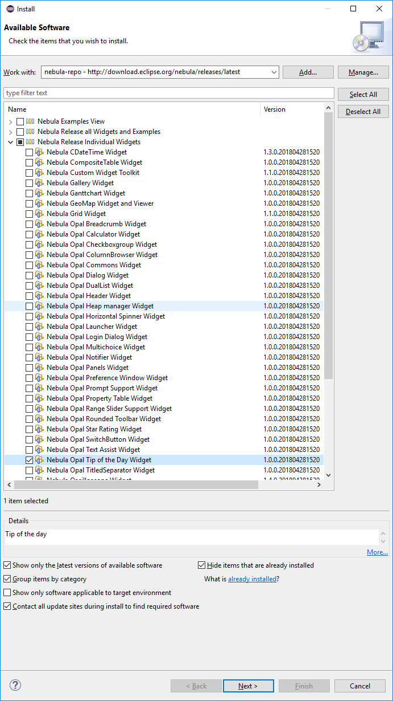

DBeaver is an [Eclipse RCP](https://wiki.eclipse.org/Rich_Client_Platform) application.  
It consists from a set of Eclipse plugins, features and products.

#### Opening workspace in Eclipse

You will need to setup "<a href="https://www.eclipse.org/downloads/packages/release/2018-09/r/eclipse-ide-rcp-and-rap-developers">Eclipse for RCP and RAP developers</a>". Currently default Eclipse version is Eclipse 2018-09. Build may fail on newer or older versions.
Then you will need to install a few additional Eclipse plugins which DBeaver depends on (and which are not included in the standard Eclipse distribution):
1. Open main menu Help -> Install New Software
2. Copy `http://dbeaver.io/eclipse-repo/` into "Work with" field and press enter
3. Check all plugins and finish the installation process

4. Repeat the same process for `http://download.eclipse.org/nebula/releases/latest` repository and check Nubula Widgets.

5. Restart Eclipse
6. Checkout DBeaver repository somewhere with `git clone https://github.com/dbeaver/dbeaver.git` command.
7. In Eclipse run Import wizard

8. Choose "General->Existing Maven Projects".  

9. Select DBeaver checkout directory. Check all plugins and features Eclipse will find and finish the wizard.  

10. Eclipse will perform project configuration process. This may take a few minutes.

11. If Eclipse will ask about additional plugin install - just agree:
  
12. Restart Eclipse. Eclipse will build project automatically or you can press `Ctrl+B`
13. Switch to Hierarchical projects presentations

14. If some modules build will fail (they will be marked with red cross) - update Maven project

#### Running and Debugging in Eclipse

1. Import DBeaver launch configuration using Eclipse Import wizard:

2. Click on Debug icon in the main toolbar->Debug configurations.
3. Choose DBeaver.product and click Debug button

If product won't start with `No application id has been found` error try this workaround:
https://stackoverflow.com/questions/13575695/eclipse-rcp-no-application-id-has-been-found  
> What you need to do is go to your Run Configurations (Run -> Run Configurations). Select the Plug-ins tab and then hit "Add Required Plug-ins". Apply, then Run, and it should work now.

That's it.

#### Sources structure:
- `docs` - some documentations (mostly outdated)
- `features` - feature descriptors. Doesn't contain any source code. Used to structurize product plugins/dependencies.
- `bundles` - very base plugins (like utils)
- `plugins` - main sources location
  - `org.jkiss.dbeaver.model` - model API and base classes. Doesn't contain any UI dependencies, just pure data model.
  - `org.jkiss.dbeaver.core` - main DBeaver module. Most of base UI classes are here.
  - `org.jkiss.dbeaver.core.application` - relatively small module which configures standalone DBeaver application.
  - `org.jkiss.dbeaver.core.eclipse` - main Eclipse plugin. Adds some extra menus/views to standard Eclipse IDE.
  - `org.jkiss.dbeaver.ext.*` - DBeaver extensions
- `product` - final products (standalone and Eclipse plugin) configuration.

#### Notes:
Everything above covers Community Edition version.  
