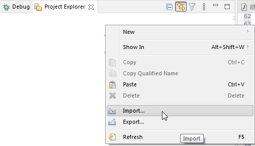

DBeaver is an [Eclipse RCP](https://wiki.eclipse.org/Rich_Client_Platform) application.  
It consists of a set of Eclipse plugins, features, and products.

## Opening workspace in Eclipse

You will need to setup [Eclipse IDE for RCP and RAP Developers](https://www.eclipse.org/downloads/packages/release/2020-12/r/eclipse-ide-rcp-and-rap-developers). The current default Eclipse version is _2021-06_. As the build may fail on older and newer versions,
you will need to install a few additional Eclipse plugins which DBeaver depends on (and which are not included in the standard Eclipse distribution):

1. Open main menu Help -> Install New Software

2. Copy `http://dbeaver.io/eclipse-repo/` into the "Work with" field and press enter

3. Check all plugins and finish the installation process:

    

4. Do the same for `http://eclipse-color-theme.github.io/update`

5. Restart Eclipse

6. Check out the DBeaver repository somewhere with the `git clone https://github.com/dbeaver/dbeaver.git` command.

7. In Eclipse run Import wizard

    

8. Choose "General->Existing Maven Projects".

    

9. Select the DBeaver checkout directory. Check all plugins and features Eclipse will find and finish the wizard.

    

10. Eclipse will perform the project configuration process. This may take a few minutes.

    

11. If Eclipse will ask about additional plugin install - just agree:

    
    
    

12. Restart Eclipse. Eclipse will build the project automatically or you can press `Ctrl+B`

13. Switch to Hierarchical projects presentations

    

14. If some modules build to fail (they will be marked with red cross) - update the Maven project

    

15. If you cannot compile and see errors "Access Restriction" in the Error log then you can turn these errors into warnings. Open context menu on the "Access Restriction" error line->Quick Fix->Configure problem severity.

## Running and Debugging in Eclipse

1. Import the DBeaver launch configuration using the Eclipse Import wizard:

    
  
    

2. Click on the Debug icon in the main toolbar->Debug configurations.

3. Choose DBeaver.product and click the Debug button

    

If the product will not start with the `No application id has been found` error, try this workaround:
[https://stackoverflow.com/questions/13575695/eclipse-rcp-no-application-id-has-been-found](https://stackoverflow.com/questions/13575695/eclipse-rcp-no-application-id-has-been-found)  
> What you need to do is go to your Run Configurations (Run -> Run Configurations). Select the Plug-ins tab and then hit "Add Required Plug-ins". Apply, then Run, and it should work now.

That is it.

## Sources structure:
- `docs` - some documentations (mostly outdated)
- `features` - feature descriptors. Does not contain any source code. Used to structurize the product plugins/dependencies.
- `bundles` - very base plugins (like utils)
- `plugins` - main sources location
  - `org.jkiss.dbeaver.model` - model API and base classes. Does not contain any UI dependencies, just a pure data model.
  - `org.jkiss.dbeaver.core` - main DBeaver module. Most of the base UI classes are here.
  - `org.jkiss.dbeaver.ui.app.standalone` - a relatively small module which configures standalone DBeaver application.
  - `org.jkiss.dbeaver.ui.app.eclipse` - the main Eclipse plugin. Adds some extra menus/views to the standard Eclipse IDE.
  - `org.jkiss.dbeaver.ext.*` - DBeaver extensions
- `product` - the final products (standalone and Eclipse plugin) configuration.

## Notes:
Everything above covers the Community Edition version.  

### Include plugins in the debug info.

Sometimes your plugins may depend on other plug-ins that are not included in the DBeaver.product.launch file.
You can check it Debug Configurations->Plug-ins tab with the button "Validate Plug-ins".
In the dialogue of the problems of the dependences appears, you can use the magic button "Add Required Plug-ins". Sometimes it solves all dependencies problems.

  

Or you can add the necessary dependencies manually.
Small tip: If you added a new plugin and you are confident that it should work, but after the project building you do not see the changes - perhaps the plugin is not marked in the tab Plug-ins.

  