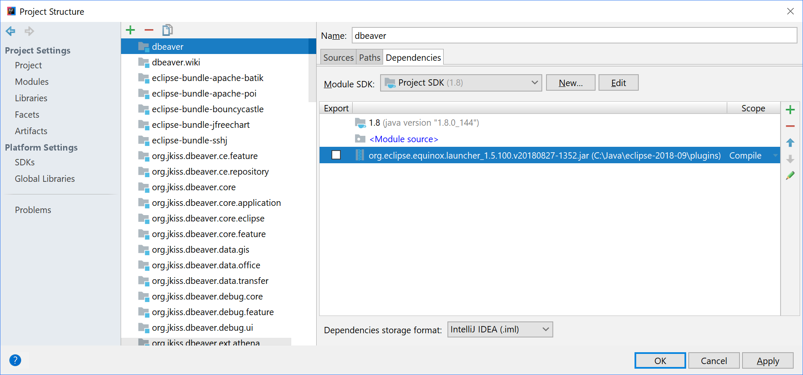
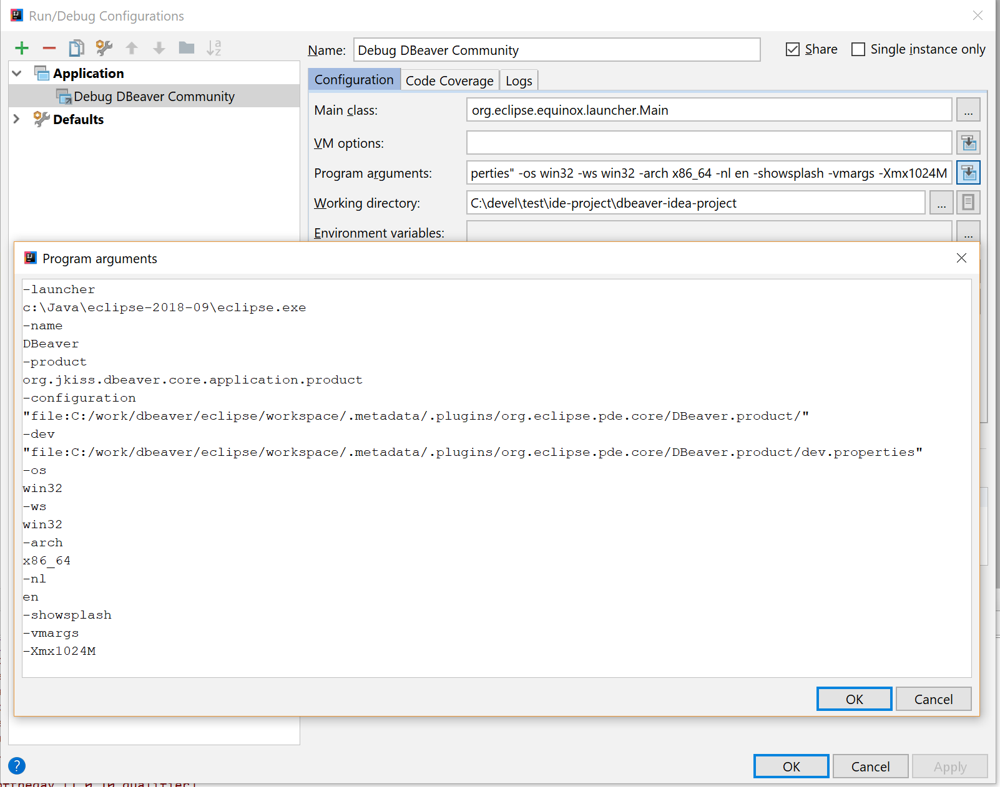

## Develop and debug DBeaver in IntelliJ IDEA

Well, this a tricky part.  

### Intro

#### Why

DBeaver is based on [Eclipse Platform](https://projects.eclipse.org/projects/eclipse.platform) and it seems logical to develop it in [Eclipse IDE](https://www.eclipse.org/downloads). 
However, many people find that even the latest Eclipse Java IDE is not as good and convenient as [IntelliJ IDEA](https://www.jetbrains.com/idea/download/).  
I personally also prefer to develop in IDEA - mostly because of historical reasons but also because of many really helpful features in it.  
Anyhow, here we will try to open the DBeaver project in IDEA, write code, compile, run and eventually debug (as Java debugger really rocks in IDEA).

#### How

It is quite easy to open the project, see the module structure and even compile.  
But running/debugging is the trickiest part because it requires Eclipse runtime workspace and only Eclipse IDE can create one (IDEA does not support this and nobody can blame JetBrains for that).  
So, we will still need Eclipse to configure the workspace for the debugger. But once you do this, you will no longer need to run Eclipse (until the plugins structure or versions change).  

Let's start!

### Instructions

#### Opening DBeaver in IDEA

1. Create some folder where you will clone DBeaver repositories. Note: all repositories must be located in the same folder. For example `dbeaver-ce`.
1. `cd dbeaver-ce`
1. `git clone https://github.com/dbeaver/dbeaver.git`
1. `git clone https://github.com/dbeaver/dbeaver-idea-project.git`
1. Optional: `git clone https://github.com/dbeaver/dbeaver.wiki.git` (skip it if you do not need WIKI)
1. Start IDEA->Open. select folder `dbeaver-ce/dbeaver-idea-project`
1. Now you can see the DBeaver modules structure: 
1. You can edit the code but you cannot compile because there are no Eclipse dependencies configured.

#### Prepare Eclipse IDE and workspace

1. Perform all steps described in the [Develop in Eclipse](Develop-in-Eclipse) article. Use just cloned `dbeaver-ce/dbeaver` as the sources root.
1. Eventually you should be able to compile and run DBeaver from Eclipse
1. Remember where your Eclipse IDE is located (let's say `eclipse-ide-path`)

#### Configuring dependencies and compile

1. Now we need to add Eclipse dependencies in the IDEA project configuration.
1. Open `File->Project structure...`.
1. Make sure you have the proper project Java SDK configured (Java 11+)
1. Go to `Global libraries`.
1. Create new library `ECLIPSE` (name and case are important)
1. Click the "Add" button. Select the folder `eclipse-ide-path/plugins`.
1. Recent IDEA should add all Eclipse jars as dependencies. But in some IDEA versions you will also need to add some other folders manually:  
   - `eclipse-ide-path/plugins/org.jkiss.bundle.apache.batik*/lib`. 
   - `eclipse-ide-path/plugins/org.jkiss.bundle.apache.poi*/lib`. 
   - `eclipse-ide-path/plugins/org.jkiss.bundle.apache.poi*/ooxml-lib`. 
   - `eclipse-ide-path/plugins/org.jkiss.bundle.jfreechart*/lib`. 
   - `eclipse-ide-path/plugins/org.jkiss.bundle.sshj*/lib`. 
1. If that is not enough, add all folders in `eclipse-ide-path/plugins/org.jkiss*`. Then manually download and add Mockito and JUnit.
1. Eventually you will see something like this: 
1. Now you should be able to compile the project. Just hit <kbd>CTRL+F9</kbd> and wait.

#### Running and debugging

DBeaver is an Eclipse RCP and must be started using the Eclipse Equinox Launcher bundle. This is a special jar file which resides in the Eclipse plugins folder and we need to add it to dependencies directly in order to be able to debug.

1. Add the launcher config as a jar dependency for module `dbeaver`. Locate the jar `org.eclipse.equinox.launcher_*.jar` in the `eclipse-ide-path/plugins/` folder. Like this: 
1. Open debug configuration "Debug DBeaver Community" and change the path in the parameters `-configuration` and `-dev`.  
Replace the path before `.metadata` with path to your Eclipse workspace. Eventually it should look like this:  

1. Click ok and run the debugger. DBeaver must start. Now you can enjoy debugging in IDEA :)

### Problems

Most likely something will go wrong as these instructions are quite long. Do not be afraid to recheck the configuration and try again.
If nothing helps - do not hesitate to ask at <a href="/dbeaver/dbeaver/issues/">tickets</a>.
