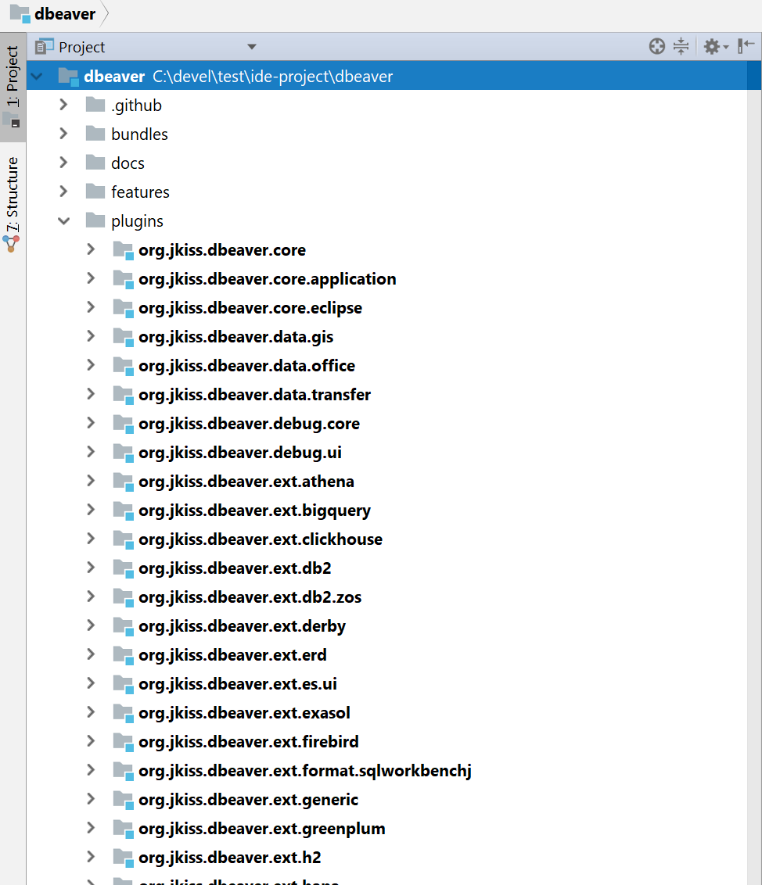
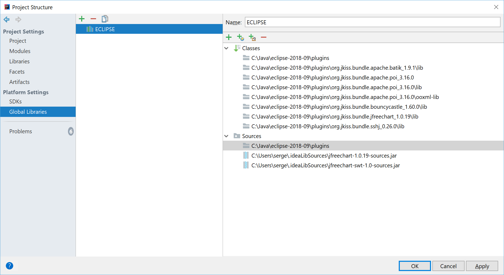

## Develop and debug DBeaver in IntelliJ IDEA

Well, that's a tricky part.  

### Intro

#### Why

DBeaver is based on [[Eclipse Platform|https://projects.eclipse.org/projects/eclipse.platform]] and it seems logical to develop it in [[Eclipse IDE|https://www.eclipse.org/downloads]]. 
However, many people find that even latest Eclipse Java IDE isn't that good and convenient as [[IntelliJ IDEA|https://www.jetbrains.com/idea/download/]].  
I personally also prefer to develop in IDEA, mostly because of historical reasons but also because of many really helpful features in it.  
Anyhow, here we will try to open DBeaver project in IDEA, write code, compile, run and eventually debug (as Java debugger really rocks in IDEA).

#### How

It is quite easy to open the project, see module structure and even compile.  
But running/debugging is the most tricky part because it requires Eclipse runtime workspace and only Eclipse IDE can create one (IDEA doesn't support this and nobody can blame JetBrains for that).  
So, we'll still need Eclipse to configure workspace for debugger. But once you will do this you will no longer need to run Eclipse (until plugins structure or versions will change).  

Let's start!

### Instructions

#### Opening DBeaver in IDEA

1. Create some folder where you will clone DBeaver repositories. Note: all repositories must be located in the same folder. For example `dbeaver-ce`.
1. `cd dbeaver-ce`
1. `git clone https://github.com/dbeaver/dbeaver.git`
1. `git clone https://github.com/dbeaver/dbeaver-idea-project.git`
1. Optional: `git clone https://github.com/dbeaver/dbeaver.wiki.git` (skip it if you don't need WIKI)
1. Start IDEA->Open. select folder `dbeaver-ce/dbeaver-idea-project`
1. Now you can see DBeaver modules structure: 
1. You can edit code but you can't compile because there are no Eclipse dependencies configured.

#### Prepare Eclipse IDE and workspace

1. Perform all steps described in [[Develop in Eclipse]] article. Use just cloned `dbeaver-ce/dbeaver` as sources root.
1. Eventually you should be able to compile and run DBeaver from Eclipse
1. Remember where you Eclipse IDE is located (let's say `eclipse-ide-path`)

#### Configuring dependencies and compile

1. Now we need to add Eclipse dependencies in IDEA project configuration.
1. Open `File->Project structure...`.
1. Make sure you have proper project Java SDK configured (Java 8+)
1. Go to `Global libraries`.
1. Create new library `ECLIPSE` (name and case are important)
1. Click "Add" button. Select folder `eclipse-ide-path/plugins`.
1. Recent IDEA should add all Eclipse jars as dependencies. But in in some IDEA versions you will also need to add some other folders manually:  
   - `eclipse-ide-path/plugins/org.jkiss.bundle.apache.batik*/lib`. 
   - `eclipse-ide-path/plugins/org.jkiss.bundle.apache.poi*/lib`. 
   - `eclipse-ide-path/plugins/org.jkiss.bundle.apache.poi*/ooxml-lib`. 
   - `eclipse-ide-path/plugins/org.jkiss.bundle.jfreechart*/lib`. 
   - `eclipse-ide-path/plugins/org.jkiss.bundle.sshj*/lib`. 
1. Eventually you see something like this: 
1. Now you should be able to compile the project. Just hit <kbd>CTRL+F9</kbd> and wait.

#### Running and debugging
