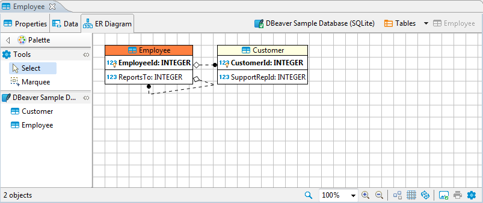
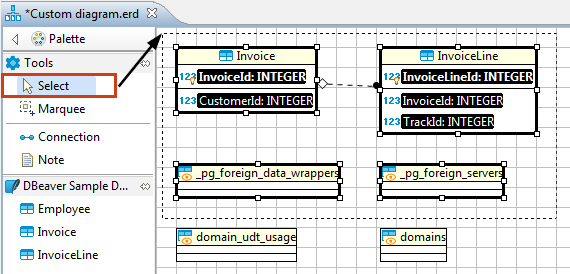
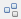
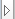
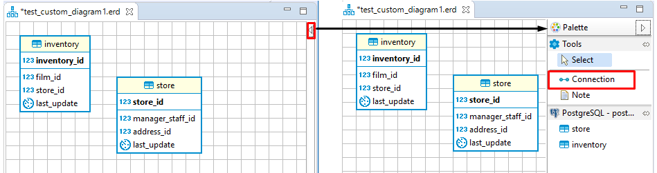
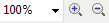
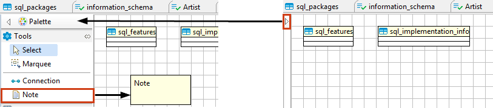

ER diagrams appear on the rightmost tab of the [Database Object Editor](Database-Object-Editor):

Entity Relation Diagrams (ERD) are graphic presentations of database entities and the relations between them. DBeaver allows you to view the diagrams of existing tables and whole database schemas, see [Database Structure Diagrams](Database-Structure-Diagrams). DB also allows the creation of custom diagrams, see
[Custom Diagrams](Custom-Diagrams).  
By default DBeaver uses [IDEF1X](https://en.wikipedia.org/wiki/IDEF1X) notation.

Both types of diagrams provide the same tools to adjust their view and structure. They can be printed and exported to image file formats.

## Selection of Elements in Diagrams
You can use one of the two tools to select elements in diagrams:
* Select – supports both, single and multi-select modes. To select a single element (table, connection, entity inside a table) in a diagram, just click that element. To select multiple elements, similar to using the Marquee tool, click outside the first element and draw until all elements you need are in focus:  

  
  
## Structure Adjustment
NOTE: All changes to existing database schemas cannot be saved and are intended for exploration purposes only.  
You can do the following structural changes in the diagrams.
*  Add new tables to a diagram by drag-n-dropping them onto the diagram field from the [Database Navigator](Database-Navigator).
*  Rearrange tables in the diagram by dragging them all over the space. You can select several tables and drag them to a new location.
*  Auto-arrange tables into a compact view after manual rearrangements: click the **Arrange Diagram** () in the toolbar or on the context menu (right-click anywhere on the diagram tab).
*  (Available for [Custom Diagrams](Custom-Diagrams) only) - connect tables with a connector: click the **Show Palette** button () in the upper-left corner of the diagram tab and then, in the Palette panel, click **Connection**:

   
   Now click the tables that you want to connect with each other in turn, one by one. To stop the connection line, double-click the last table
*  (Available for [Custom Diagrams](Custom-Diagrams) only) - removes tables and connections: right-click the table or conection and click **Delete** on the context menu or just click the table or connection and press <kbd>Delete</kbd>.

## View Adjustment
You can adjust the view of any diagram in the following ways:
* Enable/disable the diagram grid: Click **Toggle Grid** () in the toolbar.
* Modify attributes visibility: Right-click the diagram and, on the context menu, click **Show Attributes** and then select one of the options:
  - **All** - all attributes  
  - **Any keys** - primary and foreign keys  
  - **Primary key** - only primary keys  
  - **None** - no attributes  
* Modify attributes presentation: Right-click the diagram and, on the context menu, click **View Styles** and then select one of the options:
  - **Show Icons**
  - **Show Data Types**
  - **Show Nullability**
  - **Show Comments**
  - **Show Fully qualified names**
* Change the color of the entities/notes: Right-click the header of the entity or comment and then click **Set color** on the context menu. Then you can select the color and click **OK**. 
* For elements located in front of/behind others, bring an element to the front or send it to the back: Right-click the element and then click **Bring to front** / **Send to back** on the context menu.
* Zoom the diagram in/out: Click the **Zoom In**/**Zoom Out** buttons or choose the scaling value in the dropdown list in the toolbar: 

## Refresh
To see changes made by others to the database schema, you might need to refresh the diagram: click **Refresh Diagram** () in the toolbar.

## Notes
You can create notes only in [Custom Diagrams](Custom-Diagrams). To create a note, click the **Show Palette** button () in the upper-left corner of the diagram tab. Then, in the Palette panel, click **Note** and click anywhere in the diagram tab. Now you can double-click the **Note** box to enter the note text:

## Search in Diagram Entities
To search among entities of a diagram, click the **Search items** button () in the toolbar, then type in the search combination. The entities that contain the search combination are highlighted in the diagram.
To remove the filter, click the cross icon next to the search field.

## Bindings

### Navigation and selection:

* Use `ARROWS` to navigate between tables.
* Press `SHIFT` + `ARROWS` to select multiple tables.
* Press `CTRL` + `ARROWS` to select additional tables using `SPACEBAR`.
* Press `SPACEBAR` to select the current table.

### Table Manipulation:
* Press `.` (period) to change the mode to move/resize tables when use `ARROWS` to move/resize tables.

### Focus:

* Press `ENTER` to focus on attributes in the table.
* Press `BACKSPACE` to leave the focus.
* Use `|`, `?`, `\` to focus on associations.
* Press `ALT/FN + 1` to focus on the diagram.
* Press `ALT/FN + 2` to focus on the palette.
* Press `ALT/FN + 3` to focus/open the outline.
* Press `ALT/FN + 4` to focus on the parameter view.

### Other Functions:

* Press `CTRL + ENTER` to open the selected table diagram.

## Diagram Export
You can export (save) a diagram as an image (PNG, GIF, BMP formats) or as a file in GraphML format. To export a diagram, click **Save diagram in external format** () in the toolbar.

## Diagram Printing
To print a diagram, press <kbd>CTRL+P</kbd> or click **Print Diagram** () on the toolbar.

## Settings
To modify the diagram settings, click **Configuration** () on the toolbar.
