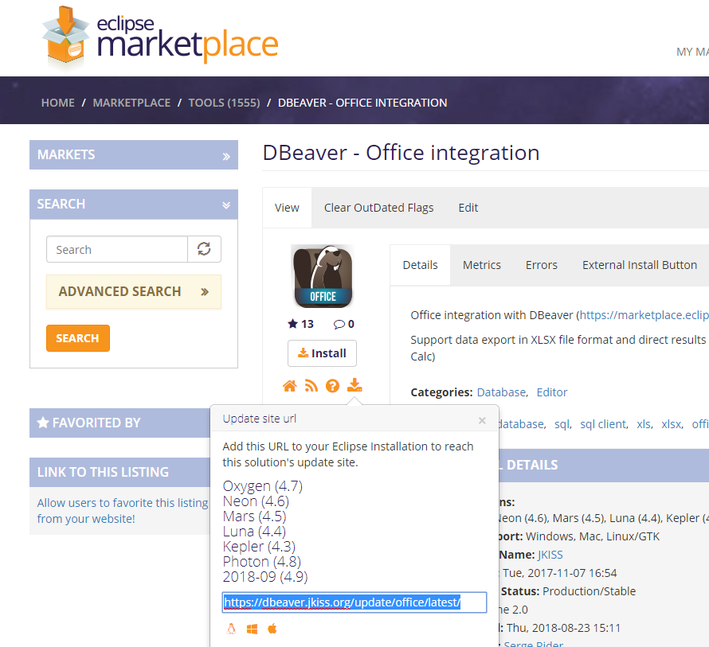
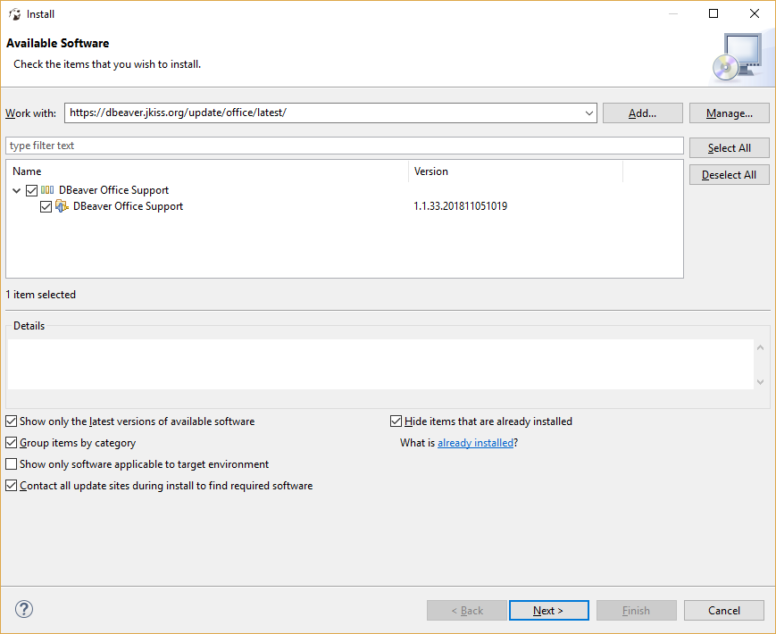
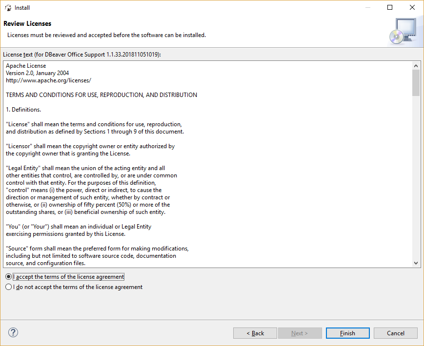
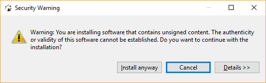

You can install a lot of optional extensions (plugins) in DBeaver.
Most of extensions can be found on [[Eclipse Marketplace|https://marketplace.eclipse.org/]] website.

# Popular extensions for DBeaver

- [[Darkest Dark theme|https://marketplace.eclipse.org/content/darkest-dark-theme-devstyle]] - the best Dark theme for DBeaver
- [[Eclipse Color Theme|https://marketplace.eclipse.org/content/eclipse-color-theme]] - use it if you don't like Darkest Dark theme by some reason
- [[Git support|https://marketplace.eclipse.org/content/egit-git-integration-eclipse]] - Git version control integration
- [[Subversion support|https://marketplace.eclipse.org/content/subclipse]] - Subversion integration
- [[Embedded Shell|https://marketplace.eclipse.org/content/easyshell]] - Allows to run shell commands directly from DBeaver
- [[Editor vertical indents|https://marketplace.eclipse.org/content/indent-guide]] - Adds vertical indents to all text editors

### DBeaver-specific extensions
- [[Office formats support (XLSX)|https://marketplace.eclipse.org/content/dbeaver-office-integration]]
- [[Vector graphics support (SVG)|https://marketplace.eclipse.org/content/dbeaver-svg-support]]
- [[SSHJ and advanced cryptography|https://marketplace.eclipse.org/content/dbeaver-sshj-support]]
- [[SQL debugger|https://marketplace.eclipse.org/content/dbeaver-sql-debugger]]

# Install Process

In DBeaver EE you can use drag-n-drop from Marketplace web site (see button `Install`) into DBeaver main window. This will launch Marketplace installation wizard automatically.
In DBeaver Community or other DBeaver-based products which do not include marketplace clients you can use following instructions:

## Extension installation in CE version:

1. Copy URL of extension update site:

1. In DBeaver main menu open `Help -> Install New Software`
1. Paste update site URL into `Work with` field and press <kbd>Enter</kbd>
1. Check items you wish to install (in most cases just all items)

1. Click Next. You may need to accept extension license before installation

1. Some extensions may contain unsigned bundles. Install such extensions only if you really trust author.

1. Click Next->Finish. Installation will take some time. Restart DBeaver.
